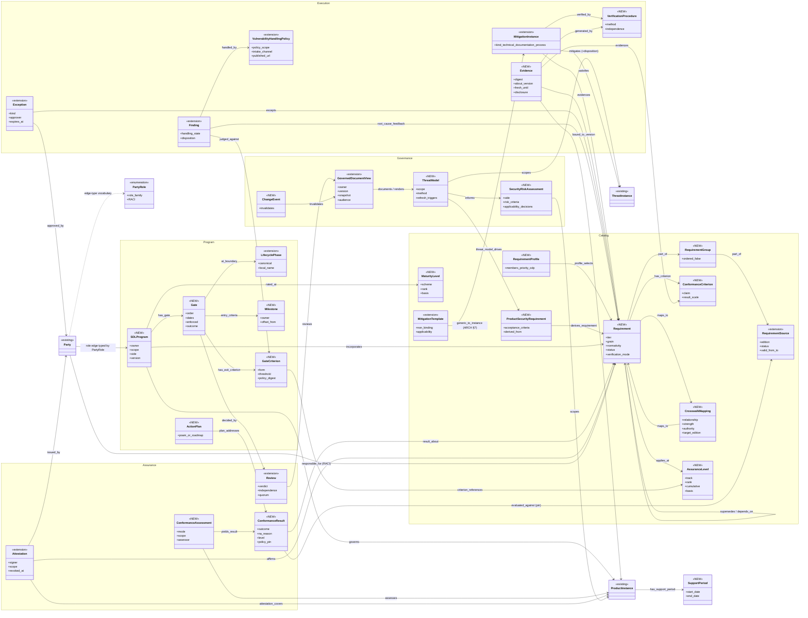

# RPT-0013-OM — Consolidated SDL object model

**Status: draft, proposals only.** This report folds the 42 per-reference object-model passes of the
`sdl` topic into one canonical model. The machine-readable form, with every absorbed source object and
edge, its locator, kind (stated or inferred) and the source's own tmodel mapping, is
[`sdl-object-model.yaml`](sdl-object-model.yaml). Proposed names target
`ARCH-0001-PROPOSAL-v0.2.0` (front matter `0.2.0-proposed.10`; its body status line still reads
"proposed.8") and DL-0009 (R-040…R-044). Nothing here is accepted.

## 0. Scope, method and coverage

- **Inputs.** There are 44 records in `topics/sdl.yaml`. Forty-two have `distilled/object-model.yaml`
  (1,510 objects, 1,230 edges). `eo-14144` and `eo-14306` are summary-only. They are used only for the
  time-validity finding: EO 14306 §1(a) struck EO 14144 §2(a)–(b), the machine-readable attestation and
  validation programme.
- **Rule.** Each source object or edge is assigned to exactly **one** canonical type, by its stated
  definition and the source's first-listed `tmodel_mapping`. A second role is noted, not double-counted.
  **Support** is the number of distinct records that contribute.
- **Coverage.** 1,146 of 1,510 source objects and 925 of 1,230 source edges map to 46 canonical SDL
  object types and 60 relationships. The remaining 364 objects map to existing ARCH layers 1–3 or have
  no SDL role: 116 product, component or deployment; 55 threat-layer; 49 DFD or structural; 39
  supply-chain custody, routed to the radar contract by ADR-0001; 27 asset or classification; 27
  finding or external-ref; 51 other context (including one negative-evidence item, the absent
  Microsoft SDL gate). The YAML lists them under `unassigned_source_objects`.
- **Verification fixes.** These were carried in from `verification.md`: the sp-800-218r1 PracticeGroup
  mapping was corrected to "NOT a LifecyclePhase"; 25 missing SLSA, 9 OSPS and 8 ASVS edges were added;
  the Microsoft SDL `crosses` edge was split; the MS SDL 5.2 FSR guard was moved. Two caveats are left
  for human review: the sp-800-53r5 ThreatModel locator also cites SA-15(5), which is attack-surface
  reduction, and the sp-800-218r1 objects ported from 1.1 still carry 1.1 definitions while 1.2 is an IPD.

## 1. Canonical model at a glance

Not drawn, for size (all are in the YAML): `ApplicabilityClass`, `RequirementParameter`, `SBOM`,
`Tool`, `DevelopmentEnvironment`, `SourceRepository`, `ResponsibilityAgreement`, `TimeframePolicy`,
`Metric`, `RootCause`, `SecurityNotice`, `Incident`, `ReleaseExt`, `ConfigurationSetting`.
`PartyRole` is drawn as an `<<enumeration>>`: under ARCH-0001 §2b (critic M2) a relational role is an
edge type, so the diagram shows one role-typed edge, not a role node. `Review` and `Finding` are
`<<extension>>` because the tables extend them (`ReviewExt`, `FindingHandling`).

## 2. Canonical objects

Sorted by support. **Scope** applies the ADR-0002 guard: SDL is post-MVP except R-040.

| # | Canonical object | Layer | Definition | Sources | Source objects | ARCH-0001 mapping | Scope |
|---|---|---|---|---|---|---|---|
| 1 | `PartyRole` | parties | SDL role vocabulary for relational Party edge types (12 role families); a vocabulary, not a node. | 42 | 213 | **extension**: Party (§2b) relational role EDGE types + role vocabulary (not a role node, per §2b critic M2); member_of between Parties | post-MVP (Party is modeled-not-built at MVP) |
| 2 | `Requirement` | catalog | Normative statement from a source; tier process or product-catalog; grain objective or testable. | 33 | 67 | **NEW**: Requirement (DL-0009 R-042/R-044); ARCH §7 lists 'audit (Requirement/WorkProduct)' as post-MVP #19; not yet a §13 class | post-MVP |
| 3 | `Evidence` | execution | Version-bound, digest-identified artifact (by-product or work product) with provenance. | 29 | 48 | **NEW**: Evidence (DL-0009 R-042) as a PROV Entity (§4) | post-MVP |
| 4 | `MitigationInstanceExt` | execution | R-040: MitigationInstance with kind technical, documentation or process, plus optional axes. | 28 | 77 | **extension**: MitigationInstance (§5) + R-040 kind | MVP-adjacent (kind only) |
| 5 | `SBOM` | execution | Machine-readable component inventory of a release (SBOM, HBOM, CBOM); an evidence type. | 23 | 30 | **extension**: materialization of composed_of/uses_component (§1) + Evidence; import via radar→tmodel contract (ADR-0001) | post-MVP |
| 6 | `Attestation` | assurance | Signed, scoped, revocable claim by a Party (attestation, certification, DoC, VSA, badge, commitment). | 21 | 31 | **extension**: subtype of Assertion (§4) with signer, scope and revocation; artifact-bound supply-chain attestations stay in the radar→tmodel contract (ADR-0001) | post-MVP |
| 7 | `RequirementGroup` | catalog | Grouping facet inside one source (practice group, function, domain, family, chapter). Not a phase. | 21 | 28 | **NEW**: grouping facet on Requirement (DL-0009 R-044); not LifecyclePhase (§3b) | post-MVP |
| 8 | `RequirementSource` | catalog | Edition-pinned standard, framework or regulation that publishes requirements (library record). | 20 | 34 | **NEW** (thin): ARCH has no standard/source class, only the §2b rule that a standard is published_by the Party its library record names; node needed so Requirement.source and maps_to can pin an edition | post-MVP |
| 9 | `GovernedDocumentView` | governance | Versioned, approvable projection over the KG with governance metadata. | 20 | 32 | **extension**: §10 View promoted to a governed, persisted subtype (DL-0009 R-043); approval = Review; change tracking = §4 provenance | post-MVP |
| 10 | `VulnerabilityHandlingPolicy` | execution | Vulnerability disclosure policy (VDP/CVD), internal handling policy and response plan; a process-kind mitigation with a published governed view. | 20 | 29 | **extension**: MitigationInstance (§5) with kind=process (policy text: kind=documentation) + GovernedDocumentView for the published policy (R-043); handled_by edges to Party (§2b) | post-MVP |
| 11 | `ThreatModel` | governance | Scoped, versioned threat-model container that the SDL requires, reviews and refreshes (risk assessments split out). | 20 | 23 | **NEW**: explicit scope node for 'the tmodel threat model itself' (ThreatInstance/AttackPath set, §1.3) + governed view (R-043); ARCH has no ThreatModel class | post-MVP as an SDL object (the threat content itself is MVP) |
| 12 | `FindingHandling` | execution | Finding/Vulnerability with handling state, disposition, fix class and SLA. | 19 | 29 | **extension**: Finding/Vulnerability (§1.3) + DEC-009 lifecycle; per-vulnerability phases ≠ product LifecyclePhase | post-MVP (Finding is MVP; handling states are not) |
| 13 | `GateCriterion` | program | Typed, machine-checkable exit criterion (bug bar, level target, policy, threats-mitigated). | 18 | 26 | **NEW**: Gate.exit_criteria (R-041) evaluated by the R-042 conformance check | post-MVP |
| 14 | `ConformanceResult` | assurance | Per-requirement outcome Assertion (VSA-shaped) with N/A reason, level or score, evidence and version pin. | 17 | 24 | **NEW**: ConformanceResult as a reified Assertion (§4) + Review verdict (R-042) | post-MVP |
| 15 | `SDLProgram` | program | Org- or product-scoped secure development lifecycle and its governance (producer or consumer side). | 17 | 24 | **NEW**: SDL / SecurityProgram (DL-0009 R-041) attached to Product/ProductFamily | post-MVP |
| 16 | `Tool` | execution | Development or security tool or toolchain; approved, configured and trusted; produces evidence. | 16 | 27 | **extension**: Component (§1) with a tooling role in a DevelopmentEnvironment | post-MVP |
| 17 | `VerificationProcedure` | execution | Declared verification method (test plan, measurement, review) and its runs; independence. | 16 | 24 | **NEW**: VerificationProcedure attached to MitigationInstance (iso-iec-27034-1 design-notes D1) + PROV Activity runs | post-MVP |
| 18 | `SecurityNotice` | execution | Advisory, VEX, customer notice or staged regulatory notification. | 16 | 21 | **NEW**: advisory/VEX Assertion (§5 R-027b) + documentation-kind MitigationInstance + governed view | post-MVP |
| 19 | `ConformanceAssessment` | assurance | Assessment event of a subject against a pinned requirement set (self, 3rd-party, regulatory). | 16 | 19 | **NEW**: conformance check run (R-042); audit model deferred (#19) | post-MVP |
| 20 | `Exception` | execution | Time-bound approved waiver, risk acceptance, extension, transfer or share. | 15 | 17 | **extension**: DEC-009 'accepted' mitigation state + Review (§4/§5); Assertion with valid_from/valid_to | post-MVP (accepted-risk value already in R-045 mitigation status) |
| 21 | `MitigationTemplate` | catalog | Generic, non-binding mitigation pattern or example with an applicability predicate. | 14 | 22 | **extension**: generic Mitigation (§1.3 catalog layer) + applicability predicate | post-MVP |
| 22 | `LifecyclePhase` | program | Canonical phase (§3b) with local names mapped onto it. | 14 | 21 | **extension**: LifecyclePhase (§3b) + canonical-phase/local-name mapping (DL-0009 R-041) | post-MVP |
| 23 | `Gate` | program | Named, ordered, dated decision point with exit criteria and an approving Review. | 14 | 16 | **NEW**: Gate/Checkpoint (DL-0009 R-041) at LifecyclePhase boundaries | post-MVP |
| 24 | `ReleaseExt` | product | ProductInstance as a gated, archived release record with update and rollback lineage. | 13 | 19 | **extension**: ProductInstance (§1, §3b) + time/version axis | post-MVP (ProductInstance itself is MVP) |
| 25 | `ProductSecurityRequirement` | catalog | Requirement authored for one product, with acceptance criteria, derived from risk or catalogue. | 13 | 18 | **NEW**: product-level Requirement (DL-0009 needs a tier split; MAP-0001 conflates them) | post-MVP |
| 26 | `ReviewExt` | assurance | Review with independence, quorum, separation of duties, method and staged approval. | 13 | 17 | **extension**: Review (§4/§5) — proposal/verdict separation kept | post-MVP (Review itself is MVP) |
| 27 | `ApplicabilityClass` | catalog | Classification of a product or party that decides which requirements and route apply. | 13 | 15 | **NEW**: applicability/regime facet on Product/Party (fda D3 'RegulatoryRegime' facet) | post-MVP |
| 28 | `DevelopmentEnvironment` | product | Producer dev, build, test and training environments and their trust relations. | 12 | 26 | **extension**: Environment (§3) is runtime-only; add kind=development/build + Component roles; build provenance stays radar→tmodel (ADR-0001) | post-MVP |
| 29 | `SourceRepository` | product | Source-control sub-model: repo, protected refs, changes, approvals, continuity. | 11 | 31 | **NEW**: source-control objects absent from ARCH (Component + PROV Activity only); custody provenance via radar contract | post-MVP |
| 30 | `Metric` | program | Derived program KPI or score (view value, not truth). | 11 | 14 | **NEW**: derived View metric (§10) on the SDL program (R-041) | post-MVP |
| 31 | `CrosswalkMapping` | catalog | Reified, typed, edition-pinned mapping between requirements (MAP-0001 unit). | 11 | 12 | **NEW**: Requirement maps_to edge (R-044) reified as an Assertion so it can carry provenance + Review (§4) | post-MVP |
| 32 | `SecurityRiskAssessment` | governance | Producer- or acquirer-side cybersecurity risk assessment that scopes and consumes the threat model and decides applicability and target levels. | 10 | 10 | **NEW**: risk-assessment artifact; its per-threat content maps to ThreatInstance + RiskScore (§1.3, §3, composite risk vector R-045); the document is a GovernedDocumentView (R-043); ARCH has no class for the assessment itself | post-MVP (risk values are MVP via RiskScore; the assessment artifact is not) |
| 33 | `AssuranceLevel` | catalog | Cumulative product/artifact tier on a track (SLSA/ASVS/OSPS/LoT/DG): how strongly or which subset, not when, not org maturity. | 9 | 11 | **NEW**: new class; DL-0009 Gate is 'when', Level is 'how strongly' (tmodel analysis in slsa-1-2 design-notes §3; SLSA itself only says each level implies the levels below) | post-MVP |
| 34 | `ActionPlan` | program | Roadmap, improvement plan or POA&M with milestones that closes gaps. | 8 | 10 | **NEW**: program plan (R-041) rendered as a governed view (R-043); POA&M = gap-with-accepted-plan conformance state (R-042) | post-MVP |
| 35 | `ResponsibilityAgreement` | parties | Party-to-Party allocation of requirements, responsibilities and attestation method. | 8 | 8 | **NEW**: agreement node + Party —responsible_for→ Requirement edges (§2b) | post-MVP |
| 36 | `RequirementProfile` | catalog | Tailored selection of requirements (baseline, community profile, fork, per-app framework). | 7 | 10 | **NEW**: tailored Requirement set; generic→product instantiation pattern of DEC-009 extended to requirements | post-MVP |
| 37 | `RootCause` | execution | Process root cause that feeds back into requirements and the SDL. | 7 | 9 | **NEW**: Finding → RootCause → Requirement/SDLProgram feedback (not only Weakness/CWE) | post-MVP |
| 38 | `ConformanceCriterion` | catalog | Checkable claim, criterion or probe that decomposes a requirement (the Claim layer). | 6 | 8 | **NEW**: ConformanceCriterion between Requirement and Evidence (R-042) | post-MVP |
| 39 | `Incident` | product | Operational incident, near miss or compromise (outside the SDL core). | 6 | 8 | **NEW**: no ARCH class (closest: realised ThreatInstance/DamageScenario); outside the SDL core | post-MVP (out of SDL core) |
| 40 | `TimeframePolicy` | program | Update, remediation and SLA time bounds. | 6 | 6 | **NEW**: policy object on the SDLProgram (R-041) checked against Finding timestamps | post-MVP |
| 41 | `MaturityLevel` | catalog | Organization or practice maturity rung (SAMM, DSOMM, 62443 ML, SDL Optimization Model) or BSIMM observation band; never product assurance, never a gate criterion. | 5 | 6 | **NEW**: new class, separate from AssuranceLevel; attaches to SDLProgram/Party via rated_at, and to Requirement (activity) via applies_at | post-MVP |
| 42 | `SupportPeriod` | product | Dated product support window and end-of-support policy. | 5 | 6 | **NEW**: dated window on ProductInstance; supplies the missing valid_from/valid_to of §3b | post-MVP |
| 43 | `ChangeEvent` | governance | Event that invalidates or stales governed views, reviews or results. | 5 | 5 | **NEW**: invalidation event over governed views/Reviews (R-043), on the §3b time/version axis | post-MVP |
| 44 | `Milestone` | program | Dated, owned deliverable point, possibly relative (offset); can be a gate entry condition. | 4 | 6 | **NEW**: Milestone (DL-0009 R-041) | post-MVP |
| 45 | `ConfigurationSetting` | product | Security-relevant product setting with default value, options and impact; target of secure-default mitigations and admin documentation. | 4 | 5 | **NEW**: no configuration object in ARCH-0001 (nearest: a Component property, §1); target of MitigationInstance sets_default and of documentation-kind mitigations | post-MVP |
| 46 | `RequirementParameter` | catalog | Organization-defined parameter or adopter-bound term inside a requirement. | 4 | 4 | **NEW**: parameter slot on Requirement (Assertion by the adopting Party) | post-MVP |

**Reading the counts.** `PartyRole` reaches all 42 sources because every source names actors. The
broadest SDL concepts are `Requirement` (33), `Evidence` (29), `MitigationInstanceExt` (28), and then
`ThreatModel` and `VulnerabilityHandlingPolicy` (20 each). `Gate` (14) and its exit criteria (18) are
common. Explicit ordering *edges* are rare (`precedes` and `has_gate`, 4 sources each), but edge
counts understate ordering: the Microsoft SDL 5.2 and 2010 phase objects are numbered and sequential
without a `precedes` edge (§4 b).

## 3. Canonical relationships

| # | Relationship | From → To | Card. | Sources | Source edges | ARCH-0001 mapping | Scope |
|---|---|---|---|---|---|---|---|
| 1 | `part_of` | Requirement / RequirementGroup → RequirementGroup / Requirement / RequirementSource | N:1 | 25 | 51 | Requirement.parent / published_in (R-044) | post-MVP |
| 2 | `mitigates (+disposition)` | MitigationInstance → ThreatInstance / Finding/Vulnerability / Weakness | N:M | 24 | 48 | MitigationInstance mitigates ThreatInstance/Finding (§5, DEC-009) — existing | MVP (existing edge); disposition values post-MVP |
| 3 | `maps_to` | Requirement (via CrosswalkMapping) → Requirement (other source/edition) | N:M | 24 | 39 | Requirement maps_to (R-044) → MAP-0001 | post-MVP |
| 4 | `evidences` | Evidence → Requirement / ConformanceCriterion / ProductSecurityRequirement / Attestation / GateCriterion | N:M | 24 | 38 | Evidence satisfies Requirement (R-042) | post-MVP |
| 5 | `bound_to_version` | Evidence / GovernedDocumentView / SBOM → ProductInstance (release) | N:1 (N:M only with an approved reuse rationale) | 22 | 29 | Evidence about ProductInstance version (§3b) | post-MVP |
| 6 | `assesses` | ConformanceAssessment / Party (assessor) → Product / SDLProgram / Party / platform | N:1 | 20 | 27 | conformance check subject (R-042) | post-MVP |
| 7 | `plays_role` | Party → Product / SDLProgram / Party / Component (edge typed by a PartyRole value) | N:M | 18 | 27 | §2b relational role edges; one Party identity (critic M1) | post-MVP |
| 8 | `responsible_for` | Party / PartyRole → Requirement / SDLProgram / process / Component | N:M | 18 | 27 | new Party —responsible_for→ Requirement edge with RACI qualifier (§2b) | post-MVP |
| 9 | `reviews` | ReviewExt → ThreatModel / design / change / policy / GovernedDocumentView | N:1 | 17 | 32 | Review points_at Assertion (§4/§5) | Review is MVP; constraints post-MVP |
| 10 | `scopes (threat model)` | ThreatModel / SecurityRiskAssessment → Product / Environment / build pipeline / ThreatInstance | N:1 | 17 | 26 | the tmodel model instance scoped to Product (core) | MVP content; SDL governance post-MVP |
| 11 | `generated_by` | Evidence → Tool / VerificationProcedure run / Activity / Party | N:1 | 15 | 28 | PROV wasGeneratedBy / wasAssociatedWith (§4) | post-MVP |
| 12 | `has_exit_criterion` | Gate → GateCriterion | N:M | 15 | 23 | Gate.exit_criteria / entry_criteria (R-041) | post-MVP |
| 13 | `excepts` | Exception → Requirement / GateCriterion / Milestone / ThreatInstance / Finding | N:1 | 15 | 18 | DEC-009 accepted + Review; Assertion with validity window | post-MVP |
| 14 | `verified_by` | MitigationInstance / Requirement / ProductSecurityRequirement → VerificationProcedure | N:M | 14 | 25 | MitigationInstance verified_by VerificationProcedure (new) → Evidence | post-MVP |
| 15 | `issued_by` | Attestation → Party (issuer, signatory, signing key) | N:1 | 14 | 23 | PROV wasAttributedTo / actedOnBehalfOf (§4) | post-MVP |
| 16 | `documents / renders` | GovernedDocumentView → Product / ThreatModel / SDLProgram / ConformanceResult set | N:1 | 13 | 24 | View over KG (§10) promoted to governed (R-043) | post-MVP |
| 17 | `satisfies` | MitigationInstance / MitigationTemplate / Product → Requirement / ProductSecurityRequirement | N:M | 13 | 20 | MitigationInstance satisfies Requirement (R-040/R-042) | post-MVP |
| 18 | `result_about` | ConformanceResult → Requirement / ConformanceCriterion / AssuranceLevel | N:1 | 13 | 17 | Assertion subject (§4) | post-MVP |
| 19 | `notifies / announces` | SecurityNotice / Party (producer) → Vulnerability / Product / Party (audience/authority) / SecurityNotice | N:M | 12 | 29 | advisory/VEX Assertion (§5 R-027b) + documentation-kind mitigation | post-MVP |
| 20 | `applicable_to` | Requirement / ApplicabilityClass → Product / Party / ApplicabilityClass | N:M | 12 | 20 | Requirement applicability + justification (R-042) | post-MVP |
| 21 | `in_phase` | Requirement / MitigationInstance / ThreatInstance / Task → LifecyclePhase | N:1 | 11 | 18 | applies_in_phase (§3b) + local-name mapping (R-041) | post-MVP (phase enum modeled at MVP) |
| 22 | `attestation_covers` | Attestation → Product / ProductInstance range / Party / artifact digest | N:M | 11 | 17 | Assertion subject set (§4) | post-MVP |
| 23 | `applies_at` | Requirement → AssuranceLevel / MaturityLevel | N:M | 10 | 14 | Requirement applies_in_profile (new) | post-MVP |
| 24 | `separated_from / trusts` | DevelopmentEnvironment → DevelopmentEnvironment | N:M | 10 | 14 | TrustBoundary between zones / connected_via (§1) | post-MVP |
| 25 | `adopts / operates` | Party → SDLProgram / RequirementSource / RequirementProfile | N:M | 10 | 13 | Party → SDL (R-041) relational edge | post-MVP |
| 26 | `profile_selects` | RequirementProfile / Party → Requirement / RequirementParameter | N:M | 9 | 14 | profile membership edge with priority/status/parameter values | post-MVP |
| 27 | `yields_result` | ConformanceAssessment / automated check → ConformanceResult | 1:N | 9 | 13 | Activity generates Assertion (§4) | post-MVP |
| 28 | `governs` | SDLProgram → Product / ProductFamily / Component | N:M | 9 | 12 | Product governed_by SDL (R-041) | post-MVP |
| 29 | `depends_on / see_also` | Requirement → Requirement | N:M | 9 | 10 | Requirement depends_on / see_also (R-044) | post-MVP |
| 30 | `root_cause_feedback` | Finding / Vulnerability → RootCause → Requirement / SDLProgram / ThreatModel | N:M | 8 | 21 | new feedback edges (Finding → RootCause → Requirement/SDL) | post-MVP |
| 31 | `supersedes` | Requirement / RequirementSource → Requirement / RequirementSource | N:M | 8 | 15 | Requirement supersession + status lifecycle (R-044); library supersedes | post-MVP |
| 32 | `uses_tool / runs_in` | SDLProgram / Party / Toolchain / Tool → Tool / DevelopmentEnvironment | N:M | 7 | 17 | Component tooling role in a development Environment | post-MVP |
| 33 | `decided_by` | Gate → ReviewExt (approver Party) | 1:N | 7 | 16 | Review (approval) on a Gate (§4/§5, R-041) | post-MVP |
| 34 | `handled_by (finding)` | Finding / VulnerabilityReport → Party (PSIRT, vendor, product division) / VulnerabilityDisclosureProgram | N:1 | 7 | 15 | Finding reported_by/assigned_to Party (§2b) + Review on Assertion (§4) | post-MVP |
| 35 | `threat_model_drives` | ThreatModel / RiskAssessment → ProductSecurityRequirement / TestSpecification / DesignDecision / Roadmap / GateCriterion | 1:N | 7 | 9 | new (threat model → Requirement/Test selection; R-042) | post-MVP |
| 36 | `judged_against` | FindingHandling / ThreatInstance / Risk → GateCriterion (bug bar, fix class, severity scale, residual-risk threshold, acceptance criterion) | N:1 | 6 | 6 | RiskScore / severity on Finding (§1.3, §3) evaluated against Gate.exit_criteria (R-041) | post-MVP |
| 37 | `control_applies_to` | MitigationInstance (technical control) → Component / NamedReference / Asset / Party | N:M | 5 | 11 | MitigationInstance applies_to Component + valid_from (missing §3b time axis) | post-MVP |
| 38 | `evaluated_against` | ConformanceResult / Attestation / Verifier → Policy / RequirementSource edition / RequirementProfile / Expectations | N:1 | 5 | 9 | version pin on conformance (R-042/R-043) | post-MVP |
| 39 | `targets_weakness_class` | Requirement / MitigationInstance / ActionPlan / Party → Weakness (CWE class) | N:M | 5 | 9 | Mitigation mitigates Weakness at ProductFamily scope (gap) | post-MVP |
| 40 | `criterion_references` | GateCriterion → Requirement / AssuranceLevel / ProductSecurityRequirement | N:M | 5 | 8 | Gate exit criteria → Requirements/Levels | post-MVP |
| 41 | `owned_by (document/program)` | GovernedDocumentView / SDLProgram / Policy → Party (owner / accountable role) | N:1 | 5 | 8 | document owner = Party role (R-043, §2b) | post-MVP |
| 42 | `derives_requirement` | ProductSecurityRequirement → Requirement / Policy / ComplianceDriver / data protection level | N:M | 5 | 7 | Requirement provenance (PROV wasDerivedFrom); tier link (R-042) | post-MVP |
| 43 | `distributed_via` | Attestation → Party (recipient agency/consumer) / attestation store / repository / transparency log / package ecosystem | N:M | 5 | 7 | external_refs / Party edges (§2b); artifact attestation stores stay in the radar→tmodel contract (ADR-0001) | post-MVP |
| 44 | `plan_addresses` | ActionPlan → ConformanceResult (gap) / AssuranceLevel target / Product / Milestone | 1:N | 5 | 6 | program plan (R-041) + gap-with-plan conformance (R-042) | post-MVP |
| 45 | `approved_by (exception)` | Exception / ActionPlan → Party (approver role, level by severity) | N:1 | 5 | 5 | Review by Party (§4) with approver_level | post-MVP |
| 46 | `incorporates` | SDLProgram → Requirement | N:M | 5 | 5 | SDL composed_of Requirement bindings (R-041) | post-MVP |
| 47 | `has_criterion` | Requirement → ConformanceCriterion | 1:N | 4 | 8 | new (R-042 Claim layer) | post-MVP |
| 48 | `measures` | Metric → SDLProgram / Party / Product | N:1 | 4 | 6 | derived View metric (§10) | post-MVP |
| 49 | `affirms` | Attestation → Requirement set (@edition) | 1:N | 4 | 4 | Assertion about Requirement satisfaction (R-042) | post-MVP |
| 50 | `bounded_by (timeframe)` | Product / Finding / SecurityUpdate / Dependency → TimeframePolicy | N:1 | 4 | 4 | policy edge on the SDL program (R-041) | post-MVP |
| 51 | `has_gate` | SDLProgram → Gate / Milestone | 1:N | 4 | 4 | SDL has ordered Gates (R-041) | post-MVP |
| 52 | `precedes` | LifecyclePhase / Gate / Milestone → LifecyclePhase / Gate / Milestone | N:M | 4 | 4 | Gate ordering (R-041) | post-MVP |
| 53 | `has_support_period` | Product / ProductInstance → SupportPeriod | 1:1 | 3 | 4 | valid_from/valid_to on ProductInstance (§3b) | post-MVP |
| 54 | `implies_level` | AssuranceLevel → AssuranceLevel | 1:N | 3 | 3 | new | post-MVP |
| 55 | `informs (threat model ↔ risk assessment)` | ThreatModel / SecurityRiskAssessment → SecurityRiskAssessment / ThreatModel | N:M | 3 | 3 | new edge between two NEW governance objects | post-MVP |
| 56 | `invalidates` | ChangeEvent → GovernedDocumentView / ThreatModel / ReviewExt / ConformanceResult | N:M | 3 | 3 | invalidation event (R-043) on the time axis | post-MVP |
| 57 | `sets_default` | MitigationInstance (secure baseline / secure default) → ConfigurationSetting | 1:N | 3 | 3 | MitigationInstance (§5, kind=technical) → ConfigurationSetting (new) | post-MVP |
| 58 | `trained_in` | PartyRole (role-typed Party edge) → MitigationInstance (kind=process: training programme) | N:M | 3 | 3 | Party role (§2b) → process-kind MitigationInstance (R-040) | post-MVP |
| 59 | `revokes / substitutes` | Attestation / ActionPlan / ConformanceAssessment → Attestation | 1:1 | 2 | 4 | Assertion status → withdrawn; alternative evidence path | post-MVP |
| 60 | `rated_at` | SDLProgram / Party / practice → MaturityLevel | N:1 per practice | 2 | 2 | new; SDLProgram (R-041) attribute or edge | post-MVP |

## 4. Design questions — answers with evidence

Citations are `library:<record-id>` plus the source locator. Every value below also appears with its
sources under `enumerations:` in the YAML.

### (a) `Mitigation.kind` — R-040

**Answer: keep the three-valued enum `kind ∈ {technical, documentation, process}`, required on
`MitigationInstance`.** It is the strongest-supported proposal in the corpus. The 28 sources in the
`MitigationInstanceExt` cluster all fit it (48 with `VulnerabilityHandlingPolicy`, which is process-kind),
and the design notes of about 20 records adopt it explicitly.

- **Exact external warrant.** BSI's control types *Activity*, *Mechanism* and *Documentation* map 1:1
  to process, technical and documentation (library:bsi-tr-03183-1 §4.6). Each type has its own PASS
  rule, which tmodel should reuse as the verification rule per kind: an activity is performed with its
  output produced, a mechanism is implemented as described, and documentation is provided in the
  described manner. Two limits from the same section: BSI uses the types "for easier differentiation"
  and says the CRA "can be satisfied with any kind of control"; and "the assessment of documentation does
  not include the assessment of the underlying processes".
- **Documentation is first-class.** ASVS 5 makes 31 documentation requirements the first section of 11
  chapters and verifies them separately from implementation (library:owasp-asvs-5 "Documented security
  decisions"). 62443-4-1 Practice 8 makes user documentation a required output and the explicit
  risk-transfer path (library:iec-62443-4-1-2018 SG-1..SG-6). The CRA requires user information
  (library:eu-cra-2024-2847 Art. 13(18); Annex II). FDA requires labeling (§VI.A).
- **All three kinds appear in one source.** SSDF examples split into technical (PS.4.3 rollback, PW.9.1
  defaults), documentation (PW.9.2, RV.2.2 Ex 3 advisories) and process (PO.2.2 training, RV.1.3 PSIRT)
  (library:sp-800-218r1 PS.4.3, PW.9.2, PO.2.2). SP 800-53 SA covers all three: SA-8, SA-11(1); SA-4(1),
  SA-4(2), SA-17; SA-3, SA-15 (library:sp-800-53r5 design-notes R-040). So do the CRA, FDA, UK Code,
  ESF, SLSA source track, CISA SbD and pledge, and SP 800-204D.
- **A framework practice is not a mitigation.** SAMM and BSIMM activities are mostly process
  (library:owasp-samm-2 design-notes; library:bsimm-16 p.45). Model the practice as a `Requirement`,
  and model its adoption for a product as a `MitigationInstance(kind=process)` that `satisfies` it, so
  the two are not double-modeled.
- **Proposed extra axes (orthogonal; optional; post-MVP).** Each comes from a single source:
  - `locus ∈ {designed-in, user-deployed, transferred}`: a compensating control the hospital runs is not
    a firmware control (library:fda-premarket-cybersecurity-guidance App. 5; §V.A).
  - `default_enabled`: secure-by-default differs from available-but-off (library:enisa-sbd-playbook-2026
    §3.2; library:cisa-secure-by-design-2023 Secure by Default p. 9).
  - `effect ∈ {removes, mitigates}` (library:iso-iec-29147-2018 §3.7).
  - `control_function` (preventive, detective, corrective, compensating) (library:bsimm-16 p.45).
  - `polarity` hardening vs loosening for documentation. The CISA guide deprecates customer-side
    hardening guides (library:cisa-secure-by-design-2023 P1 Explanation p. 13; Hardening vs Loosening
    p. 32), so the threat×mitigation matrix should flag a threat whose only mitigation is
    documentation owned by the customer.
- **Disagreement.** OSPS proposes a fourth value, `configuration`, for platform settings such as branch
  protection, MFA and CI token defaults (library:openssf-osps-baseline design-notes B3). No other source
  needs it. **Recommendation:** classify these as `technical`, with the target a `DevelopmentEnvironment`
  or `SourceRepository` component.

### (b) Gate vs Milestone vs Level — R-041 — and the shape of gate exit criteria

**Three different things.**

| | Gate | Milestone | AssuranceLevel |
|---|---|---|---|
| Question it answers | *may we cross this boundary?* | *was this deliverable done by this date?* | *how strongly does a property hold / which subset applies?* |
| Ordered in time | yes (phase boundary) | yes (date or offset) | no; cumulative rank on a track |
| Blocks progress | yes, unless excepted | no; can be a gate entry condition | no; referenced by a gate criterion |
| Example | MS SDL FSR (library:microsoft-sdl-5-2 Phase Five › FSR); 62443 release gated on closed issues + process records (library:iec-62443-4-1-2018 SM-11; SM-12) | FSR entry "milestones … reviews … all SDL-mandated tools" (library:microsoft-sdl-5-2 The FSR Process); SA-15(1) metric points (library:sp-800-53r5 SA-15(1)); dated directives with offsets (library:eo-14028 §4(b)-(x); library:omb-m-22-18 §III, App. A) | SLSA Build L0–L3 "each level implies the levels below" (library:slsa-1-2 about.md; verification_summary.md); ASVS L1⊂L2⊂L3 (library:owasp-asvs-5 Verification Levels); OSPS maturity 1–3 (library:openssf-osps-baseline applicability-groups); 27034 Level of Trust (27034-5 §5.2.1 b) 3)) |

- **Levels are not gates.** This is our analysis, not a sentence any source writes: SLSA defines
  levels as cumulative per track ("each SLSA level implies the levels below it", library:slsa-1-2
  about.md) and never mentions gates; the SLSA design notes conclude that a level says how strongly
  and a gate says when (library:slsa-1-2 design-notes §3). Our extraction notes reach the same view for
  OSPS (levels are profiles keyed to who the project is, library:openssf-osps-baseline gap 2) and SAMM
  (maturity is a summed score, library:owasp-samm-2 gap 4).
- **Two kinds of level, now two classes.** `AssuranceLevel` (SLSA, ASVS, OSPS, ISO/IEC 27034 Level of
  Trust, ETSI development groups) describes a product, artifact or applicable subset. `MaturityLevel`
  (SAMM, DSOMM, 62443-4-1 ML1–4, the SDL Optimization Model) describes the producer's program or a
  practice. BSIMM is a third case: "Activities are divided into three levels in the BSIMM based on
  observation rates" (library:bsimm-16 p.45), so a BSIMM level is a descriptive band on the activity and
  must never be a gate criterion. 62443-4-1 ML1–4 is inferred from the ToC (§4.2 Table 1).
- **The release gate is the most commonly named gate** (7 of the 14 records in `Gate`, 8 counting FDA's premarket submission). SSDF names
  "gates" once ("classes of software flaws verified by gates", library:sp-800-218 PO.1.2 Example 2) and
  says "the order of the practices, tasks, and notional implementation examples in the table is not
  intended to imply the sequence of implementation" (§2); it is neutral across waterfall, spiral and
  agile SDLCs (§1). BSI TR-03185 says "the order of the processes and requirements indicated here does
  not represent a mandatory chronological sequence" and allows "traditionally sequential or agile"
  models (library:bsi-tr-03185 §1.2.2). Neither *denies* that a lifecycle has an order; both leave the
  order to the adopter's process model. The current Microsoft SDL practice pages name no gate
  (library:microsoft-sdl gap 1).
- **Where the sources do order phases.** Microsoft SDL 5.2 numbers its phases ("Phase One:
  Requirements" … "Phase Five: Release", then Response) and places the FSR before release
  (library:microsoft-sdl-5-2 Phase One–Five); the 2010 simplified SDL uses the same sequence
  (library:microsoft-sdl-simplified-2010); IEC 81001-5-1 Figure 2 draws 5.1 → 5.8 inside software
  development but states that, like IEC 62304, it "does not prescribe a specific system of PROCESSES"
  (library:iec-81001-5-1-2021 Figure 2; Introduction); SP 800-204D orders pipeline stages; EO 14028
  chains dated directives. **So the gate order is ours to choose.** Record it as our `Assertion`, not as
  a fact about the SSDF (library:sp-800-218r1 design-notes "Gate order").
- **Canonical phase plus local name has a standard behind it.** ISO/IEC 27034 maps the organization's
  own lifecycle, for example the Microsoft SDL, onto the ASLC reference model ("MAP APPLICATION LIFE
  CYCLES USED IN THE ORGANIZATION TO THE REFERENCE MODEL", library:iso-iec-27034-1 27034-2 ToC 5.5.10;
  XSD). (The earlier citation of IEC 81001-5-1 ISH1 4.3 was wrong: that clause allows alternative
  terminology for the MAINTAINED/SUPPORTED/REQUIRED software-item categories, not for phases.)
- **Gate shape** (canonical attributes):
  - `local_name` and canonical boundary (`from_phase → to_phase`), plus `order`.
  - `planned_date` / `actual_date`, `owner` and approver role with quorum.
  - `entry_criteria`: required milestones (library:microsoft-sdl-5-2 The FSR Process).
  - `exit_criteria[]`.
  - `enforced`: observe-only checkpoints differ from enforced release conditions
    (library:bsimm-16 [SM1.4] vs [SM1.7]).
  - `outcome ∈ {passed, passed-with-exceptions, escalated, failed}` (library:microsoft-sdl-5-2 Possible
    FSR Outcomes).
  - `scope`: one gate per phase is possible. Quality gates are "negotiated per development phase" and
    approved by the security advisor (library:microsoft-sdl-simplified-2010 SDL Practice 3).
  - `exceptions[]` with debt carried to the next release, and a written release-rejection procedure
    (library:bsi-tr-03185 PROD.TEST.A.3).
  - `grain ∈ {program, release, change, deployment, intake}`. Change-grain status checks:
    library:openssf-osps-baseline OSPS-QA-03.01. Intake gates on data and components:
    library:sp-800-218a PW.3.1, PW.4.4. Deployment admission: library:cncf-supply-chain-best-practices-v2
    Admission controller; library:sp-800-204d §5.2.
- **`GateCriterion` shape.** Criteria must be typed, not free text (library:etsi-ts-104-219 gap 4). The
  `form` values are:
  - `severity-threshold`: bug bar or shall-fix class (library:microsoft-sdl 1.3;
    library:etsi-ts-104-219 PO.4.1 DG1/2/3 4-6; PW.8.2 DG3).
  - `level-target`: Actual ≥ Targeted Level of Trust (library:iso-iec-27034-1 27034-1 §0.4.4, §3.2), or
    "developed at ASVS level X" (library:owasp-asvs-5 procurement).
  - `threats-mitigated` (library:esf-sscs-developers-2022 §2.1 Release criteria;
    library:microsoft-sdl-5-2 The FSR Process).
  - `process-completion` (library:iec-62443-4-1-2018 SM-12; library:bsi-tr-03185 PROD.PM.A.14).
  - `evidence-presence/freshness` (library:sp-800-204d §5.3 BuildHorizon;
    library:fda-premarket-cybersecurity-guidance App. 4 Table 1).
  - `policy-over-attestations` (library:sp-800-204d §5.1.1; library:slsa-1-2 Expectations;
    library:cncf-supply-chain-best-practices-v2 Policy).
  - `risk-acceptance-rule` (library:iec-62443-4-1-2018 DM-4; library:bsi-tr-03183-1 §5.14.3, Annex D.2).

  Each criterion also carries `source_obligation`: policy, standard, regulation or contract
  (library:bsimm-16 [SM1.7]). It records a per-criterion result that includes "not affected" for
  unchanged controls (library:enisa-sbd-playbook-2026 §4; gap 2).
- **Milestone shape.** `owner`, `deliverable`, `planned`/`actual`, `offset_from` an external event
  (library:omb-m-23-16 §C), `depends_on` (library:eo-14028 §4) and `extends` from an approved extension
  (library:omb-m-22-18 §III.A.6).

### (c) Conformance-result shape — R-042

**There are three layers above the evidence.** `Requirement → ConformanceCriterion → Evidence`, with a
`ConformanceResult` (a reified `Assertion`) and an approving `Review`.

- The claim layer is the UK Code's APC: a principle is met when all its claims are well evidenced, and
  claims form trees (library:uk-software-security-code-of-practice APC "About this document"). SAMM's
  quality criteria (library:owasp-samm-2 questions/*.yml `quality`), Scorecard's Check→Probe→Finding
  (library:openssf-scorecard-checks probes/entries.go) and the ESF Appendix D checklist
  (library:esf-sscs-developers-2022 App. D pp.45-54) all play the same role. So do DSOMM's per-activity
  `assessment` text and its per-team implementation and evidence records (library:owasp-dsomm
  Activity.assessment; schemas/dsomm-schema-implementation.json).
- OSPS states the two grains directly: crosswalks run at the Control grain, evaluation at the
  AssessmentRequirement grain (library:openssf-osps-baseline gemara #Control / #AssessmentRequirement).

**The outcome vocabulary goes beyond pass and fail.** Store `native_outcome` verbatim, map it to a
canonical outcome, and never read a richer status back into a binary scheme
(library:bsi-tr-03185 design-notes "Audit verdict shape").

| Canonical outcome | Native values (source) |
|---|---|
| `pass` / `fail` | PASS / FAIL (library:bsi-tr-03183-1 §4.6); Pass/Fail with evidence checked (library:bsi-tr-03185 Prüfspezifikation cols G-I); PASSED/FAILED (library:slsa-1-2 verification_summary.md § SlsaResult); conformity/nonconformity (library:iso-iec-27034-1 DIS 27034-4 §3.13) |
| `not-applicable` + **closed reason list** | N/A ∈ {compensation fulfilled, target absent, if-condition not met, conflict with another regulation, risk not applicable} (library:bsi-tr-03183-1 §4.6); N/A noted in the report (library:owasp-asvs-5 Verification reporting); written justification per Annex I item (library:eu-cra-2024-2847 Art. 13(3)-(4)); NotApplicable (library:openssf-scorecard-checks finding.go) |
| `inconclusive` / `not-evaluable` | NotAvailable, Error, NotSupported; score −1 "?" (library:openssf-scorecard-checks finding.go; check_result.go) |
| `partial` (+ degree) | "Incomplete (Inc)" (library:esf-sscs-developers-2022 App. D); ordinal 0 / 0.25 / 0.5 / 1 (library:owasp-samm-2 answer_sets); SSDF says only that "the degree to which each practice is implemented … will vary" and defines no scale (library:sp-800-218 §1) |
| `gap-with-accepted-plan` | practice not attested + accepted POA&M (library:omb-m-22-18 §II.1.a.ii; library:cisa-ssdf-attestation-form-2024 p.4) |
| `waived` / `passed-with-exceptions` | Passed FSR (with exceptions) (library:microsoft-sdl-5-2 Possible FSR Outcomes); tracked exceptions at a checkpoint (library:bsimm-16 [SM1.7]). The OMB waiver (library:omb-m-22-18 §III.A.7) exempts an *agency* from the memorandum and is an `Exception`, not an outcome |
| `level_achieved` / `score` (graded) | ML1–ML4 per practice (library:iec-62443-4-1-2018 §4.2, inferred); Actual LoT (library:iso-iec-27034-1 27034-1 §3.2); `verifiedLevels`, `dependencyLevels` (library:slsa-1-2 verification_summary.md); 0–10 (library:openssf-scorecard-checks) |
| `not-assessed` | inferred: absence of a result must not read as fail |

**The result node takes its shape from the SLSA VSA** (library:slsa-1-2 verification_summary.md § Model).
Its fields are `verifier`, `time_verified`, `resource` (subject), `policy {uri, digest}`,
`input_attestations[]` (evidence), `outcome`, `verified_levels[]` and `dependency_levels{}`. tmodel adds
three things:

- `requirement_set_version`, because a claim must name the edition (library:openssf-osps-baseline
  design-notes A5).
- `valid_from` / `valid_to` and revocation, because a conformance claim is forward-binding until a lapse
  is notified (library:cisa-ssdf-attestation-form-2024 fn 4, attached in Section II: "binding for future
  versions"; Section III notify clause).
- `assurance_mode ∈ {self, internal-independent, third-party, certification, regulatory}`. Sources:
  library:omb-m-22-18 §II.1.d (3PAO); library:iec-62443-4-1-2018 SDLA-300 R1; library:eu-cra-2024-2847
  Art. 3(27), 3(29).

Evidence reuse across versions needs an approved prediction rationale (library:iso-iec-27034-1 27034-7
§3.7, §3.8).

**Where the sources disagree.**

- Some schemes are binary (BSI TR-03185), some graded (62443 ML, SLSA levels), some ordinal (SAMM).
- Attestation forms are all-or-nothing: partial conformance leaves the form and becomes a POA&M
  (library:cisa-ssdf-attestation-form-2024 design-notes). Per-requirement schemes (ASVS, BSI) are not.
- SAMM and BSIMM require no evidence at all. An answer or observation is an assessor's word
  (library:owasp-samm-2 gap 1; library:bsimm-16 gap 1). ETSI goes the other way: evidence must be a
  by-product "locked or attached to a specific version of code" (library:etsi-ts-104-219 §3.1; §5.0.4).
- **Recommendation:** keep per-requirement status and *derive* any all-or-nothing attestation from it.

**The automatable "threats-mitigated" check** (RPT-0013 §4) is a predicate the sources already state:

- the FSR reviews threat models so "all known threats … are identified and mitigated"
  (library:microsoft-sdl-5-2 The FSR Process);
- "mitigation and/or disposition for each threat" (library:iec-62443-4-1-2018 SR-2 k));
- "no unacceptable vulnerabilities … after threat modeling" (library:esf-sscs-developers-2022 §2.1);
- threat modeling as an APC claim (library:uk-software-security-code-of-practice APC-1.4-01);
- threat modeling as an OSPS L3 assessment requirement (library:openssf-osps-baseline OSPS-SA-03.02).

Its limit is the one 27034 writes down: an application "cannot be declared secure unless the auditor
agrees" (library:iso-iec-27034-1 27034-1 §0.4.4). The check proves linkage, approval and freshness. It
does not prove adequacy.

### (d) Governed document-view metadata — R-043, including attestation-form governance

A `GovernedDocumentView` is a named, versioned, approvable projection whose governance fields are stamped
from a KG snapshot (RPT-0013 §5). The sources supply these fields:

| Field | Evidence |
|---|---|
| `owner` (accountable) ≠ `approver` | the SRO "gains assurance" but approves no individual work product (library:uk-software-security-code-of-practice Code p.9 Table 3; gap 3); ONF committee manages the framework (library:iso-iec-27034-1 27034-2 §5.4.3) |
| `approvers[]` + `quorum` + independence | threat model "reviewed and approved by at least two independent engineers", author impartial (library:esf-sscs-developers-2022 §2.1 Threat models); two-party review (library:slsa-1-2 #two-party-review); reviewer not involved in the design (library:sp-800-218 PW.2.1) |
| `version`, `status`, change history | audit trail and "prevent any alteration or deletion" (library:sp-800-218 PO.3.3/E1, PO.4.2/E4); project versioning tool and change management (library:bsi-tr-03185 PROD.PM.A.11, A.12); product workflow system documents spec changes (library:etsi-ts-104-219 PW.1.2) |
| staged, signed approvals | per-lifecycle-stage e-signatures (library:iso-iec-27034-1 XSD approval-stage; 27034-5 §5.2.2) |
| `audience` / disclosure tier | public / NDA / government-mandated / confidential (library:esf-sscs-developers-2022 App. D p.42); public attestation layer vs restricted overlay (library:enisa-sbd-playbook-2026 §5.4); controlled-disclosure threat model for customers (library:sp-800-218r1 PW.1.1 Ex 5); public high-level threat model (library:cisa-secure-by-design-2023 P2-DEV-2 p. 23); public risk summary (library:eo-14028 §4(e)(v)); buyer-facing threat model with assumed controls and intended environment (library:cisa-secure-by-demand-ot-2025 Threat Modeling p.17) |
| `published_url` / date | public artifacts "for outsiders to examine" (library:cisa-secure-by-design-2023 P1 Demonstrating p. 14) |
| `retention_until` | user information online ≥ 10 years (library:eu-cra-2024-2847 Art. 13(18)); technical documentation kept ≥ 10 years (library:bsi-tr-03183-1 §3.6) |
| `review_cadence`, `refresh_triggers`, `stale` | threat model reviewed at least yearly (library:iec-62443-4-1-2018 SR-2); refresh on new interface, auth change, new sensitive data or dependency (library:enisa-sbd-playbook-2026 Table 3 row 5) |
| `omission_justification` | a view type may be omitted only with an explanation (library:fda-premarket-cybersecurity-guidance §V.B.2) |
| consistency with sibling documents | internal handling policy compatible with external disclosure policy (library:iso-iec-30111-2019 §6.3) |
| `snapshot` (commit/digest) | a release is archived with "the corresponding evidence supporting the final security and privacy review" (library:sp-800-53r5 SA-15(11)); a VSA pins `policy{uri,digest}` (library:slsa-1-2 #policy) |

**How an attestation form is governed.** The CISA form is the canonical signed view
(library:cisa-ssdf-attestation-form-2024):

- the owner is the producer (Section II.1);
- the signatory is "CEO or designee" with authority to bind the company (p.4);
- the kind is new, following an extension or waiver, or revised; the scope is company-wide, a product,
  or specific versions (Section I);
- the claim is forward-binding until a lapse notification (fn 4, Section II; Section III);
- a 3PAO assessment can stand in for the signature (p.4), and a POA&M can stand in for unattested
  practices (p.4);
- the form is submitted through CISA's online form at softwaresecurity.cisa.gov, the repository OMB
  calls for (p.3; library:omb-m-22-18 §III).

Modeling the form as a governed, signed *view* is our proposal; the form itself is a signed attestation
document.

OMB adds three minimum fields: producer name, product scope and the attestation statement
(library:omb-m-22-18 §II.1.c.i–iii).

**The regime has changed.** EO 14306 §1(a) struck EO 14144 §2(a)–(b), which set up machine-readable
attestations, CISA validation and public posting (library:eo-14306 summary §1(a); library:eo-14144 summary §2(b)). OMB
M-26-05 then rescinded M-22-18 and M-23-16 and left the form optional (library:omb-m-26-05 para 3,
para 4).

- **Consequence:** model the attestation as a *governed, signed view generated from per-requirement KG
  state*, never as a hard-coded mandated format.
- **Commitments.** The Secure by Design pledge is a forward-looking, voluntary, one-year commitment, not
  a present-tense attestation (library:cisa-secure-by-design-pledge-2024 PRE-3, PRE-7; Goals 1-7). Carry
  it as `Attestation.modality = commitment`, with goals as time-bound requirements.
- **Disagreement:** the CRA design notes would represent the EU Declaration of Conformity as a `Review`
  with `verdict=conforms` (library:eu-cra-2024-2847 design-notes D5). The attestation-form records make
  it an `Attestation`, a signed Assertion. **Proposal:** use an `Attestation` whose issuance is recorded
  by an approving `Review`, which satisfies both.

### (e) Crosswalk edge typing — R-044

**Reify `maps_to` as a `CrosswalkMapping` Assertion.** It needs these attributes:

- **`relationship`.** Use the Gemara vocabulary as the base set: `equivalent`, `subsumes`/`subsumed-by`,
  `implements`/`implemented-by`, `supports`/`supported-by`, `relates-to`, `no-match`
  (library:openssf-osps-baseline gemara #RelationshipType). It already covers the NIST OLIR types that
  SAMM publishes: whole-part, general-specific, equivalence, supports, precedes (library:owasp-samm-2
  Lookups tab). Add two values the base set lacks: `derived-from` ("derived from IEC 62443-4-1" but "not
  necessarily a sufficient condition", library:iec-81001-5-1-2021 0.1; 0.3) and `induced-by` ("neither
  directly derived from nor equivalent to", library:bsi-tr-03185 §2.3).
- **`strength`** 1–10 and **`confidence`** (library:openssf-osps-baseline gemara #MappingTarget).
- **`authority`** ∈ {normative, informative, indicative, source-asserted, our-inference}. ETSI's
  mappings "do not imply authoritative compliance" (library:etsi-ts-104-219 Introduction). ENISA Annex C
  is indicative (library:enisa-sbd-playbook-2026 Annex C). Mappings a source publishes are kept apart
  from mappings tmodel infers (library:cisa-secure-by-design-2023 design-notes 2).
  **Rule:** an `informative`, `indicative` or `relates-to` mapping never counts as equivalence in a
  conformance verdict.
- **`target_edition`** (mandatory). SSDF 1.1 maps to BSIMM12, SAMM 1.5 and ASVS 4.0.3; SSDF 1.2 re-maps
  SP 800-53 to Release 5.2.0 (library:sp-800-218 References; design-notes; library:sp-800-218r1 gap 8).
  The 218A references are pinned to the versions it cites (library:sp-800-218a design-notes #15). BSIMM
  ids must be edition-qualified because labels change between editions (library:bsimm-16 Table 9 p.60).
- **Version relations stay on `supersedes`, not `maps_to`.** Examples: ASVS ADDED / MOVED / MODIFIED /
  SPLIT / MERGED / COVERS / DEPRECATES (library:owasp-asvs-5 mappings); SSDF moved_to / formerly
  (library:sp-800-218r1 Table 1); OSPS replaced-by with ids never reused (library:openssf-osps-baseline
  gemara #Lifecycle).
- **Granularity.** OSPS crosswalks are control-level; evaluation is at the assessment-requirement level
  (library:openssf-osps-baseline design-notes A1). Some mappings are document-level: the CIS/SAFECode
  guide is "consistent in content" with ETSI TS 104 219 (library:cis-safecode-sbd-assessment-1-1 CIS
  landing page; SAFECode blog 2026-07-13). Some requirements delegate to another whole requirement set
  ("satisfied-by-conformance-to", library:openssf-concise-guide-secure-software items 14-22; gap 2).

**Crosswalks are bidirectional and evolve.** SP 800-53 Release 5.2.0 added SI-2(7) Root Cause Analysis
"identified as a gap from analysis of the NIST SSDF" (library:sp-800-53r5 design-notes).

**Ready-made source-published rows** that MAP-0001 can import as `authority: source-asserted`:

| Source | Rows |
|---|---|
| SAMM crosswalk | 428 stream/activity pairs plus 158 OLIR-typed rows |
| ETSI SSDIF | 519 SSDF-task-to-provision rows across 29 frameworks |
| BSI Prüfspezifikation | maps to 62443-4-1, SSDF and NESAS |
| CISA form appendix | form item → EO 14028 §4(e) → SSDF task |
| OSPS | 14 mapping documents, `relates-to` only |
| ASVS | 190 of 345 requirements link v5.0.0 ↔ v4.0.3 |
| BSIMM | SSDF tables |
| ENISA Annex C | 62 rows to the CRA |
| SSDF 1.2 | 497 reference lines |

### (f) Requirement tiers — framework practice vs product security requirement

**Three tiers.**

| Tier | What it is | Sources |
|---|---|---|
| 1. `Requirement(tier=process)` | what the producer's SDL must do | SSDF Task (library:sp-800-218 §2 Table 1); 62443-4-1 SM-1…SG-7 (library:iec-62443-4-1-2018 Clauses 5-12); SAMM/BSIMM activities; 81001 ACTIVITY/TASK |
| 2. `Requirement(tier=product-catalog)` | properties a source requires of the software | ASVS requirements (library:owasp-asvs-5 Scope › Requirement); CRA Annex I Part I (library:eu-cra-2024-2847 Annex I) |
| 3. `ProductSecurityRequirement` | authored per product, with acceptance criteria | SSDF PO.1.2 / PW.1.2 (library:sp-800-218 PO.1, PO.1.2, PW.1.2); 62443 SR-3/SR-4 with SL-C (library:iec-62443-4-1-2018 SR-3; SR-4); FDA design inputs (library:fda-premarket-cybersecurity-guidance §V.B.1) |

- **Two sources state the gap directly.** SSDF: tmodel's Requirement "does not yet distinguish FRAMEWORK
  requirements … from PRODUCT security requirements" (library:sp-800-218 gap 1). 62443-4-1: keep
  `SDLRequirement` distinct from `ProductSecurityRequirement`, because MAP-0001 conflates them
  (library:iec-62443-4-1-2018 design-notes; gap 2).
- **Links between tiers.** A tier-1 task is satisfied when tier-3 requirements exist and are met.
  Mitigations become product requirements (`becomes_requirement`, library:sp-800-218 PW.1.2/E1). The
  risk assessment decides which tier-2 items apply, with a justification
  (library:eu-cra-2024-2847 Art. 13(3)-(4)). ASVS pairs each documentation requirement with an
  implementation requirement (library:owasp-asvs-5 "Documented security decisions").
- **Orthogonal attributes on every tier:**
  - `normativity`: R/C/N in 218A, so that considerations do not become hard gate checks
    (library:sp-800-218a §3); requirements vs recommendations (library:microsoft-sdl-5-2 H3);
    `observed-practice` for BSIMM.
  - `grain`: objective vs testable (OSPS).
  - `status` lifecycle.
  - `applicability_condition`: OSPS "when the project has made a release" (gap 6).
  - `verification_mode` (library:cisa-secure-by-design-2023 design-notes 7).
  - parameters to bind before a requirement is decidable (library:sp-800-53r5 §2.2 ODPs;
    library:sp-800-218 §2 Terms).

### (g) Party roles needed

All are relational roles on one `Party` identity (ARCH §2b; "producers are often also consumers",
library:slsa-1-2 terminology.md § Roles). Twelve role families absorb 213 source objects from all 42
records (YAML `PartyRole.role_families`). Roles **missing from ARCH §2b** today:

| Role family | Example roles and sources |
|---|---|
| producer / manufacturer / vendor | (library:eu-cra-2024-2847 Art. 3(13); library:sp-800-218 Audience) |
| acquirer / customer / operator / asset owner / user | (library:iec-62443-4-1-2018 Fig 2; library:cisa-secure-by-demand-guide-2024 Overview) |
| **distributor**, **importer**, **authorised representative**, integrator, platform/service provider | (library:eu-cra-2024-2847 Art. 3(15)-(17); library:cncf-supply-chain-best-practices-v2 Part 1, gap 1; library:sp-800-218 §1 shared responsibility) |
| third-party supplier, **OSS steward**, maintainer, contributor | (library:eu-cra-2024-2847 Art. 3(14); library:bsi-tr-03185 Table 34) |
| **verifier**, **assessor / 3PAO**, auditor, evaluator, **notified body**, certifier, tester | (library:slsa-1-2 terminology.md § Roles; library:omb-m-22-18 §II.1.d; library:eu-cra-2024-2847 Art. 3(29); library:bsi-tr-03183-1 §4.1; library:fda-premarket-cybersecurity-guidance §V.C) |
| regulator / market surveillance / CSIRT coordinator / vulnerability database | (library:eu-cra-2024-2847 Art. 3(33), 3(51); library:iso-iec-29147-2018 §3.6) |
| PSIRT / security contact / reporter / researcher | (library:sp-800-218 RV.1.3/E1-E4; library:iso-iec-30111-2019 §6.4-§6.5) |
| **accountable owner (SRO, SbD executive, leadership, top management, application owner)** | (library:uk-software-security-code-of-practice Code p.9; library:cisa-secure-by-design-2023 P2-BIZ-1; library:iso-iec-27034-1 27034-1 §0.3.2) |
| **gate approver / signatory** (security advisor, management approver by severity, decision role, signatory) | (library:microsoft-sdl-5-2 Project Inception; library:microsoft-sdl 1.4; library:cisa-ssdf-attestation-form-2024 p.4) |
| document owner / champion / code owner | (library:microsoft-sdl-5-2 SecurityLead; library:sp-800-218 PO.2.1/E7) |
| governance bodies (SSG, board, councils, ONF committee) | (library:bsimm-16 Part 6; library:cisa-secure-by-design-2023 P3-2, P3-5) |
| **trusted robot** (authorised automation, such as an AI agent) | (library:slsa-1-2 source-requirements.md § Source Roles); review by bots does not count (library:openssf-scorecard-checks Code-Review) |

**Constraints that come with roles:**

- RACI/RASCI qualifier on `responsible_for` (library:iso-iec-27034-1 XSD responsibility-matrix-type).
- Separation of duties: the author cannot approve their own work (library:bsi-tr-03185 USER.PM.D.4;
  library:sp-800-204d §5.1.2).
- Independence level: none, person, department or organization (library:iec-62443-4-1-2018 SVV-5
  Table 3).
- `member_of` between Parties, for example a PSIRT within a vendor (library:iso-iec-30111-2019 §6.5.2;
  gap 1).

### (h) Time and validity

ARCH §3b already owes `valid_from`/`valid_to`. The SDL sources need it in eight places:

1. **Support period.** A dated product window with a legal minimum of five years
   (library:eu-cra-2024-2847 Art. 13(8); library:bsi-tr-03183-1 §3.5, §3.6). The end-of-support notice must be
   at least one year (library:uk-software-security-code-of-practice Principle 4.2). Other sources: end of
   support (library:fda-premarket-cybersecurity-guidance App. 5; §VI.A); lifecycle states active,
   maintenance, end of sale, end of support, end of life (library:enisa-sbd-playbook-2026 §4.7); the
   MAINTAINED ⊂ SUPPORTED ⊂ REQUIRED component classes (library:iec-81001-5-1-2021 ISH1 4.3 Table 1).
2. **Exception expiry and re-review.** Expiry should be mandatory:
   - library:microsoft-sdl 1.4 `expiration_date`;
   - library:safecode-fpssd-3 Risk Acceptance Process (expiry / re-review);
   - library:enisa-sbd-playbook-2026 §4 ("owner and review/expiry date");
   - library:sp-800-218 PO.1.2/E7 (periodic review);
   - library:omb-m-22-18 §III.A.7 (waiver "time-limited").

   **Disagreement:** the Microsoft SDL 5.2 FSR carries exceptions *to the next release* as debt
   (library:microsoft-sdl-5-2 Possible FSR Outcomes) instead of a date. Model both: `expires_at` and
   `carried_to_release`.
3. **Threat-model refresh triggers.**
   - at least yearly (library:iec-62443-4-1-2018 SR-2);
   - on functionality change, major release, or at least annually (library:esf-sscs-developers-2022
     §2.1);
   - on a new interface, auth change, new sensitive data, new critical dependency or update change
     (library:enisa-sbd-playbook-2026 Table 3 row 5);
   - design change requests (library:microsoft-sdl-5-2 Risk Analysis);
   - retraining and new data sources (library:sp-800-218a PW.8.2.R2);
   - modifications classed by cybersecurity impact (library:fda-premarket-cybersecurity-guidance §VII.D);
   - substantial modification (library:eu-cra-2024-2847 Art. 3(30)).

   All of these become `ChangeEvent`s that mark views and reviews stale.
4. **Control continuity.** A technical control has a continuity start, and a lapse resets it
   (library:slsa-1-2 source-requirements.md #continuity). This puts `valid_from` on MitigationInstance.
5. **Evidence freshness.** Build horizon and scan recency (library:sp-800-204d §5.3) and RPT-0013 §4
   ("fresh, digest-matching" evidence) put `fresh_until` on Evidence.
6. **Attestation validity.** An attestation is forward-binding until it lapses or is revoked
   (library:cisa-ssdf-attestation-form-2024 fn 4); certifications expire (library:iec-62443-4-1-2018
   SDLA-300 R1 `expiry`).
7. **Requirement and source status over time.**
   - the OSPS lifecycle (library:openssf-osps-baseline gemara #Lifecycle);
   - SSDF retired ids (library:sp-800-218 Table 1; App. C);
   - a source struck or rescinded by another document (library:eo-14306 summary §1(a);
     library:omb-m-26-05 para 3);
   - a 12-month transition between editions (library:pci-secure-slc-2 blog 2026-09-28).
8. **Deadlines and SLAs.**
   - milestone offsets (library:omb-m-22-18 App. A; library:omb-m-23-16 §C);
   - update and remediation windows (library:iec-62443-4-1-2018 SUM-5; library:bsi-tr-03185
     PROD.FIX.A.1; library:owasp-asvs-5 V15.1.1, V15.2.1);
   - bug-bar fix timeframes (library:microsoft-sdl 1.3);
   - regulatory notification clocks of 24 h, 72 h, and 14 days (vulnerabilities) or one month
     (severe incidents) for the final report (library:bsi-tr-03183-1 §3.6;
     library:eu-cra-2024-2847 Art. 14);
   - embargoes (library:iso-iec-29147-2018 §5.6.8).

### Consolidated disagreements

| # | Topic | Position A | Position B | Proposed resolution |
|---|---|---|---|---|
| D1 | Is a practice group a lifecycle phase? | sp-800-218a: PracticeGroup "maps loosely onto LifecyclePhase" (Table 1 group rows) | sp-800-218 / sp-800-218r1: NOT a phase; §2 says the table order implies no sequence (verification-corrected) | Not a phase. `RequirementGroup.ordered=false`; any phase placement is our Assertion. |
| D2 | What does a "level" measure? | SLSA, ASVS: cumulative assurance strength of a product | BSIMM: observation-rate band (p.45); SAMM: summed score; 62443: per-practice grade | Two classes: `AssuranceLevel` (product) and `MaturityLevel` (organization/practice); BSIMM and maturity levels are never gate criteria. |
| D3 | Fourth mitigation kind | OSPS: add `configuration` (B3) | All others: three kinds suffice | Three kinds; configuration counts as `technical` on a dev-environment target. |
| D4 | Conformance verdict | BSI TR-03185: binary Pass/Fail | ESF / Scorecard / 62443 / SAMM: NA, inconclusive, graded, ordinal | Canonical superset plus verbatim `native_outcome`; no back-mapping. |
| D5 | Attestation = epistemic Assertion? | sp-800-204d: supply-chain attestation is NOT the §4 Assertion (§5.1.1) | slsa-1-2, CISA form, OMB, ENISA: an Assertion subtype | Conformance attestations become an `Attestation` subtype of Assertion; artifact-bound in-toto predicates stay in the radar contract (ADR-0001). |
| D6 | EU DoC modeling | eu-cra-2024-2847 design-notes D5: a `Review` verdict | attestation-form records: signed `Attestation` | `Attestation` issued with an approving `Review`. |
| D7 | Exception lifetime | microsoft-sdl 1.4: timebound with expiry | microsoft-sdl-5-2: carried to next release | Both attributes; expiry mandatory. |
| D8 | Gate order | MS SDL 5.2 and 2010 phases, 81001 Figure 2 (illustrative), 204D stages, EO chains: ordered | SSDF §2, BSI §1.2.2: their listing order is not a mandatory sequence | Ordering is ours, recorded as an Assertion on the SDLProgram. |
| D9 | Evidence required? | SAMM, BSIMM: none; an assessor's answer is enough | ETSI, 27034, BSI, ASVS: evidence per requirement | Evidence optional on interview-mode criteria, required on gate criteria. |
| D10 | Documentation mitigations | CISA SbD: deprecate customer hardening guides (p. 13) | 62443 SG, CRA Annex II: documentation is required | Not a contradiction: add documentation `polarity` and `locus`; flag documentation-only mitigation owned by the customer. |
| D11 | "Workflow" | ARCH §1.2 behavioral Workflow | sp-800-204d CI/CD workflow (§4) | Rename the pipeline concept (`PipelineWorkflow`) on import. |
| D12 | Meaning of "threat" | ARCH: ThreatInstance (actor-capable scenario) | etsi-ts-104-219: threat = design weakness (gap 5) | State the sense on ThreatInstance (critic M1). |
| D13 | Threat model vs risk assessment | MS SDL 5.2: the risk assessment decides which parts need a threat model | FDA: the threat model informs the risk assessment; CRA: risk assessment only | Two objects, `ThreatModel` and `SecurityRiskAssessment`, linked by `informs` in both directions. |

## 5. MVP-adjacent vs post-MVP (ADR-0002)

**MVP-adjacent — R-040 only:**

1. `MitigationInstance.kind ∈ {technical, documentation, process}`, required, with one value per
   mitigation shown in the ADR-0002 mitigation-state demo.
2. *Candidate, sponsor decision:* reuse `accepted-risk` from the R-045 mitigation-status vocabulary only
   when an approver and an `expires_at` are present. This is the minimal `Exception`, with no new class.

**Post-MVP (modeled, not built for Nov 5):** every other canonical object and relationship in §2–§3.
That covers the requirement catalogue and crosswalk (R-044), SDL program, gates, milestones and levels
(R-041), conformance assessment, result and attestation (R-042), governed views and change events
(R-043), party-role extensions, the time axis, development environment, source repository and SBOM.

**Note:** the *approved* half of the threats-mitigated predicate needs only MVP classes
(`ThreatInstance`, `MitigationInstance.status`, `Review`). It could be demonstrated as a *query* without
any SDL class. The *evidenced* half needs `Evidence`, and ARCH-0001 §7 keeps mitigation verification
enrichment post-MVP. Building it as a gate check stays post-MVP (DL-0009 guardrails).

## 6. Prioritized iteration-7 model changes (proposals, not decisions)

| P | Change | Why (evidence) | Touches |
|---|---|---|---|
| **P1** | Add `MitigationInstance.kind` (3 values) + per-kind verification rule text | 28 sources (48 with VulnerabilityHandlingPolicy); exact BSI §4.6 warrant; MVP-adjacent | ARCH §5, §13 LinkML enum |
| **P2** | Introduce `Requirement` with `tier`, `grain`, `normativity`, `status`, edition-qualified id `<record>#<native_id>`, and a separate `ProductSecurityRequirement` | 33 + 13 sources; SSDF gap 1; 62443 gap 2 | new §4 class; DL-0009 R-042/R-044 |
| **P3** | Reify `maps_to` as `CrosswalkMapping` with relationship, strength, confidence, authority and mandatory target edition; informative mappings excluded from verdicts | Gemara / OLIR / BSI / 81001 / ETSI; edition skew | MAP-0001 schema; R-044 |
| **P4** | Define `ConformanceResult` (VSA-shaped Assertion) and `ConformanceAssessment`; canonical outcome superset with closed N/A reasons and verbatim native outcome | 17 + 16 sources; BSI §4.6; SLSA VSA | §4 Assertion subtype; R-042 |
| **P5** | Add `Evidence` (PROV Entity subtype) with version binding, digest, `fresh_until`, disclosure tier, `gathered_by`; Evidence↔Requirement N:M | 29 sources; ETSI §5.0.4; ENISA evidence reuse | §4; R-042 |
| **P6** | Add `SDLProgram`, `Gate`, `GateCriterion` (typed `form`), `Milestone`; keep `AssuranceLevel` separate from Gate; local-name→canonical phase mapping as our Assertion | 17/14/18/4/9 (+5 MaturityLevel) sources; SLSA design notes §3; 27034 ASLCRM | §3b, new program section; R-041 |
| **P7** | Add the time axis: `valid_from`/`valid_to` on Requirement, Exception (mandatory expiry), Attestation, Evidence, Review and MitigationInstance (continuity); `SupportPeriod` on ProductInstance | §4(h) items 1–8 | §3b (already owed) |
| **P8** | `Attestation` as a signed, scoped, revocable Assertion subtype (issuer, signatory, scope incl. version range, assurance mode, modality incl. commitment) | 21 sources; CISA form; D5/D6 | §4 |
| **P9** | `GovernedDocumentView` (persisted §10 View subtype) with owner≠approver, quorum, snapshot digest, audience, retention, refresh triggers; `ChangeEvent` invalidation | 20 sources; ESF §2.1; ENISA Table 3 | §10, §4; R-043 |
| **P10** | Review extensions: independence level, author≠approver, quorum, method, assurance mode, staged approval; robots/AI reviews never count as human approval | 13 sources; 62443 SVV-5; Scorecard Code-Review | §4/§5 (fits "AI proposes, human accepts") |
| **P11** | Party role vocabulary + `responsible_for` (RACI) + `member_of`; add distributor, verifier, assessor, accountable owner, signatory, steward, trusted-robot | 42 sources; CNCF gap 1; 30111 gap 1 | §2b (R-036) |
| **P12** | `Exception` class (waiver / risk-acceptance / extension / transfer / share) with mandatory expiry; disposition enum on ThreatInstance/Finding | 15 sources; DEC-009 | §5; DEC-009 |
| **P13** | `ThreatModel` as an explicit scope node (scope, method, assumptions, refresh triggers) rendered as a governed view; `threat_model_drives` edges into requirements/tests; a separate `SecurityRiskAssessment` linked by `informs` | 20 + 10 sources; ARCH has no ThreatModel or risk-assessment class | §1, §3, §10 |
| **P14** | Post-MVP, radar-boundary: `DevelopmentEnvironment`, `Tool`, `SourceRepository`, `SBOM` as SDL evaluation subjects; `RootCause` feedback; `Metric`; `TimeframePolicy`; `SecurityNotice`; `Incident` (deferred) | 12/16/11/23/7/11/6/16/6 sources | §3, ADR-0001 boundary |
| **P15** | `RequirementProfile`, `ApplicabilityClass`, `RequirementParameter` (tailoring, regime facets, ODPs) | 7/13/4 sources | R-042 applicability |
| **P16** | `VulnerabilityHandlingPolicy` (VDP/CVD, handling policy, response plan) as a process-kind mitigation with a published governed view; `ConfigurationSetting` as the target of secure-default mitigations | 20 + 4 sources; CRA Annex I Part II; ISO/IEC 29147/30111 | §5, §10 (added by the 2026-10-03 review) |

**Open questions for the sponsor and critic:**

1. Should `Exception` be a class at all before DEC-009 accepts?
2. Should `Attestation` live in the epistemic §4 spine, or in a separate assurance package?
3. How does N/A on a requirement propagate into the threats-mitigated check
   (library:owasp-asvs-5 design-notes Q2)?
4. Does a Gate store its policy as a signed governed view, or only reference it by digest
   (library:sp-800-204d design-notes)?

## Adversarial review (2026-10-03)

**Reviewer:** an agent that did not build this model. **Scope:** provenance, clustering, edge
direction and cardinality, ARCH-0001 mappings, the design-question answers, the Mermaid diagram, the
public summary in `object-model-report.md`, and concepts the model left out. **Result:** v0.1.0 →
v0.2.0. Every fix below is already applied to the YAML, this file and the report. The YAML lists every
moved item under `adversarial_review_2026_10_03.moves` (111 entries) and the provenance sample under
`adversarial_review_2026_10_03.provenance_sample` (92 items).

### Defect counts

| Category | Found | Fixed | Residual |
|---|---|---|---|
| 1. Provenance (YAML locators and md citations) | 6 | 5 | 1 |
| 2. Object clustering (merge/split) | 18 | 10 | 8 |
| 3. Edges (clustering, direction, cardinality) | 16 | 10 | 6 |
| 4. ARCH-0001 mappings | 4 | 4 | 0 |
| 5. Design-question answers (false, overstated, or proposal stated as finding) | 10 | 10 | 0 |
| 6. Mermaid diagram | 5 | 4 | 1 |
| 7. Public summary | 6 | 6 | 0 |
| 8. Missing objects/edges shared by ≥ 3 sources | 13 | 9 | 4 |
| **Total** | **78** | **58** | **20** |

### 1. Provenance

**Method.** (a) *Mechanical, all items.* A script matched every absorbed source object (1,143) and edge
(931) of v0.1.0 against its record's `distilled/object-model.yaml` by record, name, edge endpoints,
locator, kind, definition, tmodel mapping and cardinality. It also checked that support counts equal
the distinct records absorbed, and that assigned plus unassigned objects cover all 1,510 names with no
overlap. **Zero mismatches.** The same check passes on v0.2.0 (1,146 + 925). (b) *Textual, sampled.*
92 attributions (50 objects, 42 edges), at least one object and one edge from **each of the 42
records**, were checked by hand against the cached source text in `.cache/`. Result: 86 supported, 3
supported with a caveat or re-clustered, 2 weak, and 1 unverifiable.

| # | Defect | Fix |
|---|---|---|
| P1 | §4(b) cited BSI TR-03185 **§1.2.1** for "processes are unordered". The sentence is in **§1.2.2** ("Notes and explanations"). | Re-cited §1.2.2. |
| P2 | §4(d) cited BSI TR-03183-1 **§4.8** for 10-year retention. Only §3.6 says it. | §4.8 removed. |
| P3 *(withdrawn)* | CISA form "forward-binding … (Section III; fn 4)" was suspected wrong, but footnote 4 (p.5, attached in Section II) does carry "binding for future versions … unless and until … notifies", and Section III has the notify promise. **Not a defect.** | Citation kept; "Section II" added to show where fn 4 sits. Not counted. |
| P4 | IEC 81001-5-1 ISH1 4.3 was cited as a standard for local phase names. It allows alternative terminology for the MAINTAINED/SUPPORTED/REQUIRED **software-item categories**, not phases. | Claim withdrawn in §4(b). |
| P5 | Our own notes were quoted as source text. BSIMM "NOT a maturity state" is the extraction pass's `tmodel_mapping`, not BSIMM's words. "SLSA says so directly" cites the SLSA *design notes*, and SLSA never mentions gates. | Re-worded as our analysis. The BSIMM claim now quotes p.45 ("divided into three levels … based on observation rates"). |
| P6 | Outcome table: "yes/partial/no/n/a (sp-800-218 §1, inferred)". SSDF has no such scale; it says only "the degree to which each practice is implemented … will vary". | Re-worded in the md and in the `ConformanceResult.outcome` enum. |
| P7 *(residual)* | `owasp-dsomm` TeamImplementation/TeamEvidence cite `schemas/dsomm-schema-implementation.json`, which is not in `.cache`, so they cannot be checked. Two items are weak: CNCF `Client` (term present, passage generic) and SSDF `Toolchain -runs_in->` (inferred edge). | Left; cache the DSOMM schema. |

The YAML's absorbed locators, kinds and definitions are faithful copies. Every provenance defect found
was in the md prose, not in the YAML.

### 2. Object clustering

| # | Defect | Fix |
|---|---|---|
| C1 | `AssuranceLevel` merged **product** assurance (SLSA, ASVS, OSPS, LoT) with **organization** maturity (SAMM, DSOMM, 62443 ML, SDL Optimization Model) and BSIMM observation bands. They have different subjects and edges, and only the first may feed a gate. | New `MaturityLevel` (6 objects, 5 records) with a `rated_at` edge; `AssuranceLevel` now 9 records. |
| C2 | `ThreatModel` absorbed 9 **risk assessments**: CRA and FDA risk assessments, MS SDL SRA, SDL 2010 RA, BSI risk context, CISA SbD, ASVS risk analysis, and two **acquirer-side** OMB risk assessments of software agencies buy. The "24 references require a threat model" claim rested on this. | New `SecurityRiskAssessment` (10 records; `side ∈ {producer, acquirer}`) with an `informs` edge both ways. `ThreatModel` now has 20 records. |
| C3 | The **vulnerability disclosure/handling policy and response plan** was spread across four clusters: `MitigationInstanceExt` (19), `GovernedDocumentView` (6), `Evidence` (3) and `SDLProgram` (30111 process). | New `VulnerabilityHandlingPolicy` (29 objects, 20 records). |
| C4 | `Gate` counted `microsoft-sdl:Gate`, an inferred object whose locator is "absent from the current pages", i.e. **negative evidence**. | Moved to unassigned "other" with the reason. |
| C5 | `Gate` absorbed FDA `QSubmission` (a pre-submission consultation) and ETSI `Release` (a release record). | Moved to unassigned and `ReleaseExt`. `Gate` now has 14 records (was 16). |
| C6 | `Evidence` absorbed 12 non-evidence objects: issue/workflow **systems** (3), coding **standards** (2; SAFECode's was already a `Requirement`), approved-component **inventories** (2; ETSI's was already under `SBOM`), test **suites** (2), and design documents/reports (3). | Moved to `Tool`, `Requirement`, `SBOM`, `VerificationProcedure` and `GovernedDocumentView`. `Evidence` now has 29 records / 48 objects. |
| C7 | Security updates were split: 62443 in `ReleaseExt`, while 81001, CRA, UK and BSI were in `MitigationInstanceExt`. | 62443 moved to `MitigationInstanceExt`. |
| C8 | CVE records (CISA SbD, pledge, demand guide) were in `FindingHandling`, while OSPS's advisory ("e.g. a CVE entry") was in `SecurityNotice`. | Moved to `SecurityNotice`. |
| C9 | OMB M-23-16 `CIODetermination` (is contractor software agency-developed?) was a `ReviewExt`. | Moved to `ApplicabilityClass`. |
| C10 | SAMM `Benchmark` (anonymous submission for industry statistics) was a `ConformanceAssessment`. | Moved to `Metric`. |
| C11–C18 *(residual)* | BSI `PresumptionOfConformity` is a legal presumption, not a signed claim (`Attestation`). OSPS `LifecycleState` is an enum, not a `Requirement`. PCI `TransitionPeriod` is a time attribute of a `RequirementSource`. MS SDL 5.2 `SecurityPlan` and OMB `TrainingPlan` are not gap-closing `ActionPlan`s. MS SDL `SecurityAssumption` sits in `ThreatModel` (see M10). ETSI/CIS development groups could equally be `ApplicabilityClass`. OSPS `PolicyDocument` mixes CVD policy with user guides. Artifact-bound supply-chain attestations (MS SDL, SLSA, 204D, CNCF) count toward `Attestation` support although its mapping routes them to the radar contract. | Left for the critic. None changes a design answer. |

### 3. Edges

| # | Defect | Fix |
|---|---|---|
| E1 | `invalidates`: 3 of 5 absorbed edges were not invalidations (sp-800-218r1 update lineage ×2, improvement plan triggered by a report). | Lineage edges unassigned. The trigger moved to `root_cause_feedback`. Added FDA `Modification -triggers-> PremarketSubmission` (from `has_exit_criterion`). Support is now ENISA, CRA, FDA (3). |
| E2 | `revokes \| substitutes`: 9 of 13 edges were storage/distribution or VSA inputs. | New `distributed_via` (7 edges, 5 records); 2 moved to `evidences`. True support is 2 records (CISA form, OMB M-22-18), not 5. |
| E3 | `has_exit_criterion` absorbed 6 **classification** edges (bug bar, fix class, severity scale, residual-risk threshold, acceptance criterion). These link a *finding* to a criterion, not a gate to its criterion. | New `judged_against` (6 records). |
| E4 | `has_exit_criterion` also absorbed unrelated edges: FDA management plan includes CVD process; 204D signing-key authorization ×2; CNCF identity authorization. | Unassigned (the last three are supply-chain custody, ADR-0001). `has_exit_criterion` now has 15 records (was 18). |
| E5 | `satisfies` absorbed SSDF `RiskResponse -becomes_requirement->` ×2, which is derivation. | Moved to `derives_requirement`. |
| E6 | `plays_role` absorbed training edges ×3 and a maturity rating. | New `trained_in` (3) and `rated_at` (2; 62443 `rated_at` moved from `applies_at` too). |
| E7 | `mitigates` absorbed `defines_default`/`sets_default` ×3. | New `sets_default` → `ConfigurationSetting`. |
| E8 | `scopes (threat model)` absorbed risk-assessment ↔ threat-model links ×3. | New `informs (threat model ↔ risk assessment)`. |
| E9 | Cardinality. `has_exit_criterion` 1:N → **N:M** (one bug bar serves many gates; SSDF's own edge is N:M). `precedes` 1:1 → **N:M** (orderings are DAGs; EO 14028 `depends_on` is N:M). `bound_to_version` N:1 → **N:1, N:M only with an approved reuse rationale** (27034-7 §3.7). | Changed in the YAML and §3. |
| E10 | Direction/target. `plays_role` ran `Party → PartyRole` (a role node), contradicting ARCH-0001 §2b critic M2 (relational roles are edge types). | Target is now Product / SDLProgram / Party / Component via an edge typed by a `PartyRole` value. |
| E11–E16 *(residual)* | Mixed members remain in `reviews` (performed_by, establishes policy, separated_from), `decided_by` (FSR reviews threat model; SecurityCheck inspects artifact), `responsible_for` (directive tasks agency; deadline due by agency), `scopes` (threat threatens asset), `has_exit_criterion` (218A intake checks; arguably intake gates) and `precedes` (FSR gates Release). | Left. Each still has ≥ 3 clean supporting records. |

### 4. ARCH-0001 mappings

Checked against `spec/ARCH-0001-PROPOSAL-v0.2.0.md`. Its front matter says `0.2.0-proposed.10`, but
its body status line still says "proposed.8"; the brief also said proposed.8. Classes marked *existing*
were confirmed with that meaning: Party §2b, Review §4/§5, Finding/Vulnerability, ProductInstance,
ThreatInstance and MitigationInstance §1, LifecyclePhase §3b, View §10, Assertion §4, Environment §3,
Component §1, generic Mitigation §1, Workflow §1.2, RiskScore §3, and mitigation status with
`accepted-risk` (R-045, §3). Classes marked *NEW* were confirmed absent: grep finds no ThreatModel,
Gate, Milestone, Attestation, Evidence class or member_of. "Requirement" appears only in §7 "audit
(Requirement/WorkProduct)", post-MVP. `valid_from` appears only as the missing time axis in §3b.

| # | Defect | Fix |
|---|---|---|
| A1 | `PartyRole` modeled as a node (see E10). | Re-stated as a vocabulary of edge types; diagram uses `<<enumeration>>`. |
| A2 | `RequirementSource` was labelled **extension**. ARCH has no standard/source class; §2b only says a standard is `published_by` the Party its library record names. | Re-labelled **NEW (thin)**. |
| A3 | The diagram marked `Review` and `Finding` `<<existing>>`, while the tables extend them (`ReviewExt`, `FindingHandling`). | Diagram set to `<<extension>>`. |
| A4 | §5 said the threats-mitigated predicate needs only MVP classes. That holds for "approved" but not "evidenced": ARCH §7 keeps verification enrichment post-MVP. | §5 note corrected. |

### 5. Design-question answers

| # | Claim checked | Verdict and fix |
|---|---|---|
| Q1 | **BSI TR-03183-1 §4.6** (types Activity/Mechanism/Documentation, PASS rules, N/A reasons, overall verdict) | **True**, verified verbatim. The types are offered "for easier differentiation", and BSI accepts "any kind of control". Caveat added to §4(a) and the report. |
| Q2 | "Ordered phases come **only** from 81001, 204D, EO 14028" / "**only 4 sources** order phases" | **False.** Microsoft SDL 5.2 numbers its phases ("Phase One: Requirements" … "Phase Five: Release") and the 2010 SDL follows the same sequence. Conversely, 81001-5-1 "does not prescribe a specific system of PROCESSES". The "4" was the `precedes` *edge* count. Fixed in §2, §4(b), D8 and the report. |
| Q3 | "SSDF and BSI **deny any order**" | **Overstated.** SSDF: the *table* order "is not intended to imply the sequence of implementation"; it is SDLC-model neutral (waterfall, spiral, agile). BSI: the order "does not represent a *mandatory* chronological sequence"; it allows sequential or agile. Re-worded throughout. |
| Q4 | "The release gate is the one near-universal gate" (report) | **Overstated.** 7 of the 14 `Gate` records (of 42) name a release gate, 8 counting FDA's premarket submission. Now "most commonly named". |
| Q5 | Outcome list: ESF "Inc" under `inconclusive` | **Wrong.** ESF App. D defines "Incomplete (Inc)", a partial state. Moved to `partial`. |
| Q6 | Outcome list: OMB M-22-18 §III.A.7 Waiver under `waived` | **Misapplied.** It exempts an *agency* from the memo, not a product from a requirement. Removed from the outcome; it remains an `Exception`. |
| Q7 | CISA attestation-form governance pattern | **True** (CEO or designee, Section I kinds and scope, fn 4 forward-binding, 3PAO in lieu, POA&M, online submission). Defect: treating the form as a governed *view* was stated as fact; it is now marked as our proposal. |
| Q8 | "Twenty-four references require … a threat model" (summary) | **Inflated** by risk assessments (C2): 20 threat-model records plus 10 risk-assessment records. |
| Q9 | "Levels are not gates — SLSA says so directly" | **Proposal stated as a finding** (P5). Re-worded as our analysis. |
| Q10 | §4(h) "The SDL sources make it **mandatory** in eight places" | **Overreach.** Several of the eight are guidance; now "need it". The CRA incident final-report clock (one month) was added beside the 14 days for vulnerabilities. |

Verified true and left as is: EO 14306 §1(a) struck EO 14144 §2(a)–(b), which held the RSAA machine-readable
attestations and artifacts; M-26-05 rescinded M-22-18 and M-23-16 and made the form optional
("Agencies may choose to use … the Secure Software Development Attestation Form"); CRA Art. 13(4)
justification, 13(8) five-year support and 13(18) ten-year user information; BSI §3.5/§3.6 support
period and 24 h / 72 h / 14 d clocks; 27034-4 conformity/nonconformity; Scorecard outcome enum and −1
inconclusive score; SLSA PASSED/FAILED; the ETSI 519-row, SAMM 428+158, ASVS 190/345, ENISA 62-row and
SSDF 1.2 497-line counts (against design notes and verification files).

### 6. Mermaid diagram

**Syntax.** Checked by hand and by a lint script against the `classDiagram` grammar. `direction LR`;
five `namespace X { … }` blocks containing `class X { … }` bodies; annotations `<<…>>` on their own
line; members `+name`; relations `A --> B : label` and `A ..> B : label`. Braces balance, all 35
classes are defined before use, all 50 relations reference defined classes, and no label contains `;`
or a newline. **Valid.**

| # | Defect | Fix |
|---|---|---|
| D1 | `VerificationProcedure --> Evidence : generated_by (inverse)` drew the edge backwards. | `Evidence --> VerificationProcedure : generated_by`. |
| D2 | `Review`/`Finding` marked `<<existing>>` (A3). | `<<extension>>`. |
| D3 | `Party --> PartyRole` drew a role node (A1/E10). | Role-typed `Party --> SDLProgram` plus `Party ..> PartyRole : edge-type vocabulary`. |
| D4 | Labels not in the tables: `instantiated_as`, `entry`, `boundary / precedes`. | Re-labelled `generic_to_instance (ARCH §7)`, `entry_criteria`, `at_boundary`. New classes drawn: `SecurityRiskAssessment`, `MaturityLevel`, `VulnerabilityHandlingPolicy`; `ConfigurationSetting` listed as not drawn. |
| D5 *(residual)* | `Requirement --> Requirement` is a self-loop; it is grammatical, but older Mermaid renderers lay self-loops out poorly. `namespace` needs Mermaid ≥ 10.3. | Left; render once in the target viewer. |

### 7. Public summary (`object-model-report.md`)

Six defects: the 24 threat-model count (Q8); "most references do not order their practices" (Q2/Q3);
"share one underlying shape" stated as a source fact rather than our synthesis; "back to its source
and page" (locators are sections or files, rarely pages); stale counts (42/54); and jargon a student
would not follow ("object models", "canonical object types", "knowledge graph", "governed views", an
unexplained acronym list). **Rewritten** at 355 words: plain language, the synthesis is labelled as
ours, and every number matches v0.2.0. The ten-objects and ten-relationships tables and the findings
were updated to match.

### 8. Missing (≥ 3 sources)

| # | Concept | Sources | Action |
|---|---|---|---|
| M1 | Vulnerability disclosure/handling policy + response plan | 20 | **Added** `VulnerabilityHandlingPolicy` (C3). |
| M2 | Security risk assessment, distinct from the threat model | 10 | **Added** `SecurityRiskAssessment` (C2). |
| M3 | Security-relevant configuration setting (secure default) | 4 (218, 218r1, ETSI, CISA SbD; all were unassigned) | **Added** `ConfigurationSetting` + `sets_default`. |
| M4 | Organization/practice maturity level | 5 | **Added** `MaturityLevel` (C1). |
| M5 | Finding judged against a severity bar / acceptance rule | 6 | **Added** `judged_against` (E3). |
| M6 | Attestation distribution (submitted to, stored in, published in) | 5 | **Added** `distributed_via` (E2). |
| M7 | Role training | 3 | **Added** `trained_in` (E6). |
| M8 | Threat model ↔ risk assessment | 3 | **Added** `informs` (E8). |
| M9 | Maturity rating of an organization | 2 | **Added** `rated_at` (E6); kept despite 2 sources because it carries C1. |
| M10 *(residual)* | **Assumption / security context** (MS SDL SecurityAssumption, 62443 ProductSecurityContext, ENISA ProductContext, CISA OT "assumes") | 4 | Held as `ThreatModel.assumptions`. ARCH has no Assumption node. Critic to decide. |
| M11 *(residual)* | **Design decision** record (SSDF 1.1 and 1.2 DesignDecision, unassigned; ASVS DocumentedSecurityDecision) | 3 | Left. Candidate `Assertion` subtype. |
| M12 *(residual)* | **Personnel competence/qualification** (62443 SM-4, 27034 qualifications repository, 30111 StaffCapability) | 3 | Left. Training is a process mitigation; qualification is unmodeled. |
| M13 *(residual)* | **Management-system context** (81001 and FDA QMS, BSI ISMS) | 3 | Left as context; candidate `SDLProgram.within` edge. |

### Five most serious defects

1. **Ordering claims were false (Q2/Q3).** The model's central R-041 claim, that only 4 sources order
   phases and that SSDF/BSI deny any order, rested on an edge count. The 2012 Microsoft SDL is a
   numbered phase sequence. The conclusion still stands (the order is ours to choose), but for the
   correct reason: the order is model-dependent and the sources differ.
2. **Threat model inflated by risk assessments (C2/Q8).** Nine risk assessments, two of them by
   acquiring agencies about software they buy, were counted as threat models. That fed the summary's
   headline "24 references" and hid a real disagreement (D13).
3. **Product assurance and organization maturity merged (C1).** Merging them let SAMM, DSOMM and 62443
   maturity sit in the class that gate criteria reference, against the model's own rule that BSIMM
   levels must never gate.
4. **A cross-cutting concept was dissolved (C3).** VDP/CVD and vulnerability handling, required by 17
   records (CRA Annex I Part II, ISO/IEC 29147/30111, CISA, UK Code, SSDF RV.1), were split across four
   unrelated classes, so no class answered "does this product have a disclosure policy?".
5. **Edge clusters with wrong members (E1–E4).** `invalidates`, `revokes | substitutes` and
   `has_exit_criterion` mixed in storage, lineage and classification edges. That overstated support
   (5 → 2 records for revoke/substitute) and blurred the gate model.

### What remains open

- The 8 residual clustering items (C11–C18) and 6 residual edge-mix items (E11–E16) above.
- P7: cache `dsomm-schema-implementation.json` and re-check the two weak items.
- M10–M13: Assumption, DesignDecision, competence and management-system context need a sponsor or
  critic decision before iteration 7.
- D5: render the diagram once in the target Mermaid viewer.
- ARCH-0001's body status line ("proposed.8") disagrees with its front matter ("proposed.10"). That
  belongs to the ARCH owner, not this report.
- The `sp-800-218r1` source mapping still says "§2 denies sequence". It was copied verbatim from the
  record, so the record's verification pass should re-word it (Q3).
- Nothing here is accepted. Every DEC-* stays open.
