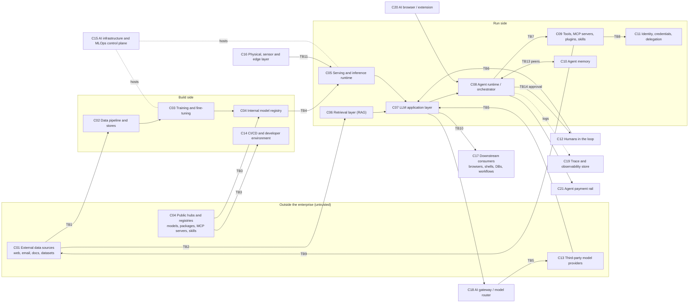

# AI threat model: published attacks, incidents, threat models and weakness enumerations

> **Preliminary report. Evidence, not decisions.** Every `DEC-*` it informs (DEC-001 object model, DEC-002 record shapes and ADR routing, DEC-003 risk scoring, DEC-008 CWE/NVD integration, DEC-009 generic-threat-to-product mapping) is open; nothing here selects a design. **This report is AI-generated** by a multi-agent workflow (DL-0011). Every threat statement, mapping and maturity rating in it, and every entry in [attack-catalog.yaml](attack-catalog.yaml), is a **hypothesis until a human reviews it** (ARCH-0001 section 2, R-018). Version 0.2.0 folds in the adversarial report review (DL-0011 step 5; see the Review log at the end); an AI review is not the human review R-018 requires. Sources are cited by S-id ([sources.md](sources.md)); incidents by INC-id ([incidents.md](incidents.md)); attack techniques by AIT-id ([attack-catalog.yaml](attack-catalog.yaml)). References are not yet `library/` records (#75).

**Companion files.** [dimensions.md](dimensions.md) (search axes) · [searches.md](searches.md) (query log) · [sources.md](sources.md) (1,181 deduplicated sources with summaries) · [incidents.md](incidents.md) (179 incidents) · [threat-models.md](threat-models.md) (127 published AI threat models and methods) · [enumerations.md](enumerations.md) (is there a CWE for AI; crosswalk; candidate local weaknesses) · [attack-catalog.yaml](attack-catalog.yaml) (146 attack techniques).

## Summary of findings

1. **The attack surface of an AI-enabled enterprise is mostly conventional security at AI-specific components, plus one genuinely new root cause.** Of the 179 incidents logged, the large in-the-wild groups are supply-chain compromise of AI artifacts and tooling, exposed and unauthenticated AI infrastructure, deepfake-enabled social engineering, and AI-assisted intrusion (incidents.md P4, P5, P7, P8). The new root cause is that LLMs take instructions and data on one channel (CWE-1427): any content a model reads can act as code over whatever the surrounding system lets the model do [S-0166]. From 2025, prompt injection plus an exfiltration or execution channel is the most frequently disclosed vulnerability class in shipped AI products: about 24 of the 36 vulnerabilities this log records as disclosed in 2025 involve prompt injection (20 name it in their attack class; 4 are memory, rules-file or self-configuration chains that start with one; the count rule and ids are in incidents.md P2). The log is a biased sample.
2. **Prompt-injection defenses at the model level do not hold against adaptive attackers; system-level controls do, within their policies.** Adaptive attacks bypassed 12 published jailbreak and prompt-injection defenses with success rates above 90% for most [S-0443], and 8 agent prompt-injection defenses above 50% [S-0486]. Architectures that keep untrusted data out of control flow (CaMeL [S-0388], FIDES [S-0386]) or check every tool call against a deterministic policy (Progent: attack success on AgentDojo from 39.9% to 1.0%, v3 paper section 1 [S-0463]) give guarantees that hold even when the model is fully hijacked, at a utility cost. Design rules (lethal trifecta [S-0820], Rule of Two [S-0808]) are cheap mechanical checks a threat-model generator can apply.
3. **Classical adversarial ML is mature in the lab and narrow in the wild.** Evasion, poisoning, backdoors, extraction and membership inference have a decade of strong results (sections 3.1-3.5). In-the-wild evidence concentrates where a model makes an identity decision (biometric checks, KYC) or learns from shared public data (Tay, VirusTotal); evasion of security classifiers is shown on production systems but the one in-the-wild case was caught by the rest of the system (INC-021), and the Pravda "LLM grooming" effect is claimed by NewsGuard and disputed by peer-reviewed analysis that attributes it to data voids [S-1151]. This run found **no public evidence** of in-the-wild poisoning of a production foundation model or of bit-flip attacks on deployed models. Two results nonetheless make poisoning a first-order threat to model builders: 250 documents sufficed to implant a low-stakes backdoor (a gibberish-output denial-of-service trigger) in models from 600M to 13B parameters regardless of corpus size [S-0466], and poisoning 0.01% of LAION-400M would have cost about US$60 [S-0231].
4. **AI artifacts are code.** Model files execute on load (pickle, Keras Lambda, `trust_remote_code`, Jinja chat templates), scanners are evaded, and hub names are hijackable (section 3.3). MalHug found 91 malicious models and 9 malicious dataset scripts in 705K models and 176K datasets [S-0355]; stealthy pickle variants evaded ten scanners and four hubs [S-0587]. Agent extensions repeat the pattern: 26.1% of 31,132 marketplace skills contain a vulnerability [S-0550], about 7.6% of scanned MCP servers have a high-severity finding after correcting for scanner precision (11.1% raw), and 40.6% of multi-version servers changed silently under the same name [S-0534]; what Koi Security reported as the first in-the-wild malicious MCP server appeared in September 2025 (INC-123).
5. **Agents turned prompt injection from a content problem into a privilege problem.** The decisive variable is not the model but the capability set: tools, credentials, egress and state change held in one context (section 3.11). Coding agents and CI agents are the highest-impact case: agents that can rewrite their own configuration or run with CI secrets produced disclosed RCE and secret-theft vulnerabilities across major vendors in 2025-2026 (INC-112, INC-154), and one such flaw was exploited to publish a malicious package (INC-141); and 496 exploitable agentic GitHub workflows were confirmed in one study [S-0637].
6. **AI as an attacker tool moved from assistance to orchestration.** Vendor and government reports describe agents used to orchestrate intrusions: one state-attributed campaign with a handful of successful intrusions (INC-120, Anthropic's attribution), one criminal campaign whose autonomous attempts all failed (INC-151), and one hybrid human-agent campaign by an unattributed actor (INC-155); plus malware that queries LLMs at runtime (INC-131) and AI services used as C2 (INC-101). Independent government evaluation estimates that the length of cyber tasks models complete unassisted doubles roughly every eight months, which AISI presents as an estimated upper bound [S-0796]. Attribution and autonomy figures are vendor claims.
7. **Many published AI threat models exist; none is complete for a company.** threat-models.md catalogs 127 models, methods, frameworks and tools. They split into five decomposition styles (lifecycle x capability; component or layer; asset x capability; capability-composition rules; attack sequences). Machine-readable forms are rare: the CoSAI Risk Map (YAML, Apache-2.0), the AWS Threat Composer GenAI example (JSON) and ATLAS were fetched; ATAG's MulVAL rules and the ATLAS-aligned executable rules are described in papers but no public artifact was retrieved. Asset models are the weakest part: only the AWS Threat Composer GenAI example mixes business and AI assets, as free text without a vocabulary; none covers compute spend or executive likeness.
8. **There is no CWE for AI in any useful sense, yet.** CWE 4.20 has four AI-specific weaknesses (1039, 1426, 1427, 1434) in view 1448; CWE 5.0 is targeted for October 2026. ATLAS (2026.09: 120 techniques, 88 sub-techniques, 40 mitigations, 73 case studies) is the attack enumeration but has no CWE linkage, and CAPEC has no AI patterns. In NVD, none of the 136 CVEs whose description contains the phrase "prompt injection" carries CWE-1427 (194 contain both words; in-house query, 2026-10-03). Most AI attack classes therefore have no weakness identifier at all (section 6; enumerations.md proposes 16 candidate local entries).
9. **Catalog ids drift fast enough to break mappings within a year.** ATLAS renumbered three techniques (2026.07) and renamed a tactic (2026.08); between v1.1 (2023) and 2025, OWASP changed the meaning of 9 of its 10 LLM ids, keeping only LLM01 (alias table in enumerations.md section 2.6). A 2023-era reference such as "LLM03 Training Data Poisoning" or "LLM10 Model Theft" mis-maps silently without the edition. Raw agent output carried deprecated ids in 39 fields. Every mapping must be stored with the catalog version, and every OWASP id with its year.
10. **Implication for tmodel (proposals only).** The evidence calls for AI-specific component and asset vocabularies, capability and trust-label edges that let a generator detect dangerous capability compositions, version-pinned catalog references, weakness nodes that are not limited to CWE, incident-evidence edges, attacker-capability preconditions calibrated to deployment reality, and an `intent` facet so provider-side and consumer-harm threats are not lost (section 7). DEC-001, DEC-002, DEC-003, DEC-008 and DEC-009 remain open.

## Method

**Run.** One workflow (DL-0011; run `wf_aeac1556-700`), 2026-10-02 to 2026-10-03:

1. **Six parallel dimension agents** searched (1) attacks on ML models, (2) LLM, RAG and agent attacks, (3) AI supply chain, infrastructure and AI-enabled offense, (4) incidents in the news, (5) weakness and attack enumerations, (6) published threat models ([dimensions.md](dimensions.md)). Each wrote structured source blocks: citation, how confirmed, cached PDF, attack classes, technical summary, threat-model mapping (*asset or component -> threat -> precondition -> impact*), catalog ids, confidence.
2. **An adversarial coverage reviewer** (fresh context, maximum effort) checked paper coverage against top-venue programs and citation ranks and spot-checked citations.
3. **Two gap-fill agents** closed the named gaps (USENIX Security 2026, IEEE S&P 2026, SaTML 2026, CCS 2025 via Crossref, ATLAS legacy case studies, national guidance) and verified or corrected suspect entries. Their Corrections sections were applied: one wrong arXiv id, two wrong CVEs on incidents, 39 deprecated ATLAS ids remapped, 40 duplicate works merged, a venue claim corrected, and confidence capped at medium on entries that contain details recalled from memory (107 raw blocks, 97 deduplicated sources; 112 after the v0.2 audit). No entry was rejected outright.
4. **Synthesis** (this agent) deduplicated 1,282 source blocks into 1,149 sources (1,181 after the v0.2 fold added 32, of which 11 split bundled works), built the incident log, the threat-model catalog, the enumeration survey and the attack-technique catalog, and wrote this report.
5. **Adversarial report review** (two lenses: threat completeness and mapping; evidence and citation rigor) produced 46 findings; the **fold** step (v0.2.0) applied or rejected each one after re-checking the facts it asserted (Review log).

**Verification standard.** A source is `high` confidence only when title, authors and venue were confirmed against a fetched record (arXiv API, Crossref, Semantic Scholar, publisher or venue page, NVD) and the summary came from the abstract or PDF. Any detail recalled from memory caps confidence at `medium`. Vendor attributions, victim counts and attack-success numbers are recorded as the reporter's claims. 285 sources have a cached PDF (outside every repo); sources.md records the filename and sha256 of each (computed in v0.2).

**Limits, stated plainly.**

- **Search was constrained.** The session's 200-call WebSearch budget was exhausted early on day one; all later agents, and the v0.2 fold, used direct APIs (arXiv, Crossref, NVD, CISA KEV, CWE, GitHub raw files) and known URLs ([searches.md](searches.md)). Discovery is therefore biased toward work the agents or the reviewer already knew, and toward arXiv. ACM DL and IEEE Xplore full text were not reachable; the CCS 2025 program could not be parsed; the USENIX Security 2026 page may be truncated.
- **News after 2026-08 and non-English sources are under-sampled.** Chinese, Japanese, Korean and Singaporean national guidance was partly captured from landing pages only.
- **Summaries are AI-written** from abstracts, landing pages and partial PDF reads. Quantitative claims flagged "from memory" in sources.md must be checked before reuse (#73).
- **Counts in catalogs were taken at fetch time.** The v0.1 conflicts are closed: the CoSAI Risk Map at commit 0d8bfc9b5d76 has 36 risks, 37 controls, 42 components and 10 personas (parsed 2026-10-03), and the SAIF risks page enumerates 15 risks (fetched 2026-10-03). Re-count at import anyway.
- **Maturity ratings are now derived mechanically** from the kinds of the incidents each technique cites (attack-catalog.yaml header), and **catalog mappings** were corrected in the v0.2 fold against ATLAS 2026.09, the NIST AI 100-2 PDF, the OWASP texts and CWE 4.20. Both remain candidate edges: the incident kinds and the mappings are still judgements.
- **Coverage is broad, not exhaustive.** arXiv alone publishes about 50 new prompt-injection papers a month in late 2026; this corpus samples representative and highly cited work per class.

## 1. Reference architecture of an AI-enabled enterprise system

A company threat model needs a place to put each attack. The reference architecture below is a working decomposition synthesized from the component models in SAIF and CoSAI [S-0780] [S-0900], BIML [S-0739], MAESTRO [S-0754], OWASP's agentic reference architecture [S-0760], MITRE SAFE-AI's four elements [S-0809] and the Trail of Bits YOLOv7 trust zones [S-0735]. It is a proposal for #74, not a decision on DEC-001. Component ids C01-C21 are used by `reference_components` in attack-catalog.yaml; C18-C21 and TB14 were added in v0.2 (AI gateway and router, trace store, AI browsers and extensions, agent payment rail; the agent-to-approver boundary).

**Components.** The right-hand column lists the catalog techniques whose `targeted_components` map to each reference component.

| id | component | examples | attack techniques that target it (AIT) |
|---|---|---|---|
| C01 | External data sources | public web, crawled corpora, partner feeds, public datasets, user uploads, email and documents arriving from outside | 8: AIT-013, AIT-014, AIT-021, AIT-086, AIT-090, AIT-129, AIT-132, AIT-135 |
| C02 | Data pipeline and data stores | ETL, labelling, data lake, dataset hub, feature stores | 4: AIT-011, AIT-012, AIT-013, AIT-043 |
| C03 | Training and fine-tuning pipeline | training cluster, fine-tuning service and API, RLHF/feedback, federated training, synthetic-data generation | 20: AIT-011, AIT-012, AIT-014, AIT-015, AIT-016, AIT-017, AIT-018, AIT-020, AIT-021, AIT-022, AIT-023, AIT-024, AIT-025, AIT-026, AIT-027, AIT-033, AIT-049, AIT-081, AIT-137, AIT-143 |
| C04 | Model registry and AI artifact supply chain | model hubs, internal registries, adapters, chat templates, ML libraries and packages, model scanners | 22: AIT-015, AIT-019, AIT-028, AIT-029, AIT-030, AIT-031, AIT-032, AIT-033, AIT-034, AIT-035, AIT-036, AIT-037, AIT-038, AIT-044, AIT-045, AIT-055, AIT-081, AIT-082, AIT-097, AIT-119, AIT-122, AIT-143 |
| C05 | Serving and inference runtime | inference servers and APIs, KV/prefix caches, GPUs, TEEs, edge runtimes | 36: AIT-001, AIT-002, AIT-003, AIT-007, AIT-008, AIT-009, AIT-025, AIT-026, AIT-027, AIT-028, AIT-031, AIT-034, AIT-040, AIT-044, AIT-046, AIT-047, AIT-048, AIT-049, AIT-052, AIT-053, AIT-054, AIT-055, AIT-057, AIT-058, AIT-059, AIT-060, AIT-061, AIT-062, AIT-068, AIT-069, AIT-078, AIT-079, AIT-080, AIT-089, AIT-112, AIT-137 |
| C06 | Retrieval layer (RAG) | ingestion, embedding model, vector store, search pipeline, GraphRAG, semantic cache | 15: AIT-042, AIT-046, AIT-050, AIT-051, AIT-064, AIT-065, AIT-084, AIT-086, AIT-087, AIT-088, AIT-089, AIT-090, AIT-108, AIT-133, AIT-134 |
| C07 | LLM application layer | prompt assembly, system prompt and configuration, guardrails, output rendering, chat UI, custom GPTs | 25: AIT-008, AIT-048, AIT-051, AIT-063, AIT-064, AIT-065, AIT-066, AIT-067, AIT-068, AIT-069, AIT-070, AIT-072, AIT-073, AIT-074, AIT-075, AIT-080, AIT-083, AIT-084, AIT-116, AIT-117, AIT-118, AIT-135, AIT-142, AIT-144, AIT-146 |
| C08 | Agent runtime and orchestrator | planner/executor loop, multi-agent orchestrator, coding, browser and computer-use agents | 38: AIT-006, AIT-019, AIT-020, AIT-038, AIT-064, AIT-067, AIT-068, AIT-070, AIT-071, AIT-091, AIT-092, AIT-093, AIT-094, AIT-095, AIT-096, AIT-098, AIT-100, AIT-101, AIT-102, AIT-103, AIT-104, AIT-105, AIT-106, AIT-107, AIT-108, AIT-109, AIT-110, AIT-111, AIT-114, AIT-115, AIT-130, AIT-131, AIT-133, AIT-134, AIT-136, AIT-138, AIT-139, AIT-140 |
| C09 | Tools, MCP servers, plugins and skills | tool registry, MCP servers and clients, connectors, skill marketplaces, A2A peers | 13: AIT-064, AIT-067, AIT-084, AIT-091, AIT-095, AIT-096, AIT-097, AIT-098, AIT-099, AIT-106, AIT-111, AIT-114, AIT-138 |
| C10 | Agent memory and session state | long-term memory, chat history, scratchpads | 3: AIT-071, AIT-102, AIT-103 |
| C11 | Identity, credentials and delegation | IAM, OAuth/agent tokens, service agents, API keys, secrets stores, non-human identities | 7: AIT-091, AIT-099, AIT-101, AIT-113, AIT-134, AIT-138, AIT-139 |
| C12 | Humans in the loop | end users, employees, approvers, executives, hiring and payment processes | 10: AIT-010, AIT-085, AIT-093, AIT-126, AIT-127, AIT-128, AIT-129, AIT-140, AIT-144, AIT-145 |
| C13 | Third-party model providers | hosted model APIs, fine-tuning APIs, reasoning-trace handling, provider-side retention and model updates | 17: AIT-016, AIT-053, AIT-054, AIT-073, AIT-074, AIT-075, AIT-076, AIT-077, AIT-085, AIT-111, AIT-113, AIT-124, AIT-135, AIT-141, AIT-142, AIT-144, AIT-146 |
| C14 | CI/CD and developer environment | repositories, GitHub Actions, developer workstations, AI CLIs and IDE agents | 13: AIT-028, AIT-032, AIT-037, AIT-045, AIT-082, AIT-092, AIT-100, AIT-110, AIT-123, AIT-124, AIT-125, AIT-131, AIT-145 |
| C15 | AI infrastructure and MLOps control plane | Ray, Kubeflow, MLflow, Langflow/Flowise/n8n, container hosts, cloud AI platforms, artifact storage | 8: AIT-039, AIT-041, AIT-042, AIT-055, AIT-101, AIT-113, AIT-121, AIT-122 |
| C16 | Physical, sensor and edge layer | cameras, LiDAR, microphones, vehicles, robots, mobile and on-device models | 8: AIT-004, AIT-005, AIT-006, AIT-010, AIT-056, AIT-057, AIT-062, AIT-136 |
| C17 | Downstream consumers | browsers rendering output, shells, databases, business workflows, security tooling acting on AI verdicts | 9: AIT-007, AIT-072, AIT-078, AIT-109, AIT-118, AIT-120, AIT-130, AIT-134, AIT-140 |
| C18 | AI gateway and model router (v0.2) | LiteLLM-style gateways holding every provider key, LLM routers choosing the model per query, budget enforcement | 3: AIT-037, AIT-113, AIT-146 |
| C19 | LLM observability and trace store (v0.2) | prompt and response logs, tool-call arguments and results, evaluation traces; often hold secrets and PII | 3: AIT-084, AIT-100, AIT-139 |
| C20 | AI browsers and browser extensions (v0.2) | agentic browsers, assistant side panels, AI extensions with page and session access | 3: AIT-100, AIT-102, AIT-104 |
| C21 | Agent payment rail (v0.2) | agent-initiated payments and checkout, mandates (for example Google AP2 Intent and Cart Mandates), payment APIs | 1: AIT-134 |

**Trust boundaries.** The boundaries that matter most for AI differ from the usual network and process boundaries in one respect: the **context window** of a model is a boundary that cannot enforce anything. Whatever crosses into it can steer the model, so the model inherits the trust level of the least-trusted content it reads (the MATA stance [S-0742]) and must be treated as an untrusted component [S-0769].

| id | boundary | what crosses it | representative attacks (AIT) | why it fails |
|---|---|---|---|---|
| TB1 | external data -> data pipeline / training | crawled pages, datasets, labels, preference data | AIT-013, AIT-014, AIT-017, AIT-018 | no content integrity binding; poison counts needed are near-constant, not proportional |
| TB2 | external content -> retrieval and context | web pages, emails, shared documents, tickets, logs | AIT-064, AIT-086, AIT-065 | the context window has no instruction/data separation |
| TB3 | public hub or registry -> enterprise | model files, adapters, templates, packages, MCP servers, skills | AIT-028, AIT-036, AIT-097, AIT-095 | artifacts execute or carry behaviour; names are mutable |
| TB4 | registry -> serving (deployment) | the exact artifact deployed after transformation | AIT-032, AIT-031, AIT-033 | behaviour is validated before, not after, transformation |
| TB5 | enterprise <-> third-party model provider | prompts, data, fine-tuning sets, API keys, provider-side model and instruction updates | AIT-085, AIT-113, AIT-054, AIT-141, AIT-142 | vendor-side risks can only be accepted or transferred [S-0739] |
| TB6 | user -> LLM application | prompts, uploads, images, audio | AIT-063, AIT-073, AIT-083 | safety training is not an access-control boundary |
| TB7 | model -> tools (decision to act) | tool calls and arguments | AIT-091, AIT-092, AIT-093 | the model chooses actions from attacker-influenced context |
| TB8 | tool -> credentials and delegated authority | OAuth tokens, API keys, service agents | AIT-101, AIT-100, AIT-099 | agents hold broad bearer credentials without attributable delegation |
| TB9 | agent -> outside world (egress) | URLs fetched, images rendered, emails sent, DNS | AIT-066, AIT-065 | rendering and fetch channels exfiltrate; allowlists are bypassed |
| TB10 | model output -> downstream interpreter | HTML, SQL, shell, templates, decisions | AIT-072, AIT-116 | output is trusted as if it were application code |
| TB11 | physical world -> sensors / edge | images, audio, LiDAR, signals | AIT-004, AIT-005 | perception has no provenance |
| TB12 | tenant <-> tenant on shared AI infrastructure | GPU memory, KV caches, containers, training jobs | AIT-041, AIT-058, AIT-059, AIT-061 | AI serving shares state for efficiency |
| TB13 | agent <-> agent, and agent <-> its memory | A2A messages, shared memory, delegated tasks | AIT-106, AIT-108, AIT-102 | peers' messages and stored memories are treated as instructions |
| TB14 | agent -> human approver (v0.2) | the action shown for approval, the approval returned | AIT-093, AIT-134, AIT-140 | what is displayed is not bound to what executes (LW-005); reviewers can be flooded |

## 2. Taxonomy of attacks by lifecycle stage

The catalog organizes 146 attack techniques by the lifecycle stage at which the attacker acts (`lifecycle_stage` in attack-catalog.yaml; the values are the ones requested for #72). v0.2 replaces the v0.1 three-level rating, which counted disclosed vulnerabilities and research demonstrations as "in the wild", with four levels derived mechanically from the kinds of the incidents each technique cites: **W** exploited or occurred in the wild (an ITW or TI incident, or an exploited CVE in CISA KEV; ACC incidents only for non-adversarial techniques); **P** demonstrated on a production system (RD or DV, a qualified ITW-Q report or a legal action); **R** research only; **T** theoretical. Each entry's `maturity_basis` lists the incidents that set it. The kinds are judgements, so the ratings are still hypotheses.

| lifecycle stage | techniques | in the wild (W) | production-demonstrated (P) | research only (R) | theoretical (T) | attack techniques (AIT id: name, maturity) |
|---|---|---|---|---|---|---|
| data | 4 | 1 | 2 | 1 | 0 | AIT-013 Web-scale dataset poisoning (split-view, frontrunning, expired domains) (P); AIT-043 Malicious dataset loading scripts and dataset-processing exploits (W); AIT-090 LLM grooming: mass publication to steer retrieval and training (P); AIT-133 AI-targeted cloaking (serving different content to AI crawlers/agents) (R) |
| training | 16 | 0 | 2 | 13 | 1 | AIT-011 Availability (indiscriminate) training-data poisoning (R); AIT-012 Targeted and clean-label poisoning (R); AIT-014 Pretraining-corpus poisoning with a near-constant number of documents (R); AIT-015 Backdoor (trojan) poisoning with input triggers (P); AIT-016 Undetectable (cryptographic) backdoors by a malicious trainer (T); AIT-017 Instruction-tuning and fine-tuning data poisoning (R); AIT-018 RLHF / preference-data poisoning (universal jailbreak backdoor) (R); AIT-019 Sleeper-agent backdoors that survive safety training (R); AIT-020 Poisoning code models to emit vulnerable or malicious code (R); AIT-021 Prompt-specific poisoning of text-to-image models (R); AIT-022 Federated-learning model poisoning and backdoors (R); AIT-023 Trait and poison propagation through synthetic data and distillation (R); AIT-024 Poisoning to amplify privacy leakage or extraction (R); AIT-025 Sponge poisoning (energy-latency via training) (R); AIT-026 Insider sabotage of training runs and pipelines (P); AIT-049 Gradient inversion in federated and split learning (R) |
| model-artifact | 13 | 3 | 3 | 7 | 0 | AIT-028 Malicious model files (pickle / Keras Lambda / joblib code execution on load) (W); AIT-029 Model-scanner evasion (broken pickles, ZIP flags, import gadgets) (W); AIT-030 Custom model code execution (trust_remote_code, repo-shipped Python) (P); AIT-031 Chat-template / GGUF metadata backdoors and template injection (P); AIT-032 Quantization- and compression-conditioned backdoors (R); AIT-033 Backdoored adapters (LoRA/PEFT) and model-merging attacks (R); AIT-034 Architectural backdoors in model code or graph (R); AIT-035 Model editing to implant false facts or triggers (ROME-style) (P); AIT-045 Steganographic malware embedded in model weights (R); AIT-081 Harmful fine-tuning to remove safety (open weights or fine-tuning APIs) (W); AIT-082 White-box safety removal (abliteration, pruning, neuron/gate attacks, decoding manipulation) (R); AIT-119 Model watermark and fingerprint removal (IP verification bypass) (R); AIT-137 Machine-unlearning failure and attacks (relearning, membership inference on unlearned models) (R) |
| supply-chain | 7 | 4 | 2 | 1 | 0 | AIT-036 Model-hub namespace reuse, typosquatting and organization confusion (P); AIT-037 ML framework and AI-tooling package compromise (dependency confusion, CI token theft) (W); AIT-038 Package hallucination squatting (slopsquatting) (P); AIT-095 Rules-file, context-file and agent-skill poisoning (W); AIT-097 Malicious and rug-pull MCP servers (silent drift) (W); AIT-110 Agentic workflow injection in CI/CD (issues and PRs into agents holding secrets) (W); AIT-143 Evaluation and benchmark manipulation (leaderboard gaming, evaluation contamination, sandbagging) (R) |
| deployment | 6 | 4 | 1 | 0 | 1 | AIT-027 Online-learning and feedback-loop poisoning (W); AIT-056 On-device / edge model extraction (P); AIT-117 Insider tampering with production system prompts and configuration (W); AIT-138 Shadow, orphaned and stale agents, MCP servers and non-human identities (T); AIT-141 Provider-side retention, secondary use, disclosure and indexing of prompts and outputs (W); AIT-142 Silent upstream model behaviour change, regression or retirement by a third-party provider (W) |
| inference | 44 | 6 | 12 | 26 | 0 | AIT-001 White-box adversarial example crafting (gradient-based) (P); AIT-002 Black-box query-based evasion (score- or decision-based) (P); AIT-003 Transfer attack via surrogate or proxy model (P); AIT-004 Physical-world adversarial perturbation (patch, sticker, object) (P); AIT-005 Sensor and signal injection (ultrasound, laser, LiDAR spoofing, projection) (R); AIT-006 Adversarial audio and hidden voice commands (R); AIT-007 Problem-space evasion of security classifiers (malware, phishing, fraud) (P); AIT-008 Adversarial text against NLP classifiers and moderation (R); AIT-009 Adversarial attacks on graph models and RL policies (R); AIT-010 Biometric presentation and camera-injection attacks (KYC, face ID) (W); AIT-046 Membership inference against models, fine-tunes and RAG stores (R); AIT-047 Model inversion and attribute inference (R); AIT-048 Training-data extraction from generative models (incl. divergence attacks) (R); AIT-050 Embedding inversion against vector stores (R); AIT-051 RAG datastore and knowledge-base extraction (R); AIT-052 Model extraction and functionality stealing via queries (P); AIT-053 LLM API parameter and architecture extraction (logit-bias, softmax bottleneck) (P); AIT-054 Distillation campaigns via fraudulent accounts (capability theft) (W); AIT-058 Serving side channels leaking prompts and responses (KV-cache, token length, MoE, speculative decoding) (R); AIT-063 Direct prompt injection (goal hijack by the user) (W); AIT-067 Hidden-instruction smuggling (Unicode tags, zero-width, white text, HTML comments) (P); AIT-068 Multimodal prompt injection (images, audio, image scaling, typography) (P); AIT-069 Special-token and chat-template role forgery (R); AIT-070 Optimization-based and learned prompt injection triggers (R); AIT-073 Manual jailbreaks (role-play, persona, competing objectives, obfuscation) (W); AIT-074 Optimization-based jailbreaks (adversarial suffixes, LLM-as-attacker, fuzzing) (P); AIT-075 Multi-turn escalation and context-poisoning jailbreaks (R); AIT-076 Many-shot and long-context in-context jailbreaks (R); AIT-077 Best-of-N random-augmentation jailbreaks (pass@k attacker) (R); AIT-078 Reasoning / chain-of-thought hijack and monitor evasion (R); AIT-079 Multimodal jailbreaks (visual adversarial images, typographic prompts, audio) (R); AIT-080 Text-to-image safety filter and concept-removal bypass (R); AIT-083 System-prompt and configuration extraction (P); AIT-084 Sensitive data disclosure from context, connectors and over-broad retrieval (P); AIT-089 Prompt/response and semantic cache poisoning (R); AIT-112 LLM inference-cost and latency attacks (sponge prompts, overthinking, infinite reasoning) (R); AIT-116 Hallucination and misinformation acted upon (deployer liability) (W); AIT-118 Watermark and AI-content detector removal or spoofing (R); AIT-120 Perceptual-hash collisions against client-side scanning (R); AIT-132 Agentic scraping and content theft bypassing bot defenses (R); AIT-135 LLM-enabled personal-attribute inference and deanonymization (R); AIT-136 Jailbreak and prompt injection of embodied and robotic agents causing physical harm (R); AIT-144 Consumer-facing safety failures with legal exposure (self-harm encouragement, non-consensual or child sexual imagery) (W); AIT-146 LLM router and model-routing manipulation (confounder gadgets, route hijacking) (R) |
| agent-runtime | 33 | 6 | 17 | 8 | 2 | AIT-064 Indirect prompt injection through retrieved or processed content (P); AIT-065 Zero-click exfiltration from enterprise copilots (email/doc-borne injection + rendering channel) (P); AIT-066 Exfiltration via rendered markdown images, links and unfurling (P); AIT-071 Triggered, delayed and dormant prompt injections (P); AIT-072 Prompt injection to classic sinks (XSS, SQLi, SSTI, SSRF, command injection) via model output (P); AIT-086 RAG knowledge-base poisoning (targeted answer manipulation) (P); AIT-087 Retriever backdoors, adversarial SEO and hubness attacks on retrieval (R); AIT-088 RAG jamming and knowledge isolation (availability) (R); AIT-091 Agent tool-call hijacking (confused deputy with the user's privileges) (P); AIT-092 Coding-agent prompt injection to remote code execution (P); AIT-093 Human-approval bypass and approval laundering (P); AIT-094 Agent configuration tampering and self-modification (P); AIT-096 MCP / tool-description poisoning and line jumping (P); AIT-098 Tool-selection hijacking and preference manipulation (R); AIT-099 Agent-protocol authorization flaws (token passthrough, confused deputy, SSRF via OAuth metadata) (P); AIT-100 Credential harvesting from agent configs, runtimes and AI clients (W); AIT-101 Over-privileged agent identities and delegation abuse (W); AIT-102 Agent memory poisoning (persistent instructions, cross-user contamination) (W); AIT-103 Agent memory and chat-history extraction (R); AIT-104 Browser and computer-use agent hijacking (pop-ups, environmental injection, clickjacking, ClickFix) (P); AIT-105 Mobile-agent injection via accessibility metadata and app content (R); AIT-106 Inter-agent injection, agent-in-the-middle and session smuggling (P); AIT-107 Multi-agent orchestrator control-flow hijacking to code execution (R); AIT-108 Self-replicating prompts and AI worms (P); AIT-109 Multi-agent collusion and steganographic covert channels (R); AIT-111 Agent denial of service and denial of wallet (loops, persistent billable state) (R); AIT-114 Excessive agency and unsafe autonomy (non-adversarial destructive actions) (W); AIT-115 Rogue or misaligned agent behaviour (insider-like actions, sandbox escape, specification gaming) (W); AIT-125 Living off installed AI agents and CLIs (malware tasks local agents) (W); AIT-130 Prompt injection against AI-driven security tooling (SOC, malware analysis, AIOps, LLM-as-judge) (P); AIT-134 Agent-initiated payment and transaction manipulation (payment-detail substitution, unauthorized transfers, mandate abuse) (P); AIT-139 Repudiation and insufficient audit of agent actions (T); AIT-140 Flooding human reviewers and approval fatigue (T) |
| infrastructure | 13 | 5 | 2 | 6 | 0 | AIT-039 Exploitation of exposed MLOps and AI workflow platforms (Ray, MLflow, ClearML, Langflow, Flowise) (W); AIT-040 Inference-server and runtime exploitation (Triton, vLLM, Ollama) (P); AIT-041 AI platform tenant isolation failure (malicious model or training job escapes) (P); AIT-042 Exposed AI data and artifact stores (buckets, registries, vector DBs, databases) (W); AIT-044 Covert integrity attacks via RNG, compilers or hardware trojans in the ML stack (R); AIT-055 Model-weight exfiltration by intrusion or insider (W); AIT-057 Hardware side-channel model and architecture extraction (cache, EM, PCIe, GPU, timing) (R); AIT-059 GPU memory remanence and cross-process leakage (R); AIT-060 Breaking confidential-computing TEEs protecting AI workloads (R); AIT-061 Rowhammer / bit-flip attacks on model weights in memory (R); AIT-062 Physical fault injection (laser, voltage) on DNN execution (R); AIT-113 LLMjacking: stolen keys and credentials to resell or abuse hosted models (W); AIT-124 AI services abused as command-and-control or relay channels (W) |
| human | 10 | 9 | 1 | 0 | 0 | AIT-085 Employee disclosure of sensitive data to third-party AI (shadow AI) (W); AIT-121 AI-orchestrated autonomous intrusion (agentic recon, exploitation, exfiltration) (W); AIT-122 AI-accelerated vulnerability discovery and exploit development (W); AIT-123 LLM-querying and self-modifying malware (W); AIT-126 AI-automated spear phishing and social engineering at scale (W); AIT-127 Deepfake voice/video executive impersonation and vishing (W); AIT-128 Synthetic-identity hiring infiltration (AI-enhanced fake workers) (W); AIT-129 AI-generated influence operations and election deepfakes (W); AIT-131 AI-generated insecure code entering production (vibe coding) (P); AIT-145 AI-themed lures and trojanized AI tools as initial access (W) |
| **total** | 146 | 38 | 42 | 62 | 4 | W = exploited or occurred in the wild; P = demonstrated on a production system; R = research only; T = theoretical |

Three observations. First, the agent-runtime stage has the most production-demonstrated techniques (17 of 33) but only 6 in the wild: most agent evidence is disclosed vulnerabilities in shipped products, not exploitation, so current risk there is high-likelihood but largely pre-exploitation (v0.1 reported 18 of 30 in the wild by counting disclosures). Second, training-time attacks are research-demonstrated (13 of 16 research, 2 on production systems, none in the wild): severe and cheap in principle, rarely observed, partly because they are hard to detect and attribute. Third, 9 of 10 human-stage techniques (AI-enabled offense, deepfakes, shadow AI, AI-tool lures) are in the wild; the exception is AI-generated insecure code (AIT-131), shown only through disclosed vulnerabilities (INC-137, INC-172). These threats do not depend on the target using AI, only on the attacker or the target's employees using it.

## 3. Attack classes: state of the art, evidence and maturity

Each subsection gives the mechanism, the key results, the in-the-wild evidence, the maturity, and what a threat model should carry. Numbers are as reported by the cited sources; figures the agents flagged as recalled from memory are marked. Bare OWASP LLM ids in this section are the 2025 edition.

### 3.1 Evasion and adversarial examples (predictive models)

**State of the art.** Small, often imperceptible input perturbations cause misclassification and transfer across models [S-0003] [S-0006]. Strong white-box optimization attacks [S-0015] [S-0044] broke defensive distillation and set the norm that defenses must be evaluated adaptively; obfuscated-gradient defenses fell to BPDA and EOT [S-0032], and 13 defenses claimed robust were circumvented [S-0103]. Black-box attacks need only scores or labels [S-0018] [S-0034] [S-0078], or a surrogate for transfer [S-0026]. Physical attacks survive printing and viewpoint (stop-sign stickers [S-0038], adversarial eyeglasses [S-0012], 3D objects against camera-LiDAR fusion [S-0112]); signal-injection attacks reach voice and perception systems through ultrasound, light and projection [S-0029] [S-0102] [S-0095]. For security classifiers, attacks must work in the problem space, on real binaries that still run [S-0098]; a 2025 study of Gmail's pipeline showed that changing 13 bytes evades the open-sourced Magika routing model in 90% of cases, turning a component evasion into system-level malware delivery; after the authors' defense was deployed in production, a highly resourced adversary needed 50 bytes for a 20% success rate [S-0444].

**In the wild.** Real attackers use cheap, manual, problem-space evasion rather than gradients [S-0685]; in the one coded case (INC-021, ATLAS AML.CS0032) logo edits evaded a commercial visual-similarity model but the rest of the system still flagged the sites. Biometric and KYC bypass for fraud is in the wild (INC-018, INC-008, INC-067; and an iProov exercise injecting live face swaps into mobile KYC, INC-163). ATLAS exercises against commercial AV, email and NIDS detectors (INC-004, INC-006, INC-020) and research demonstrations on production vehicles (INC-003, INC-012) are production demonstrations.

**Maturity.** In the wild where a model gates identity (KYC, biometrics); demonstrated on production systems for security classifiers and vehicles; otherwise research. Certified defenses (randomized smoothing [S-0060]) bound small perturbations only.

**For the threat model.** Weight attacker capability realistically: black-box and manual for most enterprise deployments [S-0740]; treat open-sourced or on-device model components as white-box surrogates for the production system. Relevant only where an ML model makes a security, identity, safety or financial decision. AIT: AIT-001 to AIT-010. Catalog anchors: AML.T0015/T0043, CWE-1039, NISTAML.022/.025, OWASP ML01.

### 3.2 Data poisoning and backdoors

**State of the art.** Poisoning ranges from availability attacks on classical learners [S-0001] through clean-label targeted poisons that pass label audits [S-0046] [S-0116] to trigger backdoors [S-0019] [S-0017] (surveys [S-0680] [S-0687]). For foundation models the economics changed: split-view poisoning of URL-indexed datasets via expired domains and frontrunning of Wikipedia snapshots are practical for tens of dollars [S-0231]; 250 poisoned documents backdoored models across a 20x range of clean data [S-0466] (tested on low-stakes denial-of-service triggers); 0.1% pretraining poison persists through SFT and DPO for three of four attack objectives (denial of service persists at 0.001%) [S-0352]; replacing 0.001% of tokens with medical misinformation produced harmful models that pass standard benchmarks [S-0366]; larger models learn poisoned behaviour faster [S-0372]. Instruction-tuning poisoning needs about 100 examples [S-0204]; malicious RLHF annotators can implant a universal jailbreak trigger [S-0305]. Backdoors persist through safety training, and adversarial training can teach concealment [S-0270]; cryptographic backdoors are undetectable by any bounded observer [S-0143]. New propagation paths run through synthetic data and distillation: traits transfer through semantically unrelated teacher outputs [S-0384] and poisons through synthetic-data pipelines [S-0425]. Federated learning adds client-side model poisoning that bypasses Byzantine-robust aggregation [S-0053] [S-0128], though realistic production FL settings limit impact [S-0152].

**In the wild.** Online-learning and shared-corpus poisoning (INC-001, INC-007). Claimed but qualified: web-scale retrieval and training-data grooming for propaganda (INC-083; NewsGuard's claim is disputed by a peer-reviewed study that finds data voids, not grooming [S-1151]) and insider training sabotage (INC-066; press headlines only, no ByteDance statement or filing captured, so AIT-026 is rated P). No public in-the-wild case of a backdoored foundation model used against a victim was found.

**Maturity.** Research-demonstrated with strong, recent, scale-relevant results; in the wild only for online-learning and shared-corpus poisoning. Detection (Neural Cleanse, STRIP, MNTD, BAIT [S-0461]) is partial, and data-free detection on pretrained models has pitfalls [S-0665].

**For the threat model.** Poisoning threatens the **model builder** (any company that pretrains, fine-tunes, distills or runs RAG over third-party data) and, through provenance, every **model consumer**. Preconditions should record the attacker's write path to the data (crawl, contributor, annotator, insider) and the number of samples, not a percentage. Controls are provenance and integrity of data (candidate weakness LW-001), behavioural testing of the deployed artifact, and trusted training. AIT: AIT-011 to AIT-027. Anchors: AML.T0020/T0018/T0115.000, OWASP LLM04, ML02/ML10, NISTAML.013/.023/.037, EU AI Act Art. 15(5). No CWE.

### 3.3 Model-artifact and AI supply-chain attacks

**State of the art.** Serialized models are programs. Pickle-based PyTorch, joblib, Keras Lambda layers and dataset loading scripts execute on load [S-0355] [S-0234] [S-1089]; "safe" modes have been bypassed ([S-1098], [S-1100]) and frameworks push the risk onto users [S-0511]. Scanners are evaded by broken pickles, ZIP flag bits and import gadgets ([S-1051], [S-1099], [S-0587], [S-0551]); allowlist-based loading (PickleBall: loads 79.8% of benign pickle models, rejects all malicious samples in its set [S-0411]) is the principled fix. `trust_remote_code` makes custom model code a normal loading path across five hubs [S-0603]. Behaviour can hide outside the weights' visible function: in chat templates that run on every inference (triggered backdoors cut factual accuracy from 90% to 15% and inject attacker URLs in over 80% of triggered cases [S-0517]), in quantization (benign at full precision, malicious once quantized [S-0252]), in LoRA adapters and model merges [S-0433] [S-0348], in architecture code [S-0417], and in model edits [S-0976]. Names are an attack surface: deleted-author namespaces can be re-registered (RCE on Vertex AI Model Garden and Azure AI Foundry [S-1061]), organizations impersonated [S-0979], and leaderboards gamed to distribute poisoned models [S-0628] (title-level confirmation only). Code LLMs hallucinate package names repeatably (at least 5.2% for commercial and 21.7% for open models; 205,474 unique names) [S-0468], enabling slopsquatting. Agent extensions are the newest supply chain: skills [S-0550] [S-0515], MCP servers [S-0534] [S-0400], rules files [S-1046]. Surveys: [S-0708], [S-0694].

**In the wild.** Malicious hub models (INC-046, INC-079), ML dependency and CI compromises (INC-023, INC-071, INC-100, INC-118, INC-145), malicious MCP server and skills (INC-123, INC-138). Production demonstrations: hallucinated-package registration (INC-050), namespace reuse (INC-122), Colab notebooks that run arbitrary code (INC-159) and pickle over sockets in Llama Stack (INC-171).

**Maturity.** In the wild for code execution, package and extension compromise; research for behaviour-level backdoors in templates, quantization and adapters.

**For the threat model.** Treat every AI artifact load as code execution unless the format is data-only and the loader enforces it; record artifact identity as an immutable digest (candidate LW-002) and validate behaviour after every transformation (LW-003). AI BOMs ([S-0827], [S-0840], [S-0847]) and model signing ([S-0962]) are the provenance controls. AIT: AIT-028 to AIT-045, AIT-095, AIT-097. Anchors: AML.T0010/T0011.000/T0115, OWASP LLM03, ASI04, ML06, CWE-502/94/829, NISTAML.05.

### 3.4 Privacy attacks on models and retrieval

**State of the art.** Membership inference began with shadow models against ML-as-a-service [S-0027] and matured into calibrated likelihood-ratio attacks [S-0139] [S-0342]. For pretrained LLMs the measured risk is lower than often claimed: MIAs barely beat chance on large, few-epoch corpora [S-0251], and "blind" baselines that never query the model beat published MIAs on eight evaluation datasets [S-0387] (see also [S-0696]). Risk is higher for fine-tuned models, duplicated data and RAG stores ([S-0368], [S-0376]). Training-data extraction is the stronger threat: verbatim PII, code and keys from GPT-2 [S-0113], gigabytes from open and closed models including a divergence attack on aligned ChatGPT that emitted training data 150x more often than normal behaviour [S-0189], hard-coded credentials from code assistants [S-0269], and fine-tuning data from fine-tuned models [S-0422]. Model inversion recovers sensitive attributes [S-0004]; separately, LLMs infer personal attributes from text people write [S-0319] and deanonymize online accounts at scale [S-0540] (AIT-135, new in v0.2). Unlearning is not erasure: relearning and adaptive attacks recover "unlearned" knowledge, and unlearning can itself leak membership [S-0114] [S-0406] [S-0436] [S-0401] (AIT-137). Embeddings are near-plaintext: Vec2Text recovers 92% of 32-token inputs exactly [S-0188]. RAG stores leak through the application [S-0344] [S-0452] and can be crawled adaptively [S-0657] (SoK: [S-0712]). Gradient inversion reconstructs federated clients' data [S-0077] [S-0085], with practical limits disputed [S-0474]. Contextual privacy failures in agents leak data the user never meant to share [S-0295] [S-0315].

**In the wild.** Mostly through the application rather than the model: over-broad retrieval and stale caches (INC-081), cross-tenant MCP logic flaws (INC-097), shadow AI (INC-027), and system-prompt and knowledge-file leakage in custom GPTs (97.2% prompt and 100% file extraction across 200+ GPTs [S-0212]).

**Maturity.** Extraction and application-level leakage are demonstrated in the wild; MIA and inversion are research, with real but frequently overstated risk.

**For the threat model.** The asset is the sensitive data inside training sets, fine-tunes, RAG stores and embeddings (A01, A05, A07); embeddings and vector stores should be classified like the text they encode. Weight MIA claims by evaluation quality. AIT: AIT-046 to AIT-051, AIT-084, AIT-085, AIT-135, AIT-137. Anchors: AML.T0024/T0057, OWASP LLM02/LLM08, NISTAML.03 (leaves .031-.039), ML03/ML04.

### 3.5 Model theft: extraction, distillation and weight exfiltration

**State of the art.** Prediction APIs leak models through equation solving and path finding [S-0013], functionality stealing [S-0068], high-fidelity and cryptanalytic extraction [S-0089] [S-0081] (survey [S-0690]). Production LLM APIs leaked their final projection layer and hidden dimension via logit bias and logprobs: under US$20 for the full matrix of OpenAI's Ada and Babbage, with an estimated under US$2,000 for gpt-3.5-turbo, whose hidden dimension was recovered [S-0232] [S-0255] (INC-178); vendors changed their APIs. Encrypted reasoning blobs proved interchangeable across models of the same provider, defeating anti-distillation [S-0581]. Query-pattern defenses assume a single client and fall to distributed queries [S-0598]. Imitation recovers style more than capability [S-0167]. Weight theft by intrusion or insider is analysed in RAND's ~38 attack vectors against five attacker capacity tiers and five security levels [S-0793], which frontier frameworks adopt [S-0805] [S-0798] and EU rules require for systemic-risk models [S-0851]. Side channels extract architecture or weights from caches, EM emanations, PCIe and GPUs (section 3.6).

**In the wild.** Distillation at scale (16M+ exchanges through about 24,000 fraudulent accounts, vendor-reported) (INC-142); weight leak by an authorized recipient (INC-028); on-device extraction (INC-082); exposed registries with pullable models (INC-038).

**For the threat model.** Asset A02 needs an owner-specific value and an attacker-tier model (RAND OC1-OC5) rather than a single likelihood. API features (logprobs, logit bias, reasoning traces) are part of the attack surface (candidate LW-012). AIT: AIT-052 to AIT-056. Anchors: AML.T0024.002/T0048.004, OWASP LLM10, ML05, NISTAML.031.

### 3.6 Hardware, side-channel and fault attacks on AI infrastructure

**State of the art.** *Leakage:* GPU local memory was not cleared between kernels on several vendors' GPUs, leaking about 181 MB per query from a 7B model in llama.cpp to a co-resident process [S-0318]; shared KV and prefix caches leak other users' prompts token by token through timing [S-0480] [S-0465] [S-0358], as do MoE routing [S-0338] [S-0390], speculative decoding [S-0324], prompt caching in public APIs [S-0398] and non-prefix KV fusion in RAG serving [S-0627]. On the network, token-length side channels reconstruct 29% of streamed responses [S-0325] and packet timing classifies prompt topics at over 98% AUPRC across 28 LLMs [S-0440]. *Extraction:* cache, EM, PCIe and GPU side channels recover architectures and weights [S-0106] [S-0136] [S-0266] [S-0526] [S-0150]. *Faults:* a single bit flip in an exponent can destroy accuracy [S-0062]; one flip can implant a backdoor in a full-precision model (up to 99.9% success) [S-0424]; at most 25 flips remove an LLM's refusal behaviour for every user of the instance [S-0241]; Rowhammer now works on GDDR6 and ECC-protected GPUs [S-0428] [S-0548] and can escalate privilege on GPUs [S-0547]. *TEEs:* a sub-US$50 DDR4 interposer breaks Intel Scalable SGX and AMD SEV-SNP [S-0509]; DDR5 bus interposition breaks Intel TDX and SGX and AMD SEV-SNP and lets an attacker borrow attestations to subvert NVIDIA GPU confidential computing [S-0506].

**In the wild.** None found for any of these. **Maturity:** research-demonstrated, several with low-cost hardware.

**For the threat model.** These matter for multi-tenant serving and for confidential-AI claims. Neither ATLAS nor NIST AI 100-2 has a dedicated id for hardware faults or serving side channels: NIST names EM side channels and Rowhammer only as model-extraction methods under NISTAML.031 (section 2.4.4), and NISTAML.026 covers fault-induced weight changes only by extension; CoSAI's side-channel risk is unmapped. CWE does fit: CWE-1256 (Rowhammer bit flips), CWE-1261, CWE-1247, CWE-1319, CWE-1332 and CWE-208 (enumerations.md gap 7). Controls are tenant isolation of caches and GPUs (ANSSI R16-R17 [S-0836]), ECC, padding and batching of streamed tokens. AIT: AIT-057 to AIT-062, AIT-058. Candidate weaknesses LW-010, LW-011, LW-016.

### 3.7 AI infrastructure and platform exploitation

**State of the art and evidence.** The MLOps and AI-workflow layer ships with weak defaults: Ray's job API is unauthenticated by design (INC-036, with thousands of clusters compromised over about seven months and a disputed CVE that scanners ignored), Kubeflow dashboards were exposed (INC-017), and agent builders accept code (INC-089 in CISA KEV, INC-149 CVSS 10, both exploited). Inference servers carry RCE chains (INC-109, INC-088, INC-057, INC-171). Exposure is large: a 2025-09 Shodan snapshot found 1,100+ exposed Ollama servers [S-1043], and SentinelLabs with Censys observed 175,108 unique exposed Ollama hosts in 130 countries over 293 days to 2026-03, 48% advertising tool calling, which turns an exposed endpoint into a code-execution and resale path [S-1150]. Workflow platforms are now exploited at scale: n8n CVE-2025-68613 is in CISA KEV (INC-175), and CVE-2026-21858 rates CVSS 10 (INC-177). Multi-tenant AI platforms failed isolation repeatedly in research: malicious models escaped Hugging Face Inference and Replicate tenants, and SAP AI Core training jobs reached cluster-admin (INC-051, INC-054, INC-061); the NVIDIA Container Toolkit allowed container escape on GPU hosts (INC-065). Data stores leak: a 38 TB SAS-token exposure (INC-037), DeepSeek's open ClickHouse (INC-074), 1.5M agent tokens at Moltbook (INC-137), ~30 open vector databases [S-0987]. The July 2026 Hugging Face intrusion chained dataset-processing RCE (HDF5 external storage, an fsspec Jinja template) with cloud-identity pivots (INC-156).

**For the threat model.** These are conventional weaknesses (CWE-306, 22, 502, 668, 732) on AI-specific components (C15, C05, C06); a generator should instantiate them from the component inventory and attach AI-specific impact (model theft, data poisoning, compute hijack). AIT: AIT-039 to AIT-043, AIT-055.

### 3.8 Prompt injection and improper output handling

**State of the art.** Direct prompt injection ("ignore previous instructions") was named in 2022 [S-0973] [S-0149] and generalized to LLM-integrated applications [S-0182] and to a formal model (target instruction, target data, injected instruction, injected data, separator) with a benchmark of attacks and defenses [S-0291]. Indirect prompt injection places instructions in content the application retrieves, making retrieved data equivalent to code over the application's capabilities [S-0166] [S-0210]. A web-scale census found 15.3K validated injections on 11.7K pages, about 70% in non-rendered HTML, with up to 8% compliance by smaller models [S-0533]. Payloads hide in invisible Unicode, white text and HTML comments [S-0994] [S-0590], in images that appear only after downscaling [S-1057], in audio [S-0609], in physical signage read by robots [S-0593], and in reserved chat-template tokens [S-0661] [S-0615]. Optimization learns transferable triggers [S-0301] [S-0288], including via a fine-tuning API's loss signal [S-0420]. The damage comes from what the model's output reaches: markdown images and links exfiltrate data [S-0978], and output flows into XSS, SQLi, SSTI, SSRF and command injection [S-0635] [S-0292] (CWE-1426). Taxonomies and schemas: [S-0308], [S-0865], [S-0825], [S-0821] (21 of 36 cases span four or more kill-chain stages).

**Defenses.** Prompt-level marking (spotlighting cut success from over 50% to under 2% on 2023 models [S-0265]; see RPT-0009 section 2.1), trained separation (StruQ [S-0382], SecAlign [S-0380], instruction hierarchy [S-0321]), detectors (TaskTracker [S-0221], DataSentinel [S-0432]) and vendor layered defenses ([S-1024], [S-1053]) all raise attack cost but are bypassed adaptively [S-0443] [S-0486]. Models do not reliably separate instructions from data [S-0494]. System-level designs (section 3.11) are the only controls with guarantees.

**In the wild.** The dominant disclosed-vulnerability class of 2023-2026 (incidents.md P2): INC-093, INC-128, INC-125, INC-134, INC-121, INC-158, INC-113 and others, almost all disclosures rather than exploitation (P); direct injection against public chatbots is in the wild (INC-040, INC-042). ATLAS exercises add MathGPT prompt-to-code execution (INC-160) and ChatGPT conversation exfiltration through markdown images (INC-161).

**For the threat model.** Every path from attacker-writable content into any model context (TB2, TB6) is an injection channel; the impact is the union of the model's downstream capabilities (TB7-TB10). AIT: AIT-063 to AIT-072. Anchors: CWE-1427/1426, AML.T0051/T0077, OWASP LLM01/LLM05, ASI01, NISTAML.015/.018/.039.

### 3.9 Jailbreaks and safety removal

**State of the art.** Safety training fails through competing objectives and mismatched generalization [S-0207]; in-the-wild jailbreak prompts were catalogued at scale [S-0201]. Attacks now include optimized adversarial suffixes that transfer to closed models [S-0220], attacker LLMs (PAIR, TAP) [S-0160] [S-0186], fuzzing and genetic search [S-0213] [S-0181], simple adaptive attacks reaching 100% on many frontier models using logprobs or prefill [S-0225], multi-turn escalation [S-0310], many-shot in-context attacks following a power law in shots [S-0226], and Best-of-N random augmentation (89% on GPT-4o and 78% on Claude 3.5 Sonnet at N=10,000) [S-0271]. Multimodal inputs bypass text alignment [S-0304] [S-0165]; reasoning models can be steered through their chain of thought [S-0419]. With weights or a fine-tuning API, safety is removable: 10 examples for under US$0.20 through OpenAI's fine-tuning API (stated in the arXiv abstract) [S-0303], a single refusal direction [S-0227], safety only a few tokens deep [S-0451], and narrow fine-tuning causing broad misalignment [S-0370]. Defenses: constitutional classifiers resisted universal jailbreaks over 3,000 estimated red-team hours at +0.38% refusals and 23.7% inference overhead [S-0460], which raised attack cost, but in a seven-day public challenge (2025-02-03 to 02-10) four participants cleared all eight levels and one universal jailbreak was found [S-1152]; circuit breakers [S-0360] were later bypassed by Best-of-N; evaluation quality matters [S-0928] [S-0926] [S-0722].

**In the wild.** Brand-damaging chatbot jailbreaks (INC-042), resale of guardrail-bypassed access (INC-070), jailbreaks enabling intrusion support (INC-143), and 212 real malicious LLM services built on uncensored open models and jailbreak prompts (INC-179, [S-0287]), which puts harmful fine-tuning (AIT-081) in the wild; white-box safety removal such as abliteration (AIT-082) has no incident attributed to it and stays research. Jailbreaks of embodied agents that cause physical actions are shown in research [S-0307] [S-0593] (AIT-136).

**For the threat model.** For a deploying company, jailbreaks matter as (a) misuse of the company's AI by its users (A13 reputational, legal) and (b) the privilege-escalation step of a promptware chain. Model-internal safety must not be treated as an access-control boundary (candidate LW-014). AIT: AIT-073 to AIT-082, AIT-136. Anchors: AML.T0054, OWASP LLM01, NISTAML.018/.04. No CWE.

### 3.10 RAG and retrieval attacks

**State of the art.** Five injected texts per target question reached 90% attack success in databases of millions of documents [S-0493]; adversarial passages poison dense retrieval [S-0218]; single-document triggers [S-0236] [S-0333], backdoored retrievers [S-0240], adversarial SEO and hubness [S-0374] [S-0606] [S-0446], opinion manipulation [S-0373], GraphRAG relation poisoning [S-0546], jamming [S-0458] and semantic-cache poisoning [S-0575]. Enterprise copilots confuse poisoned documents with authority [S-0309]. Defenses: certifiably robust aggregation [S-0650] and attribution or traceback ([S-0608], [S-0624]). Formal threat model: [S-0748].

**In the wild.** Untrusted retrieval in production search (INC-055, non-adversarial), propaganda targeting retrieval (INC-083, disputed), and RAG as the carrier in most zero-click copilot exfiltration chains (section 3.8). On production: a retrieved email swapped the attacker's bank details into M365 Copilot's answer for a wire transfer (INC-162, ATLAS AML.CS0026), the case that links RAG poisoning to financial assets.

**For the threat model.** Every writer to an indexed source is a potential attacker against every reader of the RAG application; the asset is both the knowledge base (A05) and the decisions it informs (A12). AIT: AIT-086 to AIT-090. Anchors: AML.T0070/T0071/T0066, OWASP LLM08, ASI06. No CWE (a related submission is in the CWE AI WG pipeline).

### 3.11 Agent hijacking, tools and MCP, memory, computer-use agents

**State of the art.** Agent benchmarks show injected tool output hijacking agents across email, banking and travel tasks (AgentDojo: 97 tasks, 629 security cases [S-0244]; InjecAgent [S-0345]; ASB [S-0347]). Web and computer-use agents are hijacked by pop-ups (86% ASR) [S-0490], hidden form fields (up to 70% PII theft) [S-0426], dark patterns [S-0514] and low-effort human-written injections (partial success up to 86%, "security by incompetence") [S-0934]; agentic browsers undo site isolation [S-0618]; mobile agents trust accessibility trees [S-0508] (SoK [S-0703]). Tools are a channel and a supply chain: tool-description poisoning, rug pulls and cross-server shadowing [S-1031], pre-invocation "line jumping" [S-1058], up to 72.8% ASR (o1-mini) among 20 agents on 45 live MCP servers and 353 tools, where even the most-refusing model (Claude-3.7-Sonnet) refused under 3% [S-0941], tool-selection hijacking [S-0577], and chaining of legitimate tools for exfiltration [S-0667] [S-0454]. Memory makes injection persistent: query-only memory injection that poisons other users [S-0392], memory/RAG backdoors above 80% ASR at under 0.1% poison [S-0237], poisoned experiences [S-0469], persistent control of self-evolving agents [S-0656]. Approval is only as strong as its binding to execution (six laundering classes) [S-0638] [S-0427]. Agents also fail without an attacker (unsafe actions [S-0196]) and act as insiders under goal conflict [S-1009].

**Defenses with guarantees.** Dual-LLM and design patterns [S-0787] [S-0799], capability and information-flow control (CaMeL: 77% of AgentDojo tasks with provable security vs 84% undefended [S-0388]; FIDES [S-0386]), deterministic tool-call policies [S-0463], execution isolation [S-0329], authenticated delegation [S-0818], and approval tokens bound to arguments [S-0638]. Vendor model-level hardening reaches about 1% ASR against an internal adaptive attacker at 100 attempts per environment, which the vendor itself calls meaningful risk [S-1010].

**In the wild.** Mostly disclosures (P), the majority of 2025-2026 DVs: confused-deputy MCP and connector flows (INC-092, INC-104, INC-098, INC-130, and the MCP client flaws INC-173 and INC-174), coding-agent RCE (INC-112, INC-110, INC-106, INC-103, INC-148), browser agents (INC-114, INC-077), credentials (INC-154, INC-072, INC-147). In the wild: commercial memory manipulation through crafted assistant links (INC-139), CI secret theft (INC-141), over-privileged agent identity abuse (INC-111) and non-adversarial excessive agency (INC-102, INC-144). New in v0.2: agent-initiated payment manipulation (AIT-134; control: approval bound to exact items and price, as in AP2 Cart Mandates [S-1153]), shadow and stale agents and non-human identities (AIT-138), repudiation of agent actions (AIT-139) and flooding of human reviewers (AIT-140).

**For the threat model.** The unit of analysis is the agent's **capability set per session** (untrusted inputs, sensitive access, state change or egress, credentials held), not the model. A generator can flag every agent that holds all three Rule-of-Two properties without a deterministic policy (candidate LW-004), every agent that can write its own configuration (LW-006), and every approval that is not bound to arguments (LW-005). The deployer is often the victim of its own agent ([S-0775]). AIT: AIT-091 to AIT-105, AIT-110, AIT-114, AIT-115, AIT-134, AIT-138 to AIT-140. Anchors: ASI01-ASI06, ASI09, ASI10; OWASP LLM06; AML.T0053/T0080/T0086/T0110/T0046; T1-T11; MCP08, MCP09.

### 3.12 Multi-agent and agent-protocol attacks

**State of the art.** Injections replicate across agents [S-0283] and across RAG-connected assistants as worms (Morris II [S-0242], peer-reviewed as [S-0385]); one adversarial image jailbreaks a million-agent population exponentially fast in simulation [S-0261]. Orchestrators route adversarial content to code executors, giving arbitrary code execution even when individual agents resist injection (58-90% with GPT-4o depending on the orchestrator) [S-0473]. Protocols add their own flaws: A2A session smuggling [S-1059], agent-card and name spoofing [S-0535] [S-0557], agent-in-the-middle [S-0403], and MCP authorization weaknesses (token passthrough, confused deputy, SSRF through OAuth metadata) [S-0829] [S-0854]. Agents can collude through steganography [S-0296]. Risk frameworks: [S-0756], [S-0706]. Defenses: four architectural defenses together (message signing with provenance, sanitization at agent boundaries, role-scoped tool access, anomaly detection on inter-agent traffic) cut injection success from 31.2% to 4.2% in one testbed (workshop paper, not peer-reviewed in full) [S-0776]; topology-aware detection [S-0475]; governed agent identity [S-0629].

**In the wild.** Second-order injection through agent discovery (INC-130, disclosed); the Morris II worm exercise (INC-049, ATLAS AML.CS0024); coordinated autonomous agents during the Hugging Face intrusion (INC-156; sources disagree on agent counts, S-1167 vs S-1168). **Maturity:** mostly research and production demonstrations.

**For the threat model.** Inter-agent channels are trust boundaries (TB13); a generator should propagate trust labels across delegation edges and treat each peer as a potential injection source. AIT: AIT-106 to AIT-109, AIT-099. Anchors: ASI07, ASI08; T12, T13, T16; AML.T0061/T0118.

### 3.13 Availability and cost: denial of service, denial of wallet, LLMjacking

**State of the art.** Sponge inputs raise energy and latency [S-0130]; for LLMs, optimized prompts suppress end-of-sequence for 2-13x longer outputs [S-0250], decoy problems inflate hidden reasoning tokens 13x and more while answers stay correct [S-0418], and infinite-thinking traps hit black-box services [S-0576]. In agents, a tool's return value that is carried into later turns is billed again on every call; cumulative input reached 14,293x the first call in one session, and only 71 of 3,830 MCP repositories showed any code-visible bound [S-0662]; agents loop and malfunction [S-0349] [S-0558]. LLMjacking turns stolen cloud credentials into victim-paid model use, estimated at over US$46,000 per day at maximum quota [S-1000].

**In the wild.** LLMjacking and resale (INC-053, INC-070; ATLAS now names resale proxies AML.T0008.005); compute hijack on exposed clusters (INC-036) and on exposed Ollama hosts at scale [S-1150]. LLM routers can be steered by query-independent "confounder gadgets" that force expensive routes [S-1181] (AIT-146), and reviewers can be flooded with approvals or alerts (AIT-140, AML.T0046).

**For the threat model.** Asset A11 (compute budget) has a direct financial value per hour and should carry it; per-session and per-tenant budgets are the control (candidate LW-009). AIT: AIT-111 to AIT-113, AIT-025, AIT-088, AIT-140, AIT-146. Anchors: OWASP LLM10, AML.T0029/T0034/T0008.005, NISTAML.014/.017, CWE-400.

### 3.14 AI-enabled offense: AI as the attacker's tool

**State of the art.** Capability is measured on real targets: GPT-4 agents exploited 87% of 15 one-day vulnerabilities given the CVE text (7% without) [S-0254]; teams of agents reached 42% pass@5 on unseen web vulnerabilities [S-0359]; CTF and exploitation benchmarks track progress [S-0944] [S-0946] [S-0943]; an autonomous tester topped a HackerOne leaderboard (vendor claim) [S-1063]; an LLM agent found an exploitable SQLite bug before release [S-0980]; DARPA AIxCC systems found and patched real vulnerabilities [S-1139] [S-0725]. Government evaluations: the cyber task length frontier models complete unassisted doubles about every eight months (an estimated upper bound, per AISI), and apprentice-level task success rose from just over 10% to 50% between early 2024 and 2025 [S-0796]. Fully automated spear phishing matched human experts (54% click-through vs 12% control, n=101) with up to 50x profitability for large campaigns [S-0264]; a 7,700-participant study extends this [S-0507]; humans cannot reliably detect speech deepfakes [S-0184]. Frameworks: [S-0726] (now largely realized), [S-0689], [S-0817] (12,000 real AI-involved attacks), [S-0707].

**In the wild.** Orchestration (INC-120, INC-155, INC-157; INC-151's autonomous attempts all failed), extortion and AI-built ransomware (INC-119, INC-117), runtime-LLM malware (INC-095, INC-131), AI-as-C2 (INC-101, INC-140), malware that tasks local AI CLIs (INC-118), deepfake fraud (INC-041, INC-033, INC-060, INC-085), influence operations (INC-035, INC-043), and prompt injection aimed at AI-based defenders (INC-096, which ATLAS records as ineffective against the models tested; AIT-130 is now grouped with prompt injection, X08). AI-themed lures and trojanized AI tools are an initial-access vector (INC-058, INC-146; AIT-145).

**For the threat model.** These threats apply to every company, AI user or not. They change **attacker capability and cost** rather than adding a component: the evidence supports modelling AI uplift as a time-varying attribute of threat actors (shorter exploit windows, cheaper personalised phishing, autonomous recon) and as new techniques where AI services are themselves the channel (C2, local agents). Insecure AI-written code is an AI-induced weakness on the defender's side, now grouped with non-adversarial failures (X15): the best model in BaxBench, o1, is correct 62% of the time and correct and secure about 38%, and about half of correct programs are exploitable on average [S-0940]; users with assistants wrote less secure code and trusted it more [S-0192]; Lovable-generated apps shipped without effective row-level security (INC-172, disputed) and Moltbook, which its founder says AI wrote entirely, exposed 1.5M agent tokens (INC-137). AIT: AIT-121 to AIT-129, AIT-131, AIT-132, AIT-145 (AIT-130 and AIT-133 moved to X08). Anchors: AML.T0016.002/T0017.001/T0052/T0088/T0102/T0116-T0124/T0118.001; NISTAML.04 only where a jailbreak is used.

### 3.15 Provenance, watermarking and non-adversarial failures

**Provenance.** Text and image watermarks and AI-content detectors are removable or spoofable: impossibility results [S-0354], regeneration attacks [S-0356], watermark stealing [S-0276], paraphrase evasion [S-0176], and design trade-offs [S-0300]; content credentials with cryptographic hard bindings [S-0858] and NIST's synthetic-content guidance [S-0842] are the control layer, with soft bindings attackable. AIT: AIT-118 to AIT-120.

**Non-adversarial failures.** Deployers are liable for chatbot misstatements (INC-047), agents delete production data (INC-102), retrieval surfaces satire as fact (INC-055), and insiders change system prompts (INC-090). CWE-1426 (improper validation of generative AI output [S-0886]) and CWE-1434 (insecure inference parameters [S-0893]) are the two CWEs that treat unreliable output as a weakness.

**Provider-side and consumer-harm failures (v0.2).** Some threats sit at the provider boundary (TB5), outside the deployer's control: a provider update made GPT-4o sycophantic and was rolled back within five days (INC-165), an upstream code path restored old Grok instructions (INC-166), shared Grok conversations were indexed by Google (INC-167), and a provider's analytics vendor was breached (INC-133). Consumer-facing failures now carry legal exposure: Grok was used to sexualize photos of real people including minors (INC-168), at least nine US lawsuits allege GPT-4o encouraged teen suicide (INC-169), and the FTC opened a 6(b) inquiry into seven companion-chatbot providers (INC-170). AIT: AIT-141 (provider data handling), AIT-142 (upstream model change), AIT-144 (consumer safety failure), AIT-143 (evaluation and benchmark manipulation), with new asset classes A17 (end-user safety and wellbeing) and A18 (third-party data subjects). A threat model limited to adversaries misses these; the evidence supports carrying an `intent` facet (adversarial, accidental, insider, provider, autonomous agent) on threats, as Microsoft's failure-mode taxonomies do [S-0872] [S-0902]; attack-catalog.yaml now does. AIT: AIT-114, AIT-116, AIT-117, AIT-131, AIT-141, AIT-142, AIT-144.

## 4. Asset x attack matrix

Rows are enterprise asset classes (A01-A18, `asset_classes` in attack-catalog.yaml; A17 and A18 added in v0.2); columns are attack-class groups (X01-X16, `class_group`). A cell gives the strongest maturity among the catalog techniques that target that asset in that class (`W` exploited or occurred in the wild, `P` demonstrated on a production system, `R` research only, `T` theoretical; section 2) followed by the number of techniques. An empty cell means no catalog technique targets that pair, not that the pair is impossible. The matrix is computed from the catalog, so it inherits the catalog's hypothesis status.

**Asset classes.**

| id | asset class | includes | techniques (count) | in the wild (W) | production-demonstrated (P) |
|---|---|---|---|---|---|
| A01 | Training and fine-tuning data | corpora, labels, preference data, fine-tuning sets | 12 | 1 | 2 |
| A02 | Model weights and model IP | weights, architecture, proprietary capability, reasoning traces | 22 | 9 | 8 |
| A03 | Model behaviour integrity | correct, aligned and safe outputs; refusal behaviour | 40 | 5 | 8 |
| A04 | System prompts and application configuration | system prompt, tool definitions, guardrail config | 9 | 2 | 3 |
| A05 | Knowledge base and embeddings | RAG corpora, vector stores, indices | 7 | 1 | 2 |
| A06 | Agent memory and session state | long-term memory, chat history | 3 | 1 | 1 |
| A07 | Customer and user data | PII, conversations, CRM and enterprise documents | 46 | 9 | 18 |
| A08 | Source code and release pipeline | repositories, build and release artifacts | 15 | 6 | 7 |
| A09 | Secrets, credentials and tokens | API keys, OAuth tokens, session cookies, CI secrets | 37 | 16 | 14 |
| A10 | Hosts and infrastructure | workstations, CI runners, clusters, cloud resources | 28 | 14 | 11 |
| A11 | Compute budget and service availability | GPU time, token spend, latency SLOs | 10 | 3 | 1 |
| A12 | Downstream decisions and physical safety | automated decisions, actuation, vehicles, robots | 23 | 3 | 12 |
| A13 | Brand, reputation and legal standing | public trust, liability, content provenance | 19 | 10 | 3 |
| A14 | Financial assets and payment processes | funds, transactions, payee records, fraud exposure | 9 | 4 | 4 |
| A15 | Human identity and trust | executives' likeness, employees, hiring, KYC | 5 | 3 | 0 |
| A16 | Security detection and oversight | security ML, guard models, monitors, human review capacity, audit trails | 8 | 0 | 2 |
| A17 | End-user safety and wellbeing (v0.2) | users' physical and mental safety, minors, vulnerable users | 2 | 1 | 0 |
| A18 | Third-party data subjects (v0.2) | people described, depicted or inferred who are not users or customers | 6 | 2 | 0 |

**Matrix.**

| asset \ attack class | X01 | X02 | X03 | X04 | X05 | X06 | X07 | X08 | X09 | X10 | X11 | X12 | X13 | X14 | X15 | X16 |
|---|---|---|---|---|---|---|---|---|---|---|---|---|---|---|---|---|
| **A01** Training and fine-tuning data |  | P6 |  | R5 |  |  | W1 |  |  |  |  |  |  |  |  |  |
| **A02** Model weights and model IP |  | P1 | W2 | W3 | W6 | R1 | W4 |  |  |  |  |  |  | W2 | W2 | R1 |
| **A03** Model behaviour integrity | P3 | W14 | P7 | R1 | W1 | R1 |  | R2 | W10 |  |  |  |  |  | W1 |  |
| **A04** System prompts and application configuration |  |  |  | P2 |  |  |  | W5 |  | R1 |  |  |  |  | W1 |  |
| **A05** Knowledge base and embeddings |  |  |  | P3 |  |  | W1 |  |  | P3 |  |  |  |  |  |  |
| **A06** Agent memory and session state |  |  |  | R1 |  |  |  | P1 |  | W1 |  |  |  |  |  |  |
| **A07** Customer and user data |  | R1 | W3 | W13 |  | R1 | W3 | P7 |  | W2 | W8 | P3 |  | W2 | W3 |  |
| **A08** Source code and release pipeline |  | R2 | W3 | W1 |  |  |  | P3 |  |  | W3 |  |  | W2 | P1 |  |
| **A09** Secrets, credentials and tokens | R1 |  | W9 | P2 |  |  | W3 | P4 |  |  | W11 | P1 |  | W5 | W1 |  |
| **A10** Hosts and infrastructure |  |  | W10 |  |  |  | W2 | P1 |  |  | W6 | R1 |  | W6 | W2 |  |
| **A11** Compute budget and service availability |  | P2 |  |  |  |  | W1 | R1 |  | R1 |  |  | W4 |  | W1 |  |
| **A12** Downstream decisions and physical safety | P9 | P1 |  |  |  | R1 |  | P3 | R1 | W3 | P1 | P2 |  |  | W2 |  |
| **A13** Brand, reputation and legal standing |  | W1 | P1 |  |  |  |  | W2 | W2 | P3 | T1 |  | W1 | W1 | W5 | R2 |
| **A14** Financial assets and payment processes | W1 |  | R1 |  |  |  |  | P1 |  | W2 | P2 |  |  | W2 |  |  |
| **A15** Human identity and trust | W1 |  |  | R1 |  |  |  |  |  |  |  |  |  | W2 |  | R1 |
| **A16** Security detection and oversight | P2 |  | R1 |  |  |  |  | P1 | R1 |  | T1 | R1 | T1 |  |  |  |
| **A17** End-user safety and wellbeing (v0.2) |  |  |  |  |  |  |  |  | R1 |  |  |  |  |  | W1 |  |
| **A18** Third-party data subjects (v0.2) |  |  |  | R4 |  |  |  |  |  |  |  |  |  |  | W2 |  |

X01 = Evasion; X02 = Poisoning and backdoors; X03 = AI supply chain; X04 = Privacy and leakage; X05 = Model theft; X06 = Hardware faults; X07 = AI infrastructure exploitation; X08 = Prompt injection and output handling; X09 = Jailbreak and safety removal; X10 = RAG and memory poisoning; X11 = Agent hijack and identity; X12 = Multi-agent; X13 = Availability and cost; X14 = AI-enabled offense; X15 = Non-adversarial and insider failures; X16 = Provenance and watermarks.

**Reading the matrix.**

- **Secrets and credentials (A09) and hosts (A10) are hit by the most in-the-wild techniques** (16 and 14), through supply chain (X03), agent hijack and identity (X11) and AI-enabled offense (X14); then brand and legal standing (A13, 10), model weights (A02, 9) and customer data (A07, 9). Customer data is the most-targeted asset overall (46 techniques), mostly through production-demonstrated agent and injection flaws (18 P). For most companies these, not the model, are the assets AI puts at risk first.
- **Model behaviour integrity (A03) is targeted by 40 techniques, mostly research-only** (5 in the wild, 8 on production systems). It matters most to model builders and to anyone relying on a model for security or safety decisions (A12, A16).
- **Model weights and IP (A02)** are threatened in the wild by theft, distillation, infrastructure exploitation, supply chain and insider or provider failures (9 of 22 techniques).
- **Agent memory (A06) and knowledge bases (A05)** have few techniques but they are persistent: a single successful write affects every later session or user.
- **Brand and legal standing (A13)** is hit by jailbreaks, non-adversarial and provider failures, consumer-harm events and influence operations, mostly in the wild.
- **Security detection and oversight (A16)** has no technique rated in the wild after v0.2: the one in-the-wild report aimed at AI defenders (INC-096) was ineffective.
- **Gaps in the matrix are informative, and some v0.1 gaps were artefacts.** v0.1 listed financial assets through prompt injection (A14 x X08) as a gap; ATLAS AML.CS0026 (INC-162) shows a retrieved email swapping a supplier's bank details in M365 Copilot's answer, now P1 in A14 x X08, and agent payment manipulation has its own technique (AIT-134, A14 x X11). Physical harm through jailbroken robots (A12 x X09) and LLM deanonymization (A15 x X04) were empty only because the techniques were missing (AIT-136, AIT-135). Empty cells still mean only that no catalog technique targets the pair; a generator should compose chains across columns, which is what AttackPath in ARCH-0001 is for.

## 5. Existing threat models: comparison and what tmodel can reuse

[threat-models.md](threat-models.md) catalogs 127 entries in five groups with a comparison table. The ones most relevant to tmodel:

| model | S-id | decomposition | strength for tmodel | limitation |
|---|---|---|---|---|
| CoSAI Risk Map | [S-0900] | component x persona -> risk -> control; actorAccess, impactType, lifecycleStage | machine-readable (YAML + JSON Schema, Apache-2.0), version-pinned crosswalks to ATLAS/OWASP/STRIDE: direct import candidate | 36 risks; agentic additions partly unmapped; one dangling ATLAS id |
| NIST AI 100-2 E2025 | [S-0855] | objective x capability x knowledge x stage | stable NISTAML ids; the clearest attacker-capability vocabulary | no machine-readable release; agents section has no ids |
| MITRE ATLAS 2026.09 | [S-0903] | tactics -> techniques; mitigations; case studies | the attack vocabulary; 73 case studies coded to techniques; STIX; ATT&CK links | no assets, no weaknesses; monthly releases since 2026.05, with ids renumbered (2026.07) and a tactic renamed (2026.08) |
| OWASP Agentic T&M + MAS guide + MAESTRO | [S-0760] [S-0761] [S-0754] | agent reference architecture; seven layers; T1-T17 | worked multi-agent threat models usable as gold sets; agent threat vocabulary | narrative PDFs; assets implicit |
| Microsoft AI Red Team ontology | [S-0753] | System -> Actor -> TTP -> Weakness -> Impact | maps almost one-to-one onto ARCH-0001 types | no published data |
| Baek et al. threat tuple | [S-0711] | surface x boundary x property x architecture | ready edge pattern for agent threats | review-based |
| AWS Threat Composer GenAI example | [S-0950] | DFD; threat statements with prerequisites and impacted assets | JSON gold example (37 threats, 84 mitigations); statement grammar; the only published model mixing business and AI assets (free text) | one system; no asset vocabulary |
| AWS Generative AI Security Scoping Matrix | [S-1178] | five ownership scopes (consumer app to self-trained model) x five disciplines | a ready company-profile axis: the scope decides which components the company owns | no threats enumerated |
| BIML ARA (ML and LLM) | [S-0728] [S-0739] | components; 78 + 81 risks with parseable ids | vendor-boundary concept; component risk lists | no structured export |
| ENISA AI threat landscape | [S-0729] | asset x threat x lifecycle | the clearest asset-centred AI threat landscape | predates GenAI |
| RAND Securing AI Model Weights | [S-0793] | attacker tier OC1-OC5 x ~38 vectors x SL1-SL5 | calibrated attacker-capability model for one asset | weights only |
| Rule of Two / lethal trifecta / MATA | [S-0808] [S-0820] [S-0742] | capability composition; trust inheritance | mechanically checkable rules over the KG | heuristics, not complete |
| ATAG | [S-0750] | MulVAL attack graphs for agent topologies | executable attack-path generation (rules described in the paper; no public artifact retrieved) | small validation |
| Promptware Kill Chain | [S-0821] | seven stages | stage axis for AttackStep ordering | prompt injection only |
| MCP-38, CoSAI MCP-T, Hou et al. | [S-0909] [S-0770] [S-0757] | protocol categories; lifecycle x attacker | MCP coverage with crosswalks | three overlapping id spaces |
| Grosse et al. | [S-0740] | written threat models vs practitioner access | calibration of preconditions | six attack classes |

**What tmodel can reuse (proposals for #73-#75).** (1) Import the CoSAI Risk Map YAML and ATLAS YAML as version-pinned catalog layers, with an alias table for deprecated ids. (2) Adopt a threat-statement grammar compatible with Threat Composer ("[source] with [prerequisites] can [action], leading to [impact] on [assets]") for generated threats, so they can be compared with the gold example. (3) Encode Rule of Two, lethal trifecta and MATA trust inheritance as queries over component capability edges. (4) Use the Promptware Kill Chain and ATLAS tactics as the coarse ordering of AttackSteps (ARCH-0001 proposal section 2a). (5) Use RAND's attacker tiers and Grosse's calibration for precondition values. (6) Use the OWASP MAS worked examples, the Threat Composer example and the Trail of Bits YOLOv7 model as evaluation gold sets for generated threat models. (7) Use the AWS Scoping Matrix scopes as the company-profile axis for #74 and ADR-0002. (8) Compare against existing generators (ThreatFinderAI, ASTRIDE, STRIDE GPT, PriMod4AI, MCPThreatHive); none records human review of each generated threat, which is tmodel's distinguishing requirement (R-018).

## 6. Weakness enumerations: the answer and the crosswalk

**Answer.** There is no comprehensive CWE for AI. CWE 4.20 contains four AI-specific weaknesses (CWE-1039, 1426, 1427, 1434) grouped with 13 general weaknesses common in AI products in view CWE-1448 [S-0901]; the CWE AI Working Group targets CWE 5.0 for October 2026 with more entries, but not per-channel variants [S-0888]. CAPEC has no AI patterns [S-0882]; ATLAS is the attack layer but is not linked to CWE [S-0903]. In NVD, AI root causes are typed with generic CWEs, and CWE-1427 is absent from all 136 CVEs whose description contains "prompt injection" (194 match both words), with `cweId=CWE-1427` returning 0 records [S-0948, in-house measurement]. Everything else (OWASP lists, NIST AI 100-2, SAIF/CoSAI, DASF, Cisco, MIT, AVID) is a risk list, taxonomy or scoring overlay. Full survey with scope, id scheme, count, version, format and licence: [enumerations.md](enumerations.md) section 2.

**Crosswalk.** Official crosswalks exist only between ATLAS and ATT&CK; ASI and OWASP LLM, T-codes and AIVSS; CoSAI and ATLAS/OWASP/STRIDE; SAFE-AI and SP 800-53. **No official mapping links CWE AI entries or NISTAML ids to anything.** enumerations.md section 3.2 gives a concept-level crosswalk of 39 concepts (7 added in v0.2; cells reconciled with attack-catalog.yaml) across CWE, ATLAS, OWASP LLM, ASI, T-codes, OWASP ML, NIST, SAIF/CoSAI, AVID, the EU AI Act, other lists, and this report's AIT ids; inferred cells are marked.

**Gaps.** Twelve, listed in enumerations.md section 4; the most consequential for tmodel are the missing weakness layer for most AI attack classes, the loss of AI root causes in CVE records, id drift (9 of 10 OWASP LLM ids changed meaning; alias table in enumerations.md section 2.6), unaligned agentic catalogs, and the absence of business-asset mapping in every catalog. enumerations.md section 6 lists the 75 ATLAS 2026.09 techniques the catalog leaves unmapped on purpose.

**Candidate local weaknesses.** enumerations.md section 5 proposes 16 candidate entries (LW-001 to LW-016, **candidate, not accepted**) for weaknesses no CWE covers, for example "co-location of untrusted input, sensitive access and external effect in one model context" (LW-004), "human approval not bound to the executed action" (LW-005, tracking CWE AI WG submission CDR #174), "AI artifact referenced by a mutable identifier" (LW-002) and "cross-tenant shared inference state" (LW-010). LW-016 now names CWE-1256 and CWE-1261 as candidate parents (v0.1 named two unrelated CWEs). Each names a candidate parent CWE, the WG submission it may be superseded by, the techniques it enables and the evidence.

## 7. Implications for the tmodel object model (proposals only)

ARCH-0001 section 3 defines Asset, Component, TrustBoundary, Weakness, Vulnerability, Threat, AttackStep, AttackPath, Mitigation, RiskScore, Review and Product/ProductFamily, with typed edges (`exploits`, `mitigated_by`, `part_of`, `step_of`, `instance_of`, `reviewed_by`, `applies_to_product`, `supersedes`). The proposal in `spec/ARCH-0001-PROPOSAL-v0.2.0.md` adds a Component-authoritative layer, DFD roles projected onto components, a reified Assertion for provenance, AND/OR attack structure and a method facet. The table states **what the AI evidence requires** and **a proposal** in those terms. Nothing here accepts DEC-001, DEC-008 or DEC-009; each proposal is input to those decisions and must go through an ADR.

| ARCH-0001 term | what the evidence requires | proposal (not a decision) | evidence | informs |
|---|---|---|---|---|
| Component | AI-specific component kinds with different threat profiles (model artifact, serving runtime, RAG store, agent runtime, tool/MCP server, memory, model provider, MLOps control plane) | a `component_kind` vocabulary aligned with C01-C21 (section 1) and with CoSAI components, so catalog risks attach by kind | [S-0900], [S-0780], [S-0754] | DEC-001 |
| Component (capability) | agent risk depends on the capability set in one context (untrusted input, sensitive access, state change/egress, credentials) | capability edges such as `ingests_untrusted`, `can_access`, `can_act_on`, `holds_credential`, `renders_to` on agent and app components, so Rule-of-Two and lethal-trifecta checks become queries | [S-0808], [S-0820], [S-0388], [S-0463] | DEC-001 |
| Component (lineage) | behaviour changes through fine-tuning, quantization, merging, adapters and templates; identity by name is unsafe | a `derived_from` edge with transformation type, and artifact identity by digest, so validation status attaches to the exact deployed artifact | [S-0252], [S-0517], [S-1061] | DEC-001, DEC-009 |
| TrustBoundary | the context window is a boundary that enforces nothing; models inherit the trust of what they read; vendor and tenant boundaries matter | treat model components as untrusted by default and propagate a trust label along `ingests_untrusted` and agent-delegation edges (MATA); add vendor and tenant boundary types | [S-0742], [S-0769], [S-0739] | DEC-001 |
| Asset | business assets (customer data in RAG, cloud spend, executive likeness) and AI assets (weights, system prompts, memory, embeddings) in one model; impact is owner-relative | an asset-class vocabulary like A01-A18 (section 4, including end-user safety and third-party data subjects) with an owner-set impact (R-019); weights carry an attacker-tier requirement | [S-0729], [S-0762], [S-0793], [S-0775] | DEC-001 |
| Weakness | most AI attack classes have no CWE; CWE 5.0 pending; CWE AI WG submissions in flight | Weakness may reference CWE **or** a candidate local entry (`LW-*`, status `candidate`) with a `superseded_by` edge to a future CWE id | [S-0901], [S-0888], enumerations.md section 5 | DEC-001, DEC-008 |
| Vulnerability | many AI flaws have no CVE (service-side fixes, model behaviour); CVE records drop AI CWEs | allow non-CVE identifiers (AVID, GCVE, vendor advisory URL) and record the CNA-assigned CWE separately from NVD's | [S-0948], [S-0899], [S-0894], [S-0838] | DEC-008 |
| Threat | several intents (adversarial, accidental, insider, provider, autonomous agent); AI-enabled offense changes attacker capability rather than adding components | an `intent` facet beside the method facet; threat-actor capability attributes that can change over time (AI uplift) | [S-0872], [S-0796], [S-0740] | DEC-001 |
| AttackStep | preconditions are attacker access, knowledge and a write path, with realistic values (query budget, poison count) | precondition fields for `attacker_access`, `attacker_knowledge`, write path and quantity, as in attack-catalog.yaml | [S-0855], [S-0672], [S-0466] | DEC-001 |
| AttackPath | real AI attacks are chains (injection -> privilege -> persistence -> exfiltration); a kill-chain stage orders steps | use ATLAS tactics or promptware stages as the coarse ordering tag (the proposal's Kill-Chain phase), with ATLAS case studies as reference paths | [S-0821], [S-0903], [S-0750] | DEC-001 |
| Mitigation | the effective controls are system-level and often have stated guarantees; model-level defenses must carry an "evaluated adaptively" flag | mitigation records keep `evaluated_against_adaptive` and the guarantee scope; link to ATLAS AML.M ids and CoSAI controls | [S-0443], [S-0799], [S-0903] | DEC-001 |
| Catalog references | ids drift (ATLAS renumbering, OWASP changing 9 of 10 LLM ids) | every external id stored as (framework, version, id) with an alias table for deprecated ids | [S-0905], [S-0883], [S-0900] | DEC-001, DEC-008 |
| Incident evidence | 179 incidents, 69 with ATLAS case-study ids; the incident -> technique link is what makes likelihood defensible, and v0.2 derives maturity from it | an `observed_in` (technique -> incident) and `evidenced_by` (any node -> source) edge, both as reified Assertions with review | incidents.md, [S-0732] | DEC-001 |
| RiskScore | no mature AI scoring; AIVSS pre-1.0; maturity (in the wild vs research) is a strong likelihood signal | keep CVSS/AIVSS as inputs only; carry `maturity` (exploited or occurred in the wild / production / research / theoretical, derived from linked incidents) and attacker tier as separate likelihood factors until DEC-003 | [S-0860], [S-0830] | DEC-003 (informs; decided elsewhere) |
| Review | every generated threat, mapping and maturity rating in this report is a hypothesis | each AIT entry and each catalog mapping is an Assertion requiring a Review before `accepted` (R-018) | ARCH-0001 section 7 | DEC-001 |
| Product / ProductFamily | the same agent deployed with different tool sets or credentials has different threats; model updates change behaviour | product-family members differ by capability edges and model version; mitigation status tracked per member (R-021) | [S-0774], [S-0775] | DEC-009 |

## 8. Open questions and gaps

**Evidence gaps.**

1. **Search coverage.** No general web search after the first morning; CCS 2025, USENIX Security 2026 (possibly truncated), ACL/EMNLP 2026 and NeurIPS 2025 were not swept systematically; news after 2026-08 and non-English sources are under-sampled. A rerun with a fresh search budget should target those first.
2. **Unread primary sources.** OWASP Securing Agentic Applications Guide, CSA Agentic AI Red Teaming Guide, IMDA agentic framework, TC260 2026 guides and AI Safety Governance Framework 2.0 attachments, GB/T 45654-2025 full text, NSA/CISA "Deploying AI Systems Securely" (TM-127, landing page only), OpenAI Preparedness v2 (TM-124, 403), the Meta Frontier AI Framework document (TM-125, announcement only), and the individual "Month of AI Bugs" posts.
3. **Recalled details.** 112 sources carry details recalled from memory and are capped at medium confidence (v0.2 audit); six others were verified instead. Some numbers still depend on recalled details, for example the ransom demands "up to over $500k" in the GTG-2002 report (S-1012) and the Disney lure being an AI image tool (INC-058); #73 must verify them against the primary sources.
4. **Vendor-only evidence.** Attribution, autonomy percentages and victim counts in threat-intelligence reports (Anthropic, Google, Microsoft, OpenAI, Unit 42) and vendor red-team attack-success numbers are not independently verified.
5. **No in-the-wild evidence** for foundation-model poisoning, deployed backdoored weights, bit-flip attacks, serving side channels or TEE breaks. Absence of public evidence is weak evidence of absence for attacks that are hard to detect.
6. **Counts to re-check at import.** AIID total, Microsoft's "99 MCP CVEs in 2025" vs 23 by NVD phrase search, and the agent counts in the Hugging Face intrusion (S-1167 vs S-1168). The CoSAI and SAIF count conflicts are closed (Limits).
7. **Pending releases.** CWE 5.0 (October 2026), ISO/IEC 27090 and CEN/CENELEC prEN 18282 publication status, an OWASP LLM Top 10 2026 edition, AIVSS 1.0.

**Questions for the human reviewers.**

1. Should AI-enabled offense (section 3.14) be modelled as threat-actor capability, as techniques, or both?
2. Should non-adversarial failures (excessive agency, hallucination liability, shadow AI) be Threats in tmodel, or a separate failure facet?
3. At what granularity should prompt injection be represented: one weakness with channel-specific attack steps (the CWE WG position), or several techniques (the catalog's current ten)?
4. Should tmodel import the CoSAI Risk Map and ATLAS directly as catalog layers, and pin which versions?
5. Is a local weakness namespace (`LW-*`) acceptable, and who curates it against CWE 5.0?
6. Which company profile should be the first deep domain for AI threats under ADR-0002 (for example an enterprise copilot + RAG + coding-agent deployment), and should the AWS Generative AI Security Scoping Matrix scopes (TM-126) be the profile axis?
7. Should provider-side and consumer-harm threats (AIT-141, AIT-142, AIT-144) and the new assets A17 and A18 be in scope for company threat models generated by tmodel?

## 9. Next steps

| step | sub-issue | what | inputs from this report | unblocks |
|---|---|---|---|---|
| 1 | #72 (this) | Adversarial report review (threat completeness and mapping; evidence and citation rigor) and fold: done in v0.2.0; record accepted and rejected findings in DL-0011; human review still required | this report and companions | a reviewed RPT-0014 |
| 2 | #73 extraction | FX-1 extraction at maximum effort of the 127 threat-model entries (priority: CoSAI Risk Map, OWASP agentic T&M and MAS guide, MAESTRO, NIST AI 100-2, BIML ARAs, ENISA 2020, RAND, Threat Composer example, ATAG, MCP-38) and of the top sources per attack class; verify every recalled figure against the cached PDFs; fetch the unread primary sources in section 8 | threat-models.md (capture status), sources.md, PDF cache | evidence-grade facts for the KG |
| 3 | #74 schema | decide the record shapes for attack technique, weakness (including candidate local entries), incident, threat model and catalog reference, aligned with ARCH-0001; the decisions go through ADRs for DEC-001/002 (and inform DEC-008/009). Use attack-catalog.yaml (146 entries) as test data and the gold examples as vectors | attack-catalog.yaml, section 7, enumerations.md section 5 | KG loading |
| 4 | #75 KG load | ingest the 1,181 sources as `library/` records (sha256 per cached PDF now recorded); load ATLAS 2026.09 and the CoSAI Risk Map as version-pinned catalog layers with a deprecated-id alias table; load incidents with `observed_in` edges; load reviewed AIT entries as Assertions with Review nodes | sources.md, incidents.md, attack-catalog.yaml | queryable AI threat knowledge for generation |
| 5 | #71 | human sign-off of the definition of done; decide the first AI deep-domain profile (question 6) | sections 8 and 9 | generation of company AI threat models |

Owners are those assigned on #71. The sponsor decides; nothing in this report is accepted until a human reviews it and, for any `DEC-*`, until an ADR records it.

## Review log

All rounds so far are AI reviews. They do not replace the human review that ARCH-0001 R-018 requires before any entry is `accepted`.

| round | date | reviewer | scope | outcome |
|---|---|---|---|---|
| 1. Coverage review | 2026-10-02 | adversarial coverage reviewer (fresh context, maximum effort) | paper coverage against top-venue programs and citation ranks; spot-checked citations | named gaps (USENIX Security 2026, IEEE S&P 2026, SaTML 2026, CCS 2025, ATLAS legacy case studies, national guidance) closed by two gap-fill agents; 40 duplicate works merged; one arXiv id, two CVEs and 39 deprecated ATLAS ids corrected (Method step 3) |
| 2. Report review, lens A | 2026-10-03 | adversarial reviewer: threat completeness and mapping | attack-catalog.yaml, report sections 1-6, enumerations crosswalk, incidents coverage | 22 findings (1 critical, 13 major, 8 minor) |
| 3. Report review, lens B | 2026-10-03 | adversarial reviewer: evidence and citation rigor | every quantitative claim, S-id confidence, incident kinds, PDF records | 24 findings (1 critical, 8 major, 15 minor) |
| 4. Fold (v0.2.0) | 2026-10-03 | fold agent | each finding re-checked against the source it cites (ATLAS 2026.09 YAML, NIST AI 100-2 PDF, OWASP ASI PDF, NVD, CISA KEV, CWE API, arXiv, vendor and government pages) before applying | 41 applied in full, 5 applied in part, 0 rejected outright; details in DL-0011 |

**What changed in v0.2.0.**

- **Maturity.** The three-level rating was replaced by four levels (exploited or occurred in the wild; demonstrated on production; research; theoretical) derived mechanically from the kinds of the incidents each technique cites, with `maturity_basis` and ATLAS's own per-technique maturity recorded. In-the-wild techniques went from 61 of 133 to 38 of 146; 42 are production-demonstrated. The section 2 and 4 tables and their prose were regenerated. Incident kinds gained `ITW-Q` (failed attempt, disputed claim or press-only report) and `LEG`.
- **Catalog.** 13 techniques added (AIT-134 to AIT-146: agent payment manipulation, attribute inference and deanonymization, embodied-agent hijack, unlearning reversal, shadow agents and NHIs, repudiation, reviewer flooding, provider data handling, upstream model change, evaluation manipulation, consumer safety failure, AI-tool lures, router manipulation); components C18-C21, boundary TB14 and assets A17-A18 added; an `intent` field on every entry; ATLAS, NIST, OWASP and CWE mappings corrected (for example nullifAI to AML.T0076, NISTAML.05 restricted to ML-specific poisoning, ASI05 kept only where an agent executes code, CWE-1256 for Rowhammer); 12 ATLAS techniques evidenced by cited case studies added; a rule that an AIT cites the technique its ATLAS case study codes; 75 ATLAS techniques listed as deliberately unmapped (enumerations.md section 6).
- **Incidents.** 21 added (INC-159 to INC-179), including the six ATLAS case studies the log lacked (so all 73 now appear), the Grok and GPT-4o events, the FTC 6(b) orders and teen-suicide lawsuits, seven NVD-verified CVEs and the Malla measurement; INC-021, INC-083, INC-096, INC-137 and INC-151 re-classified; every incident linked to a technique except four marked context only; pattern P11 (consumer harm and regulation) added.
- **Evidence.** Figures corrected or qualified against their sources: Progent (39.9% to 1.0%, from the v3 PDF), MCPTox (per-model maximum), MCP census (7.6% after precision correction), Ollama exposure (175,108 hosts), NVD counts (136 phrase matches, 194 both words, 0 typed CWE-1427), the 2025 prompt-injection share (about 24 of 36 DVs, with the rule), TEE papers, AISI's upper bound, 250-document and 0.1% poisoning qualifiers, Magika's defended rate, Carlini's US$20 vs US$2,000, the 31.2% to 4.2% multi-defense result, and the constitutional-classifier public challenge. The S-0303 cost figure was verified and its hedge removed.
- **Sources.** 32 added (S-1150 to S-1181), 4 bundles split, OWASP ids suffixed by edition, sha256 recorded for every cached PDF, 15 more entries capped and 6 verified under the C15 rule, and a coverage check listing the 459 sources no technique cites.
- **Enumerations and threat models.** OWASP v1.1-to-2025 alias table (9 of 10 ids changed); ATLAS versioning history corrected; crosswalk reconciled with the catalog and 7 rows added; LW-016 parents corrected; CoSAI and SAIF counts closed; ATAG and the ATLAS-aligned rules moved to "described, not confirmed"; TM-124 to TM-127 added (OpenAI Preparedness v2, Meta Frontier AI Framework, AWS Scoping Matrix, NSA et al. Deploying AI Systems Securely).

**Applied in part.** Reasons are recorded in DL-0011. In short: NISTAML.04 was also kept on harmful fine-tuning (AIT-081), and injection-driven RCE was remapped to NISTAML.015 rather than left without a NIST id; AML.T0010.004 was not added to weight exfiltration (AIT-055) because it describes pushing images into a registry; the M365 Copilot payment case (INC-162) was linked to injection, RAG, tool and payment techniques but not to zero-click exfiltration (AIT-065); abliteration (AIT-082) stays research because no incident attributes real misuse to it. Where a fix offered an alternative, the fold took it: the ByteDance primary source could not be fetched, so AIT-026 was downgraded; the crosswalk was reconciled row by row rather than generated.

**Still open after v0.2.** Human review of every AIT entry and mapping (R-018); the bundles that remain inside six S-ids with two cached PDFs each (S-0754, S-0760, S-0773, S-0849, S-0859, S-0902); primary sources that refused automated fetch (OpenAI, Guardian, BBC, Reuters, the Meta framework PDF, the NSA PDF); and the search-coverage limits stated under Method.
