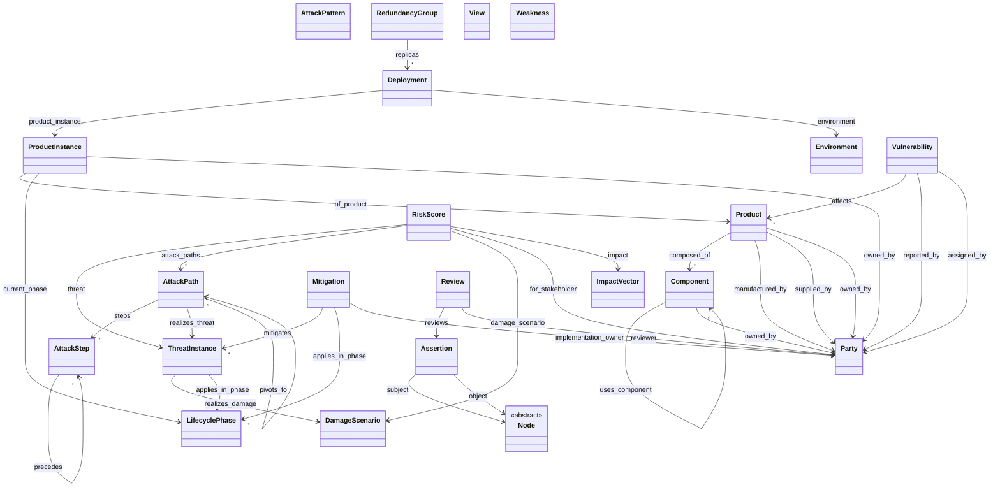

<!-- GENERATED by spec/schema/render_object_model.py — do not hand-edit; edit the LinkML and regenerate. -->
# tmodel object model — draft (all object types)

> **DRAFT, incrementable.** Generated from `spec/schema/tmodel-object-model.linkml.yaml` (schema v0.1.0, status draft) on 2026-10-07. Regenerate: `python3 spec/schema/render_object_model.py`. **Not normative** — DEC-001 (object model) and DEC-002 (encoding) are open; this view grows as the schema is filled out (RPT-0015 §3/§4).

**22 object types · 62 slots · 9 enums.** Base type `Node` (abstract) gives every object a stable `id` (ADR-0004); its inheritance edges are omitted from the graph for readability.

## Object relation graph

## Object schemas

### Assertion — `is_a: Node`

Reified edge (§4): subject / predicate / object, so a Review, confidence, and provenance can point at the statement. Substrate-neutral logical node; RDF-star, named graphs, and LPG edge-properties are storage lowerings (ADR-0004) and are not chosen here. Promoting a reviewed edge to this node narrows DEC-004 (no pure edge-property-only form for reviewed assertions). The acceptance gate (provenance + review before status=accepted) is a hand-written constraint, not something gen-shacl emits (§13).

| slot | type | req | multi | notes |
|---|---|---|---|---|
| `subject` | → `Node` | ✓ |  | Subject of the reified statement (§4). |
| `predicate` | `string` | ✓ |  | Edge type name (§4), e.g. composed_of, affects, realizes, owned_by. Not a closed enum: reviewed edges that are not first-class slots stil… |
| `object` | → `Node` | ✓ |  | Object of the reified statement (§4). |
| `confidence` | `string` |  |  | Confidence attached to the Assertion (§4). Scale is not fixed in the proposal. |
| `assertion_status` | `string` |  |  | Proposal status of the Assertion (§4). Must not be `accepted` until provenance and a review are present. That gate is not encoded as a Li… |

### AttackPath — `is_a: Node`

An ordered set of AttackSteps realising a ThreatInstance (§2a, §3). Feasibility is rated here, at path level (human-rated at MVP). Feasibility METHOD is ISO/SAE 21434 Table-1 (§3, DL-0011), human-rated at MVP; Common Criteria is display-only (numbers + label). No per-step aggregation at MVP. DEC-003 is open; ADR-0005 was dropped, not accepted.

| slot | type | req | multi | notes |
|---|---|---|---|---|
| `steps` | → `AttackStep` |  | ✓ | AttackSteps in this path (§2a). Order is the `precedes` edges, not list position. |
| `realizes_threat` | → `ThreatInstance` |  |  | This path realises the threat scenario (§3). |
| `attack_feasibility` | enum `FeasibilityLevel` |  |  | Path-level feasibility, ISO 21434 4-point scale, human-rated at MVP (§3, Table 1 / RQ-15-10). Not CVSS. Not per-step min/max (that is pos… |
| `pivots_to` | → `AttackPath` |  | ✓ | Path-level pivot across a reachability substrate (§1). Reachability's other two levels (connected_via, step preconditions) are not classe… |

### AttackPattern — `is_a: Node`

Generic attack pattern (CAPEC / ATT&CK technique = *what*, §1, §2a). STRIDE is not a property of this class (§2). Kill-chain phase is on AttackStep, not here.

| slot | type | req | multi | notes |
|---|---|---|---|---|
| `catalog_ref` | `string` |  |  | External catalog identifier when the proposal names one (CWE, CAPEC, ATT&CK, CVE, D3FEND). The identifier scheme is not pinned in §13. |

### AttackStep — `is_a: Node`

A step in an attack graph (§2a): AND/OR `gate`, explicit `precedes` order, shareable across paths. Optional kill-chain phase is coarse order, not the ATT&CK technique. Pre/postconditions are not given a schema shape in §2a.

| slot | type | req | multi | notes |
|---|---|---|---|---|
| `gate` | enum `AttackGate` |  |  | AND/OR combination of this step with its predecessors (§2a, R-031). |
| `precedes` | → `AttackStep` |  | ✓ | Explicit ordering edge (§2a). Steps may be shared across paths. |
| `kill_chain_phase` | `string` |  |  | Optional coarse order tag (§2a). Distinct from the ATT&CK technique. The Lockheed kill-chain record is not pinned; do not rely on a fixed… |

### Component — `is_a: Node`

Authoritative deployed artifact (service, container, dependency, chip, core) — not an OTM diagram node (§0). `uses_component` / `composed_of` are the propagation paths for vulnerabilities (§5).

| slot | type | req | multi | notes |
|---|---|---|---|---|
| `composed_of` | → `Component` |  | ✓ | Recursive structural composition (§3). Inlined as references, not as nested trees. |
| `depends_on` | → `Component` |  | ✓ | Dependency edge, including DNS/service-style depends_on (§3). |
| `uses_component` | → `Component` |  | ✓ | Use edge along which vuln/finding propagation is sound (§5). |
| `owned_by` | → `Party` |  |  | Proposal attaches owned_by to Asset (§2b, §3). Asset is not a §13 class; the slot is on Product, ProductInstance, and Component as the st… |

### DamageScenario — `is_a: Node`

The damage a ThreatInstance realizes (§1). Impact categories are recorded on RiskScore, not collapsed here (§3).

_(no own slots — see gap list in RPT-0015 §4)_

### Deployment — `is_a: Node`

A placement of one ProductInstance (§3). Many Deployments per instance; each points at one Environment. Single deployment is the MVP assumption; deployment-relative risk (R-023) is post-MVP.

| slot | type | req | multi | notes |
|---|---|---|---|---|
| `product_instance` | → `ProductInstance` | ✓ |  | The instance this Deployment places (§3). |
| `environment` | → `Environment` | ✓ |  | The one Environment for this Deployment (§3). |

### Environment — `is_a: Node`

Reusable operational exposure of a running deployment (§3, F9): physical security, connectivity, operational context. Parameterises feasibility's exploitability side only — never impact CIA (F5). Distinct from LifecyclePhase (§3b). The MVP metric runs without requiring this node.

| slot | type | req | multi | notes |
|---|---|---|---|---|
| `physical_security` | `string` |  |  | Environment facet (§3). Feeds feasibility exploitability only, post-MVP. |
| `connectivity` | `string` |  |  | Environment facet (§3). Feeds attack vector / reachability / window, not impact. |
| `operational_context` | `string` |  |  | Environment facet (§3). |

### ImpactVector

Inlined value object for RiskScore.impact (§3). ISO 21434 safety / financial / operational / privacy, each severe|major|moderate|negligible. Keeping the four categories is the method; collapsing to one number is display-only. Not a §13 domain class. business_impact is a different post-MVP axis and is not a field here.

| slot | type | req | multi | notes |
|---|---|---|---|---|
| `safety` | enum `ImpactSeverity` |  |  | Safety impact; ISO 26262-informed (§3, RQ-15-06). |
| `financial` | enum `ImpactSeverity` |  |  | Financial impact on the end-beneficiary, not the owner's P&L (§3). |
| `operational` | enum `ImpactSeverity` |  |  | Operational impact (§3). |
| `privacy` | enum `ImpactSeverity` |  |  | Privacy impact (§3). Not re-indexed by asset owner. |

### LifecyclePhase — `is_a: Node`

Coarse lifecycle stage (§3b). The vocabulary is LifecyclePhaseCode (concept through decommission/disposal, ISO 21434 + ISO 26262 aligned). Reverse-logistics transitions and custody provenance are post-MVP and are not modeled. `name` is the human label; `code` is the enum.

| slot | type | req | multi | notes |
|---|---|---|---|---|
| `code` | enum `LifecyclePhaseCode` | ✓ |  | Controlled phase code (§3b). |

### Mitigation — `is_a: Node`

A mitigation/control (catalog example D3FEND, §1). §5 instance fields (implementation owner, external work-item refs, status) are on this class until a separate MitigationInstance class is accepted. Status is also surfaced as RiskScore.mitigation_status (R-045) — a peer of the derived risk, not an input to it.

| slot | type | req | multi | notes |
|---|---|---|---|---|
| `catalog_ref` | `string` |  |  | External catalog identifier when the proposal names one (CWE, CAPEC, ATT&CK, CVE, D3FEND). The identifier scheme is not pinned in §13. |
| `mitigates` | → `ThreatInstance` |  | ✓ | Threats this mitigation addresses (§5). Phase binding is applies_in_phase. |
| `applies_in_phase` | → `LifecyclePhase` |  | ✓ | Coarse lifecycle stage a threat or mitigation belongs to (§3b). Not a substitute for Environment. One threat uses the axis that fits. |
| `implementation_owner` | → `Party` |  |  | Who implements the mitigation (§5). |
| `external_refs` | `string` |  | ✓ | Linked work items, e.g. a Jira key (§5). Opaque strings; no tracker schema. |
| `mitigation_status` | enum `MitigationStatus` |  |  | Lifecycle of the mitigation (§3 R-045, §5): planned / in-progress / complete / accepted-risk / n-a. Vocabulary may be refined by DEC-009.… |

### Node — **abstract**

Shared identity for every §13 class. `id` is the stable object id ADR-0004 requires across file, LPG, and RDF encodings. Not itself a §13 class.

| slot | type | req | multi | notes |
|---|---|---|---|---|
| `id` | `uriorcurie` | ✓ |  | Stable object id (ADR-0004). Adapters must not renumber it. |
| `name` | `string` |  |  | Human-readable name. |
| `description` | `string` |  |  | Short prose description. |

### Party — `is_a: Node`

One reusable identity for an organization or a person (§2b). ThreatActor and PROV Agent are facets of this identity, not separate §13 classes. Only intrinsic classifications live on the node; supplier/owner/vendor-of are edges.

| slot | type | req | multi | notes |
|---|---|---|---|---|
| `party_kind` | enum `PartyKind` |  |  | Organization or person (§2b). |
| `classifications` | `string` |  | ✓ | Intrinsic classifications only, e.g. standards-body, cna (§2b). |

### Product — `is_a: Node`

A product design (structural layer, §1). Recursive composition is `composed_of` Components (§3). Relational party roles are edges (§2b).

| slot | type | req | multi | notes |
|---|---|---|---|---|
| `composed_of` | → `Component` |  | ✓ | Recursive structural composition (§3). Inlined as references, not as nested trees. |
| `manufactured_by` | → `Party` |  |  | Relational role edge (§2b), not a classification on Party. |
| `supplied_by` | → `Party` |  |  | Relational role edge (§2b). The same Party may supply one product and consume another. |
| `owned_by` | → `Party` |  |  | Proposal attaches owned_by to Asset (§2b, §3). Asset is not a §13 class; the slot is on Product, ProductInstance, and Component as the st… |

### ProductInstance — `is_a: Node`

A versioned, identity-bearing instance of a Product (§1, §3b). Lifecycle *state* sits here (with valid_from/valid_to), not on Product or Component. A refurbished unit can share a firmware hash and still carry a new phase, Deployment, and owner.

| slot | type | req | multi | notes |
|---|---|---|---|---|
| `of_product` | → `Product` | ✓ |  | The Product this ProductInstance instantiates (§1). |
| `current_phase` | → `LifecyclePhase` |  |  | Lifecycle state of this ProductInstance at valid_from/valid_to (§3b). |
| `valid_from` | `datetime` |  |  | Start of the (ProductInstance, time) state interval (§3b). Temporal axis was flagged as still-missing; included here because §3b says to … |
| `valid_to` | `datetime` |  |  | End of the (ProductInstance, time) state interval (§3b). Open-ended if absent. |
| `owned_by` | → `Party` |  |  | Proposal attaches owned_by to Asset (§2b, §3). Asset is not a §13 class; the slot is on Product, ProductInstance, and Component as the st… |

### RedundancyGroup — `is_a: Node`

Marks Deployments (or whole build/review systems) as replicas (§3, §10): `replica_of` / `redundant_with`. Supports common-mode risk and per-replica mitigation divergence. Post-MVP (R-034).

| slot | type | req | multi | notes |
|---|---|---|---|---|
| `replicas` | → `Deployment` |  | ✓ | Deployments in this redundancy group (§3, §10). |
| `redundancy_relation` | enum `RedundancyRelation` |  |  | replica_of or redundant_with (§3). |

### Review — `is_a: Node`

Human verdict on an Assertion (§4, §5). Kept separate from the proposal. Carries status, priority, and justification. STIX Opinion/Note is a future mapping (DEC-002 / #9), not a parent class.

| slot | type | req | multi | notes |
|---|---|---|---|---|
| `reviews` | → `Assertion` | ✓ |  | The Assertion this Review judges (§4). |
| `reviewer` | → `Party` |  |  | Human (or, later, an agent facet of a Party) who issued the verdict (§4). |
| `review_status` | `string` |  |  | Verdict status (§5). Kept open: proposal does not enumerate the values. |
| `priority` | `string` |  |  | Review priority (§5). Scale not specified in the proposal. |
| `justification` | `string` |  |  | Why the verdict was reached (§5). Separate from the Assertion text. |

### RiskScore — `is_a: Node`

Composite risk vector (sponsor round, proposed.10 / DL-0011; DEC-003 OPEN — ADR-0005 was dropped, not accepted). Peer slots: feasibility (ISO 21434 Table-1 method; Common Criteria display-only — numbers, label, and a colored indicator in table views), impact (from attack damage; 21434 S/F/O/P), mitigation_status, and derived risk. Shown alongside its inputs, never instead of them. Not a single CVSS score. More components only with a further sponsor decision. MVP: one stakeholder; business_impact is post-MVP and intentionally has no slot.

| slot | type | req | multi | notes |
|---|---|---|---|---|
| `threat` | → `ThreatInstance` | ✓ |  | Threat scenario this score is about (§3, RQ-15-15/16). |
| `attack_paths` | → `AttackPath` |  | ✓ | Paths whose feasibilities feed this score. Reduction across paths is worst-path (§3); this schema stores the set, not the fold function. |
| `damage_scenario` | → `DamageScenario` |  |  | Damage scenario whose impact feeds M(I, F) (§3). |
| `for_stakeholder` | → `Party` |  |  | Owner this score is reported for, when a path crosses assets with different owners (§3). MVP assumes one stakeholder; omit unless needed. |
| `feasibility` | enum `FeasibilityLevel` |  |  | Vector component (§3, DL-0011). Copied or reduced from AttackPath.attack_feasibility (worst path). Method is ISO 21434 Table-1, not Commo… |
| `impact` | → `ImpactVector` |  |  | Per-category S/F/O/P vector (§3). Human-supplied. Do not replace this object with a single severity. |
| `mitigation_status` | enum `MitigationStatus` |  |  | Lifecycle of the mitigation (§3 R-045, §5): planned / in-progress / complete / accepted-risk / n-a. Vocabulary may be refined by DEC-009.… |
| `risk` | `string` |  |  | Derived Risk = M(Impact, Feasibility) (§3). ISO 21434 wants one value 1–5 per (threat-scenario, impact-category), and per stakeholder whe… |

### ThreatInstance — `is_a: Node`

A threat in a model, not the generic catalog entry (§1). Carries the method facet (STRIDE and, post-MVP, LINDDUN/MAESTRO) and `realizes` a DamageScenario. Phase scope is `applies_in_phase` (§3b), distinct from Environment.

| slot | type | req | multi | notes |
|---|---|---|---|---|
| `realizes_damage` | → `DamageScenario` |  |  | ThreatInstance realizes a DamageScenario (§1). |
| `method_facet` | enum `MethodFacet` |  | ✓ | Which method classified this threat (§2). STRIDE is a facet, not an AttackPattern property. Facets beyond STRIDE are post-MVP. |
| `source_method` | `string` |  |  | Which method proposed this ThreatInstance (§2). |
| `violates_property` | `string` |  |  | Security property the facet says is violated (§2). STRIDE sketch, not a closed enum: S authentication, T integrity, R non-repudiation, I … |
| `applies_in_phase` | → `LifecyclePhase` |  | ✓ | Coarse lifecycle stage a threat or mitigation belongs to (§3b). Not a substitute for Environment. One threat uses the axis that fits. |

### View — `is_a: Node`

Derived presentation lens (§10): query/filter + projection. Not domain truth and never written back onto domain nodes. Saved views may be persisted; rendered geometry is transient and out of this schema. One graph projection is MVP; other projections are post-MVP.

| slot | type | req | multi | notes |
|---|---|---|---|---|
| `projection` | enum `ViewProjection` |  |  | Which derived projection this View spec names (§10). |
| `focus_query` | `string` |  |  | Bounded query / filter that defines the view (§10, R-033). Opaque to this schema (not a committed query language — DEC-004 is open). |

### Vulnerability — `is_a: Node`

A finding/vulnerability (CVE/NVD-shaped) that `affects` a Product (§2b). Propagation along uses_component/composed_of and the per-instance VEX override are Assertions plus Reviews (§5), not extra classes.

| slot | type | req | multi | notes |
|---|---|---|---|---|
| `catalog_ref` | `string` |  |  | External catalog identifier when the proposal names one (CWE, CAPEC, ATT&CK, CVE, D3FEND). The identifier scheme is not pinned in §13. |
| `affects` | → `Product` |  | ✓ | Vulnerability/Finding affects a vendor Product (§2b). |
| `reported_by` | → `Party` |  |  | Reporter (§2b). |
| `assigned_by` | → `Party` |  |  | Assigning CNA (§2b). Party.classifications should include cna when this is set; not enforced here. |

### Weakness — `is_a: Node`

Generic weakness, catalogued as CWE (§1 layer 3). The CWE↔CAPEC link is a human-reviewed mapping (an Assertion), not a facet property (§2) — no hard edge to AttackPattern in this cut.

| slot | type | req | multi | notes |
|---|---|---|---|---|
| `catalog_ref` | `string` |  |  | External catalog identifier when the proposal names one (CWE, CAPEC, ATT&CK, CVE, D3FEND). The identifier scheme is not pinned in §13. |

## Enumerations

- **AttackGate** — How an AttackStep combines (§2a).: `and_gate`, `or_gate`
- **FeasibilityLevel** — ISO/SAE 21434 path-level 4-point scale (§3, Table 1). Human-rated at MVP. Not a Common Criteria score and not a CVSS exploitability number.: `high`, `medium`, `low`, `very_low`
- **ImpactSeverity** — ISO 21434 impact ordinal per S/F/O/P category (§3, RQ-15-04/05).: `severe`, `major`, `moderate`, `negligible`
- **LifecyclePhaseCode** — LifecyclePhase vocabulary (§3b), aligned to ISO/SAE 21434 + ISO 26262. Returns/refurbish/resale/dispose are called out as future phase tags; they are not given codes here because §3b says the returns branch is post-MVP.: `concept`, `architecture`, `design`, `implementation`, `verification_validation`, `production`, `distribution`, `deployment`, `operation`, `maintenance`, `end_of_support`, `decommission`
- **MethodFacet** — Method that proposed a ThreatInstance (§2). Only STRIDE is in MVP.: `stride`, `linddun`, `maestro`
- **MitigationStatus** — Mitigation lifecycle (§3 R-045). Refined later by DEC-009.: `planned`, `in_progress`, `complete`, `accepted_risk`, `not_applicable`
- **PartyKind** — Party is an organization or a person (§2b).: `organization`, `person`
- **RedundancyRelation** — Edge names inside a RedundancyGroup (§3).: `replica_of`, `redundant_with`
- **ViewProjection** — Named projections over one graph (§10). Matrix, compare, saved views are post-MVP.: `graph`, `threat_mitigation_matrix`, `attack_path`, `dfd`, `timeline`, `provenance`, `compare`
